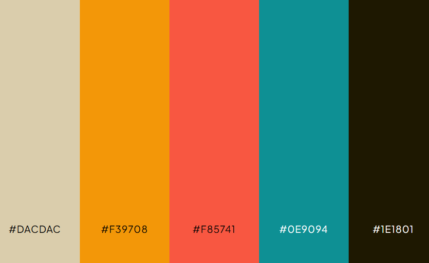



   
  
<strong>Universidad Peruana de Ciencias Aplicadas</strong>

  

  Ingeniería de Software   
  Periodo: 202610   
  1ASI0572 Desarrollo de Soluciones IOT   
  NCR: 6772   
  Docente: Marco Antonio Leon Baca   
  Informe de Trabajo Final   
  StartUp: CryoGuard   
  Producto: CryoGuard Pro   
  

  <table align="center">
    <tr>
      <th>Member</th>
      <th>Code</th>
    </tr>
    <tr>
      <td>Arias Segil, Marllely Anahi</td>
      <td>U202223984</td>
    </tr>
    <tr>
      <td>Hallasi Saravia, Miguel</td>
      <td>U202312391</td>
    </tr>
    <tr>
      <td>Miranda Ayasta, Rogger Faryd</td>
      <td>U202319239</td>
    </tr>
    <tr>
      <td>Sanchez Rios, Camila</td>
      <td>U202210973</td>
    </tr>
    <tr>
      <td>Vargas Javier, Jose Enrique</td>
      <td>U20221F693</td>
    </tr>
  </table>
    
Abril 2026

# Registro de Versiones del Informe

 
<table>
  <tr>
    <th>Versión</th>
    <th>Fecha</th>
    <th>Autor</th>
    <th>Descripción</th>
  </tr>
  <tr>
    <th>AV1</th>
    <td>25/4/2026</td>
    <td>Todos</td>
    <td>Se desarrollo los primeros avances del trabajo</td>
  </tr>
    <tr>
    <th>TB1</th>
    <td></td>
    <td></td>
    <td></td>
  </tr>
    <tr>
    <th>AV2</th>
    <td></td>
    <td></td>
    <td></td>
  </tr>
    <tr>
    <th>TB2</th>
    <td></td>
    <td></td>
    <td></td>
  </tr>
</table>

# Project Report Collaboration Insights

  <table>
    <tr>
      <td>Link del repositorio del informe</td>
      <td>https://github.com/CryoGuard/ProjectReport/tree/main</td>
    </tr>
      <tr>
      <td>Link de los repositorios de la organización</td>
      <td>https://github.com/CryoGuard</td>
    </tr>
      <tr>
      <td>Link del Event Storming</td>
      <td></td>
    </tr>
  </table>

   

  <h6> Evidencias AV1 </h6>

  <h6> Evidencias TB1 </h6>
  <h6> Evidencias AV2 </h6>
  <h6> Evidencias TB2 </h6>

# Contenido

- [Registro de Versiones del Informe](#registro-de-versiones-del-informe)
- [Project Report Collaboration Insights](#project-report-collaboration-insights)
- [Contenido](#contenido)
- [Student Outcome](#student-outcome)
- [Capítulo I: Introducción](#capítulo-i-introducción)
  - [1.1. Startup Profile](#11-startup-profile)
    - [1.1.1. Descripción de la Startup](#111-descripción-de-la-startup)
    - [1.1.2. Perfiles de integrantes del equipo](#112-perfiles-de-integrantes-del-equipo)
  - [1.2. Solution Profile](#12-solution-profile)
    - [1.2.1. Antecedentes y problemática](#121-antecedentes-y-problemática)
    - [1.2.2. Lean UX Process](#122-lean-ux-process)
      - [1.2.2.1. Lean UX Problem Statements](#1221-lean-ux-problem-statements)
      - [1.2.2.2. Lean UX Assumptions](#1222-lean-ux-assumptions)
      - [1.2.2.3. Lean UX Hypothesis Statements](#1223-lean-ux-hypothesis-statements)
      - [1.2.2.4. Lean UX Canvas](#1224-lean-ux-canvas)
  - [1.3. Segmentos objetivo](#13-segmentos-objetivo)
- [Capítulo II: Requirements Elicitation \& Analysis](#capítulo-ii-requirements-elicitation--analysis)
  - [2.1. Competidores](#21-competidores)
    - [2.1.1. Análisis competitivo](#211-análisis-competitivo)
    - [2.1.2. Estrategias y tácticas frente a competidores](#212-estrategias-y-tácticas-frente-a-competidores)
  - [2.2. Entrevistas](#22-entrevistas)
    - [2.2.1. Diseño de entrevistas](#221-diseño-de-entrevistas)
    - [2.2.2. Registro de entrevistas](#222-registro-de-entrevistas)
    - [2.2.3. Análisis de entrevistas](#223-análisis-de-entrevistas)
  - [2.3. Needfinding](#23-needfinding)
    - [2.3.1. User Personas](#231-user-personas)
    - [2.3.2. User Task Matrix](#232-user-task-matrix)
    - [2.3.3. User Journey Mapping](#233-user-journey-mapping)
    - [2.3.4. Empathy Mapping](#234-empathy-mapping)
  - [2.4. Big Picture EventStorming](#24-big-picture-eventstorming)
  - [2.5. Ubiquitous Language](#25-ubiquitous-language)
- [Capítulo III: Requirements Specification](#capítulo-iii-requirements-specification)
  - [3.1. User Stories](#31-user-stories)
  - [3.2. Impact Mapping](#32-impact-mapping)
  - [3.3. Product Backlog](#33-product-backlog)
- [Capítulo IV: Solution Software Desing](#capítulo-iv-solution-software-desing)
  - [4.1 Strategic-Level Domain-Driven Design.](#41-strategic-level-domain-driven-design)
    - [4.1.1 Design-Level EventStorming.](#411-design-level-eventstorming)
    - [4.1.1.1 Candidate Context Discovery.](#4111-candidate-context-discovery)
    - [4.1.1.2 Domain Message Flows Modeling.](#4112-domain-message-flows-modeling)
    - [4.1.1.3 Bounded Context Canvases.](#4113-bounded-context-canvases)
    - [4.1.2 Context Mapping.](#412-context-mapping)
    - [4.1.3.1 Software Architecture System Landscape Diagram](#4131-software-architecture-system-landscape-diagram)
  - [4.2. Tactical-Level Domain-Driven Design](#42-tactical-level-domain-driven-design)
    - [4.2.4. Bounded Context: Control y Actuación](#424-bounded-context-control-y-actuación)
      - [4.2.4.1. Domain Layer](#4241-domain-layer)
      - [4.2.4.2. Interface Layer](#4242-interface-layer)
      - [4.2.4.3. Application Layer](#4243-application-layer)
      - [4.2.4.4. Infrastructure Layer](#4244-infrastructure-layer)
      - [4.2.4.5. Bounded Context Software Architecture Component Level Diagrams](#4245-bounded-context-software-architecture-component-level-diagrams)
      - [4.2.4.6. Bounded Context Software Architecture Code Level Diagrams](#4246-bounded-context-software-architecture-code-level-diagrams)
        - [4.2.4.6.1. Bounded Context Domain Layer Class Diagrams](#42461-bounded-context-domain-layer-class-diagrams)
        - [4.2.4.6.2. Bounded Context Database Design Diagram](#42462-bounded-context-database-design-diagram)
    - [4.2.5 Bounded Context: Operaciones / Flags](#425-bounded-context-operaciones--flags)
      - [4.2.5.1. Domain Layer](#4251-domain-layer)
      - [4.2.5.2. Interface Layer](#4252-interface-layer)
      - [4.2.5.3. Application Layer](#4253-application-layer)
      - [4.2.5.4. Infrastructure Layer](#4254-infrastructure-layer)
      - [4.2.5.5. Bounded Context Software Architecture Component Level Diagrams](#4255-bounded-context-software-architecture-component-level-diagrams)
      - [4.2.5.6. Bounded Context Software Architecture Code Level Diagrams](#4256-bounded-context-software-architecture-code-level-diagrams)
        - [4.2.5.6.1. Bounded Context Domain Layer Class Diagrams](#42561-bounded-context-domain-layer-class-diagrams)
        - [4.2.5.6.2. Bounded Context Database Design Diagram](#42562-bounded-context-database-design-diagram)
    - [4.2.6 Bounded Context: Notificaciones](#426-bounded-context-notificaciones)
      - [4.2.6.1. Domain Layer](#4261-domain-layer)
      - [4.2.6.2. Interface Layer](#4262-interface-layer)
      - [4.2.6.3. Application Layer](#4263-application-layer)
      - [4.2.6.4. Infrastructure Layer](#4264-infrastructure-layer)
      - [4.2.6.5. Bounded Context Software Architecture Component Level Diagrams](#4265-bounded-context-software-architecture-component-level-diagrams)
      - [4.2.6.6. Bounded Context Software Architecture Code Level Diagrams](#4266-bounded-context-software-architecture-code-level-diagrams)
        - [4.2.6.6.1. Bounded Context Domain Layer Class Diagrams](#42661-bounded-context-domain-layer-class-diagrams)
        - [4.2.6.6.2. Bounded Context Database Design Diagram](#42662-bounded-context-database-design-diagram)
    - [4.2.7. Bounded Context: Seguridad / Roles](#427-bounded-context-seguridad--roles)
      - [4.2.7.1. Domain Layer](#4271-domain-layer)
      - [4.2.7.2. Interface Layer](#4272-interface-layer)
      - [4.2.7.3. Application Layer](#4273-application-layer)
      - [4.2.7.4. Infrastructure Layer](#4274-infrastructure-layer)
      - [4.2.7.5. Bounded Context Software Architecture Component Level Diagrams](#4275-bounded-context-software-architecture-component-level-diagrams)
      - [4.2.7.6. Bounded Context Software Architecture Code Level Diagrams](#4276-bounded-context-software-architecture-code-level-diagrams)
        - [4.2.7.6.1. Bounded Context Domain Layer Class Diagrams](#42761-bounded-context-domain-layer-class-diagrams)
        - [4.2.7.6.2. Bounded Context Database Design Diagram](#42762-bounded-context-database-design-diagram)
- [Capítulo V: Solution UI/UX Design](#capítulo-v-solution-uiux-design)
  - [5.1. Style Guidelines.](#51-style-guidelines)
    - [5.1.1. General Style Guidelines](#511-general-style-guidelines)
    - [5.1.2. Web, Mobile and IoT Style Guidelines](#512-web-mobile-and-iot-style-guidelines)
  - [5.2. Information Architecture.](#52-information-architecture)
    - [5.2.1. Organization Systems](#521-organization-systems)
    - [5.2.2. Labeling Systems](#522-labeling-systems)
    - [5.2.3. SEO Tags and Meta Tags](#523-seo-tags-and-meta-tags)
    - [5.2.4. Searching Systems](#524-searching-systems)
    - [5.2.5. Navigation Systems](#525-navigation-systems)
  - [5.3. Landing Page UI Design.](#53-landing-page-ui-design)
    - [5.3.1. Landing Page Wireframe](#531-landing-page-wireframe)
    - [5.3.2. Landing Page Mock-up](#532-landing-page-mock-up)
  - [5.4. Applications UX/UI Design.](#54-applications-uxui-design)
    - [5.4.1. Applications Wireframes](#541-applications-wireframes)
    - [5.4.2. Applications Wireflow Diagrams](#542-applications-wireflow-diagrams)
    - [5.4.2. Applications Mock-ups](#542-applications-mock-ups)
    - [5.4.3. Applications User Flow Diagrams](#543-applications-user-flow-diagrams)
  - [5.5. Applications Prototyping](#55-applications-prototyping)
  - [5.6. IoT Device Design](#56-iot-device-design)
- [Capítulo VI: Product Implementation, Validation \& Deployment](#capítulo-vi-product-implementation-validation--deployment)
  - [6.1. Software Configuration Management.](#61-software-configuration-management)
    - [6.1.1. Software Development Environment Configuration](#611-software-development-environment-configuration)
    - [6.1.2. Source Code Management](#612-source-code-management)
    - [6.1.3. Source Code Style Guide \& Conventions](#613-source-code-style-guide--conventions)
    - [6.1.4. Software Deployment Configuration](#614-software-deployment-configuration)
  - [6.2. Landing Page, Services \& Applications Implementation.](#62-landing-page-services--applications-implementation)
    - [6.2.1. Sprint n](#621-sprint-n)
      - [6.2.1.1. Sprint Planning n](#6211-sprint-planning-n)
      - [6.2.1.2. Aspect Leaders and Collaborators](#6212-aspect-leaders-and-collaborators)
      - [6.2.1.3. Sprint Backlog n](#6213-sprint-backlog-n)
      - [6.2.1.4. Development Evidence for Sprint Review](#6214-development-evidence-for-sprint-review)
      - [6.2.1.5. Testing Suite Evidence for Sprint Review](#6215-testing-suite-evidence-for-sprint-review)
      - [6.2.1.6. Execution Evidence for Sprint Review](#6216-execution-evidence-for-sprint-review)
      - [6.2.1.7. Services Documentation Evidence for Sprint Review](#6217-services-documentation-evidence-for-sprint-review)
      - [6.2.1.8. Software Deployment Evidence for Sprint Review](#6218-software-deployment-evidence-for-sprint-review)
      - [6.2.1.9. Team Collaboration Insights during Sprint](#6219-team-collaboration-insights-during-sprint)
  - [6.3. Validation Interviews.](#63-validation-interviews)
    - [6.3.1. Diseño de Entrevistas](#631-diseño-de-entrevistas)
    - [6.3.2. Registro de Entrevistas](#632-registro-de-entrevistas)
    - [6.3.3. Evaluaciones según heurísticas](#633-evaluaciones-según-heurísticas)
  - [6.4. Video About-the-Product](#64-video-about-the-product)
- [Conclusiones](#conclusiones)
  - [Conclusiones y recomendaciones.](#conclusiones-y-recomendaciones)
- [Video About-the-Team.](#video-about-the-team)
- [Bibliografía](#bibliografía)
- [Anexos](#anexos)

  

# Student Outcome

ABET – EAC - Student Outcome 4

**Criterio:** Capacidad de reconocer responsabilidades éticas y profesionales en situaciones de ingeniería y hacer juicios informados, considerando el impacto de las soluciones en contextos globales, económicos, ambientales y sociales.

<table>
  <tr>
    <td><b>Criterio específico</b></td>
    <td><b>Acciones realizadas</b></td>
    <td><b>Conclusiones</b></td>
  </tr>
  <tbody>
    <tr>
      <td><b>Reconoce responsabilidad ética y profesional en situaciones de ingeniería de software</b></td>
      <td>
        
<b>Miranda Ayasta, Rogger Faryd</b>

        
<b>AV1: </b> 

        
<b>TB1: </b> 

        
<b>AV2: </b> 

        
<b>TB2: </b> 

        
<b>Vargas Javier, Jose Enrique</b>

        
<b>AV1: </b> 

        
<b>TB1: </b> 

        
<b>AV2: </b> 

        
<b>TB2: </b> 

        
<b>Sanchez Rios, Camila</b>

        
<b>AV1: </b>Para esta entrega colabore en la realizacion de los capitulos Capítulo II: Requirements Elicitation & Analysis y Capítulo III: Requirements Specification. Del mismo modo, de elaborar la presentacion para darle un enfoque visual al proyecto.  

        
<b>TB1: </b> 

        
<b>AV2: </b> 

        
<b>TB2: </b> 

        
<b>Arias Segil, Marllely Anahi</b>

        
<b>AV1: </b>Al diseñar la arquitectura y los modelos como el EventStorming o el Context Mapping, traté de asegurar que el sistema sea confiable, que permita monitoreo en tiempo real y que reduzca errores humanos. También consideré aspectos como la disponibilidad, la precisión de los datos y la capacidad de funcionar incluso sin conexión.

        
<b>TB1: </b> 

        
<b>AV2: </b> 

        
<b>TB2: </b> 

        
<b>Hallasi Saravia, Miguel</b>

        
<b>AV1: </b>urante el desarrollo de los bounded contexts de Control y Actuación, Operaciones/Flags, Notificaciones y Seguridad/Roles, identifiqué que cada decisión de diseño tiene consecuencias directas sobre la vida de pacientes que dependen de vacunas y medicamentos termosensibles. Para ello, incorporé bloqueos de seguridad que impiden acciones manuales que puedan comprometer los productos, y generé registros auditables de cada override realizado, asegurando que las decisiones queden documentadas y sean rastreables.

        
<b>TB1: </b> 

        
<b>AV2: </b> 

        
<b>TB2: </b> 

      </td>
      <td></td>
    </tr>
  </tbody>
</table>

# Capítulo I: Introducción

## 1.1. Startup Profile

### 1.1.1. Descripción de la Startup

### 1.1.2. Perfiles de integrantes del equipo

## 1.2. Solution Profile

### 1.2.1. Antecedentes y problemática

### 1.2.2. Lean UX Process

#### 1.2.2.1. Lean UX Problem Statements
#### 1.2.2.2. Lean UX Assumptions

#### 1.2.2.3. Lean UX Hypothesis Statements

#### 1.2.2.4. Lean UX Canvas

_Imagen (N°1). Elaboración propia. Realizado en Canva_

## 1.3. Segmentos objetivo

# Capítulo II: Requirements Elicitation & Analysis

## 2.1. Competidores
### 2.1.1. Análisis competitivo

### 2.1.2. Estrategias y tácticas frente a competidores

## 2.2. Entrevistas

### 2.2.1. Diseño de entrevistas

### 2.2.2. Registro de entrevistas
### 2.2.3. Análisis de entrevistas

## 2.3. Needfinding

En el siguiente apartado, analizaremos a nuestros segmentos objetivos para identificar sus necesidades y en base a esto ofrecerles soluciones óptimas a sus problemas.

### 2.3.1. User Personas

### 2.3.2. User Task Matrix

### 2.3.3. User Journey Mapping

### 2.3.4. Empathy Mapping

## 2.4. Big Picture EventStorming

## 2.5. Ubiquitous Language

# Capítulo III: Requirements Specification

## 3.1. User Stories

## 3.2. Impact Mapping
  
## 3.3. Product Backlog

# Capítulo IV: Solution Software Desing 

## 4.1 Strategic-Level Domain-Driven Design.

### 4.1.1 Design-Level EventStorming.

### 4.1.1.1 Candidate Context Discovery.

### 4.1.1.2 Domain Message Flows Modeling.

En esta sección, se modeló la colaboración entre los Bounded Contexts para resolver los casos de uso críticos de CryoGuard. Se utilizó la técnica de Domain Storytelling, que permite visualizar la narrativa del negocio mediante el intercambio de mensajes entre actores, sistemas y contextos.

  

El Sensor IoT detecta una temperatura fuera de los parámetros permitidos y envía el mensaje a Evaluation Management. Este contexto genera la alerta hacia IoT Monitoring Management, la cual viaja a través de la CryoGuard Platform. Finalmente, Operations Management procesa la información para que el Operador Logístico visualice la alerta y tome medidas.

  

Al detectar una desviación, el Sensor IoT lo comunica a Logistics Management, que genera una alerta de ubicación. El mensaje pasa por IoT Monitoring Management hacia la CryoGuard Platform. Desde allí, Operations Management registra el desvío, permitiendo que el Operador Logístico visualice la ruta y la alerta en su pantalla.

  

El Sensor IoT detecta la apertura física y IAM Management valida que no cuenta con autorización. Se genera una alerta de seguridad hacia IoT Monitoring Management que llega a la CryoGuard Platform. El sistema envía la notificación a Operations Management para almacenar el incidente y el Operador Logístico recibe la alerta de seguridad inmediata.

  

El Sensor IoT verifica la conexión y IoT Monitoring Management detecta la pérdida de red. Ante esto, Operations Management activa el almacenamiento local para no perder datos. La información se registra temporalmente en el dispositivo y la CryoGuard Platform reporta al Operador Logístico la falta de monitoreo en tiempo real.

  

La CryoGuard Platform detecta que hay conexión disponible y lo comunica a IoT Monitoring Management. Este restablece la conexión con Operations Management, que procede a sincronizar todos los datos almacenados con la nube. Al terminar, la plataforma actualiza el dashboard y entrega el historial de eventos completo al Operador Logístico.

### 4.1.1.3 Bounded Context Canvases.

### 4.1.2 Context Mapping.

### 4.1.3.1 Software Architecture System Landscape Diagram

## 4.2. Tactical-Level Domain-Driven Design

### 4.2.4. Bounded Context: Control y Actuación

#### 4.2.4.1. Domain Layer

#### 4.2.4.2. Interface Layer

| Tipo | Clase / Nombre | Descripción | Métodos / Endpoints principales |
| --- | --- | --- | --- |
| Controller | ActuatorController | Control de actuadores | POST /api/commands · GET /api/actuators/status |
| Controller | OverrideController | Override manual protegido | POST /api/commands/override · GET /api/commands/override/available |
| DTO (in) | CommandResource | Payload de comando | actuatorId, command, parameters{}, authorizedBy? |
| DTO (in) | OverrideRequestResource | Request de override con autorización | command, reason, authToken, actor |
| DTO (out) | ExecutionResponse | Respuesta de ejecución | sessionId, command, result, executedAt |
| DTO (out) | ActuatorStatusResource | Estado actual de todos los actuadores | actuators[], lockState, coolingMode |

#### 4.2.4.3. Application Layer

| Tipo | Clase / Nombre | Descripción | Métodos / Comandos manejados |
| --- | --- | --- | --- |
| Command Handler | ExecuteCommandHandler | Ejecuta comando en actuador | handle(ExecuteCommandCommand) |
| Command Handler | ScheduleCommandHandler | Programa comando para ejecución diferida | handle(ScheduleCommandCommand) |
| Command Handler | ApplyOverrideHandler | Aplica override manual autorizado | handle(ApplyOverrideCommand) |
| Command Handler | ReleaseInterlockHandler | Libera bloqueo de seguridad | handle(ReleaseInterlockCommand) |
| Event Handler | ActuationResultPublisher | Publica resultado a Operaciones | on(ActuatorCommandExecuted) |
| Event Handler | SafetyEventPublisher | Publica eventos de seguridad | on(SafetyLockApplied, ManualCommandRejected) |

#### 4.2.4.4. Infrastructure Layer

#### 4.2.4.5. Bounded Context Software Architecture Component Level Diagrams

#### 4.2.4.6. Bounded Context Software Architecture Code Level Diagrams

##### 4.2.4.6.1. Bounded Context Domain Layer Class Diagrams

##### 4.2.4.6.2. Bounded Context Database Design Diagram

### 4.2.5 Bounded Context: Operaciones / Flags

#### 4.2.5.1. Domain Layer

#### 4.2.5.2. Interface Layer

#### 4.2.5.3. Application Layer

#### 4.2.5.4. Infrastructure Layer

#### 4.2.5.5. Bounded Context Software Architecture Component Level Diagrams

#### 4.2.5.6. Bounded Context Software Architecture Code Level Diagrams

##### 4.2.5.6.1. Bounded Context Domain Layer Class Diagrams

##### 4.2.5.6.2. Bounded Context Database Design Diagram

### 4.2.6 Bounded Context: Notificaciones

#### 4.2.6.1. Domain Layer

#### 4.2.6.2. Interface Layer

#### 4.2.6.3. Application Layer

#### 4.2.6.4. Infrastructure Layer

#### 4.2.6.5. Bounded Context Software Architecture Component Level Diagrams

#### 4.2.6.6. Bounded Context Software Architecture Code Level Diagrams

##### 4.2.6.6.1. Bounded Context Domain Layer Class Diagrams

##### 4.2.6.6.2. Bounded Context Database Design Diagram

### 4.2.7. Bounded Context: Seguridad / Roles

#### 4.2.7.1. Domain Layer

#### 4.2.7.2. Interface Layer

#### 4.2.7.3. Application Layer

#### 4.2.7.4. Infrastructure Layer

#### 4.2.7.5. Bounded Context Software Architecture Component Level Diagrams

#### 4.2.7.6. Bounded Context Software Architecture Code Level Diagrams

##### 4.2.7.6.1. Bounded Context Domain Layer Class Diagrams

##### 4.2.7.6.2. Bounded Context Database Design Diagram

# Capítulo V: Solution UI/UX Design

## 5.1. Style Guidelines.

### 5.1.1. General Style Guidelines

A continuación, se definen las decisiones de diseño visual y comunicacional que guiarán la construcción de la interfaz de usuario de CryoGuard, tanto para la plataforma web (administradores y ONGs) como para la aplicación móvil (operadores en ruta) y la pantalla local del dispositivo.

**Branding**

| Elemento | Decisión |
| --- | --- |
| Nombre del producto | CryoGuard |
| Tagline | Cold Chain IoT Monitoring |
| Propuesta visual | Confianza, precisión, tecnología médica, seguridad. Transmite control predictivo y protección de la cadena de frío. |

**Logotipo:**

  

**Typography**
La elección tipográfica para CryoGuard es un componente esencial que complementa la identidad visual de la marca. Se ha seleccionado una familia tipográfica que ofrece versatilidad y coherencia, asegurando que la comunicación sea clara y efectiva tanto en web como en dispositivos móviles y pantalla local.

| Elemento | Decisión |
| --- | --- |
| Fuente primaria | Inter (sans-serif) - Limpia, moderna, altamente legible en pantallas de escritorio, móviles y pantallas pequeñas del dispositivo. |
| Fuente secundaria | Inter (misma familia) para consistencia, variando pesos (Regular 400, Medium 500, Bold 700). |
| Escala tipográfica | Tamaños basados en progresión 1.25 (major third) |
| Títulos principales (H1) | Web (Desktop): 32px / 40px — Móvil / Pantalla local: 24px / 32px |
| Subtítulos (H2) | Web (Desktop): 24px / 32px — Móvil / Pantalla local: 20px / 28px |
| Encabezados de sección (H3) | Web (Desktop): 20px / 28px — Móvil / Pantalla local: 18px / 24px |
| Texto base (Body) | 16px / 24px |
| Texto pequeño (Caption) | 14px / 20px |
| Texto auxiliar (Helper) | 12px / 16px |

**Colors**

  

| Token | Color | Uso Principal |
| --- | --- | --- |
| Primary | #0E9094 (Teal) | Botones principales, encabezados, enlaces, elementos de navegación activos. Transmite confianza, tecnología médica y precisión. |
| Secondary | #1E1801 (Dark Olive) | Fondos secundarios, bordes, elementos de soporte, íconos no principales. |
| Accent 1 | #DACDAC (Beige claro) | Fondos de secciones alternas, tarjetas destacadas, modales informativos. |
| Accent 2 | #F39708 (Ámbar) | Alertas preventivas, advertencias de temperatura cercana al límite, atención. |
| Alert / Critical | #F85741 (Rojo coral) | Flags críticos, alertas de temperatura fuera de rango, emergencias, notificaciones de alta prioridad. |
| Success | #2E7D32 (Verde) | Estados de éxito, confirmaciones, temperatura dentro del rango permitido, operación normal. |
| Warning | #F39708 (Ámbar) | Advertencias, vibración excesiva, apertura no autorizada, atención preventiva. |
| Neutral Gray | #6C757D (Gris) | Texto secundario, placeholders, deshabilitados, separadores. |
| Dark / Text | #1E1801 (Dark Olive) | Texto principal sobre fondos claros, elementos de alto contraste. |
| White | #FFFFFF (Blanco) | Fondos principales, tarjetas, contenedores de contenido. |

**Spacing**
Sistema basado en múltiplos de 8px (8, 16, 24, 32, 48, 64).

| Token | Valor | Uso |
| --- | ---: | --- |
| spacing-1 | 4px | Espaciado mínimo entre elementos muy cercanos |
| spacing-2 | 8px | Espaciado interno de componentes pequeños (padding) |
| spacing-3 | 16px | Espaciado estándar entre elementos relacionados |
| spacing-4 | 24px | Margen entre secciones, padding de tarjetas |
| spacing-5 | 32px | Separación entre bloques funcionales |
| spacing-6 | 48px | Separación entre secciones principales |
| spacing-7 | 64px | Separación entre pantallas o grandes bloques |

**Tono de comunicación**

Aspecto	Decisión
Estilo general	Profesional, claro, orientado a acción médica y seguridad.
Formalidad	Formal pero directo. Debe transmitir urgencia sin alarmismo.
Para administradores (Web)	Tono preciso, orientado a datos, eficiencia y cumplimiento normativo. Uso de términos como "monitoreo", "trazabilidad", "flag crítico", "reporte", "auditoría", "cumplimiento".
Para operadores (App / Pantalla local)	Tono claro, simple, accionable. Uso de términos como "revisar contenedor", "temperatura alta", "abrir caja", "silenciar alerta".
Comunicación de errores/alertas	Clara, urgente pero no alarmista. Acción recomendada siempre presente. Uso de color rojo (#F85741) para flags críticos.
Mensajes de éxito	Positivos, breves, reforzantes. Uso de color verde (#2E7D32).
Mensajes preventivos	Informativos, con acción sugerida. Uso de color ámbar (#F39708).

### 5.1.2. Web, Mobile and IoT Style Guidelines

A continuación, se definen los estilos particulares para cada plataforma, considerando los diferentes contextos de uso, dispositivos y necesidades de cada segmento objetivo.

## 5.2. Information Architecture.

### 5.2.1. Organization Systems

### 5.2.2. Labeling Systems

### 5.2.3. SEO Tags and Meta Tags

### 5.2.4. Searching Systems

### 5.2.5. Navigation Systems

## 5.3. Landing Page UI Design.

### 5.3.1. Landing Page Wireframe

### 5.3.2. Landing Page Mock-up

## 5.4. Applications UX/UI Design.

### 5.4.1. Applications Wireframes

### 5.4.2. Applications Wireflow Diagrams

### 5.4.2. Applications Mock-ups

### 5.4.3. Applications User Flow Diagrams

## 5.5. Applications Prototyping

## 5.6. IoT Device Design

# Capítulo VI: Product Implementation, Validation & Deployment

## 6.1. Software Configuration Management.

### 6.1.1. Software Development Environment Configuration

### 6.1.2. Source Code Management

### 6.1.3. Source Code Style Guide & Conventions

### 6.1.4. Software Deployment Configuration

## 6.2. Landing Page, Services & Applications Implementation.

### 6.2.1. Sprint n

#### 6.2.1.1. Sprint Planning n

#### 6.2.1.2. Aspect Leaders and Collaborators

#### 6.2.1.3. Sprint Backlog n

#### 6.2.1.4. Development Evidence for Sprint Review

#### 6.2.1.5. Testing Suite Evidence for Sprint Review

#### 6.2.1.6. Execution Evidence for Sprint Review

#### 6.2.1.7. Services Documentation Evidence for Sprint Review

#### 6.2.1.8. Software Deployment Evidence for Sprint Review

#### 6.2.1.9. Team Collaboration Insights during Sprint

## 6.3. Validation Interviews.

### 6.3.1. Diseño de Entrevistas

### 6.3.2. Registro de Entrevistas

### 6.3.3. Evaluaciones según heurísticas

## 6.4. Video About-the-Product
# Conclusiones
## Conclusiones y recomendaciones.
# Video About-the-Team.
# Bibliografía
# Anexos

