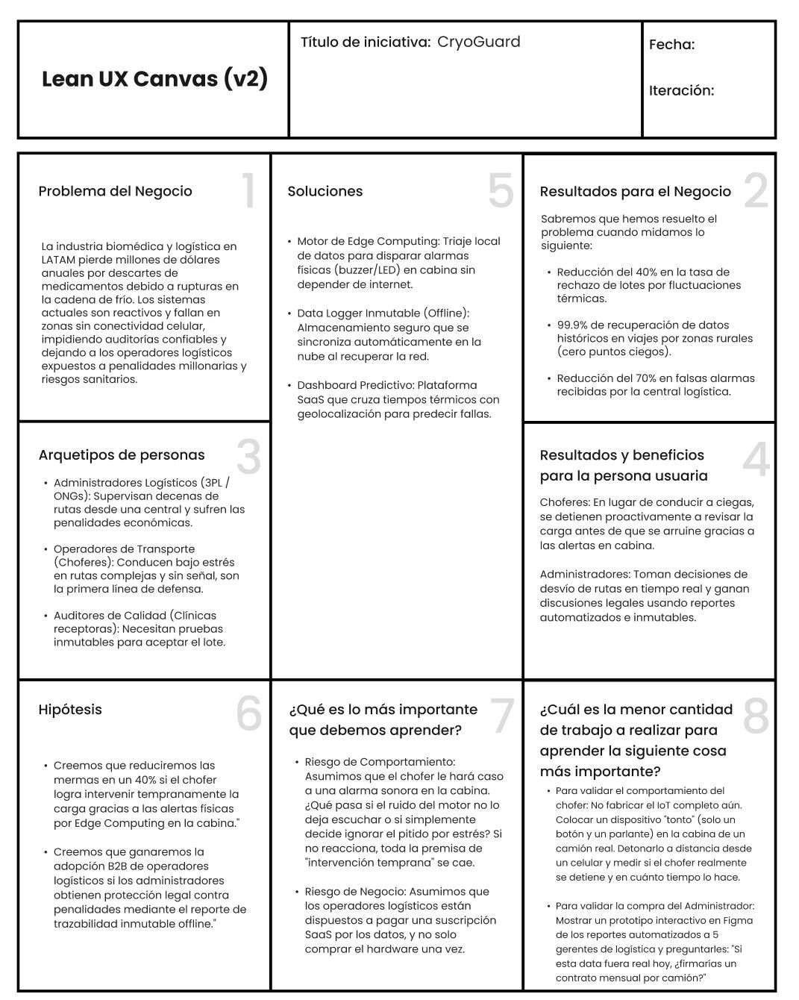
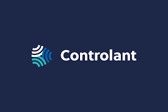

   
  
<strong>Universidad Peruana de Ciencias Aplicadas</strong>

  

  Ingeniería de Software   
  Periodo: 202610   
  1ASI0572 Desarrollo de Soluciones IOT   
  NCR: 6772   
  Docente: Marco Antonio Leon Baca   
  Informe de Trabajo Final   
  StartUp: CryoGuard   
  Producto: CryoGuard Pro   
  

  <table align="center">
    <tr>
      <th>Member</th>
      <th>Code</th>
    </tr>
    <tr>
      <td>Arias Segil, Marllely Anahi</td>
      <td>U202223984</td>
    </tr>
    <tr>
      <td>Hallasi Saravia, Miguel</td>
      <td>U202312391</td>
    </tr>
    <tr>
      <td>Miranda Ayasta, Rogger Faryd</td>
      <td>U202319239</td>
    </tr>
    <tr>
      <td>Sanchez Rios, Camila</td>
      <td>U202210973</td>
    </tr>
    <tr>
      <td>Vargas Javier, Jose Enrique</td>
      <td>U20221F693</td>
    </tr>
  </table>
    
Abril 2026

# Registro de Versiones del Informe

 
<table>
  <tr>
    <th>Versión</th>
    <th>Fecha</th>
    <th>Autor</th>
    <th>Descripción</th>
  </tr>
  <tr>
    <th>AV1</th>
    <td></td>
    <td></td>
    <td></td>
  </tr>
    <tr>
    <th>TB1</th>
    <td></td>
    <td></td>
    <td></td>
  </tr>
    <tr>
    <th>AV2</th>
    <td></td>
    <td></td>
    <td></td>
  </tr>
    <tr>
    <th>TB2</th>
    <td></td>
    <td></td>
    <td></td>
  </tr>
</table>

# Project Report Collaboration Insights

  <table>
    <tr>
      <td>Link del repositorio del informe</td>
      <td></td>
    </tr>
      <tr>
      <td>Link de los repositorios de la organización</td>
      <td></td>
    </tr>
      <tr>
      <td>Link del Event Storming</td>
      <td></td>
    </tr>
  </table>

   

  <h6> Evidencias AV1 </h6>
  <h6> Evidencias TB1 </h6>
  <h6> Evidencias AV2 </h6>
  <h6> Evidencias TB2 </h6>

# Contenido

- [Registro de Versiones del Informe](#registro-de-versiones-del-informe)
- [Project Report Collaboration Insights](#project-report-collaboration-insights)
- [Contenido](#contenido)
- [Student Outcome](#student-outcome)
- [Capítulo I: Introducción](#capítulo-i-introducción)
  - [1.1. Startup Profile](#11-startup-profile)
    - [1.1.1. Descripción de la Startup](#111-descripción-de-la-startup)
          - [**Visión**](#visión)
          - [**Misión**](#misión)
    - [1.1.2. Perfiles de integrantes del equipo](#112-perfiles-de-integrantes-del-equipo)
  - [1.2. Solution Profile](#12-solution-profile)
          - [**Descripción General de la Solución**](#descripción-general-de-la-solución)
          - [**Características Clave de la Solución**](#características-clave-de-la-solución)
          - [**Beneficios de la Solución**](#beneficios-de-la-solución)
          - [**Tecnología y Arquitectura**](#tecnología-y-arquitectura)
    - [1.2.1. Antecedentes y problemática](#121-antecedentes-y-problemática)
          - [**What? (¿Qué?)**](#what-qué)
          - [**When? (¿Cuándo?)**](#when-cuándo)
          - [**Where? (¿Dónde?)**](#where-dónde)
          - [**Who? (¿Quién?)**](#who-quién)
          - [**Why? (¿Por qué?)**](#why-por-qué)
          - [**How? (¿Cómo?)**](#how-cómo)
          - [**How much? (¿Cuánto?)**](#how-much-cuánto)
    - [1.2.2. Lean UX Process](#122-lean-ux-process)
      - [1.2.2.1. Lean UX Problem Statements](#1221-lean-ux-problem-statements)
      - [1.2.2.2. Lean UX Assumptions](#1222-lean-ux-assumptions)
      - [1.2.2.3. Lean UX Hypothesis Statements](#1223-lean-ux-hypothesis-statements)
      - [1.2.2.4. Lean UX Canvas](#1224-lean-ux-canvas)
  - [1.3. Segmentos objetivo](#13-segmentos-objetivo)
          - [Centros de salud rurales o urbanos:](#centros-de-salud-rurales-o-urbanos)
          - [ONGs y gestores de logística sanitaria:](#ongs-y-gestores-de-logística-sanitaria)
- [Capítulo II: Requirements Elicitation \& Analysis](#capítulo-ii-requirements-elicitation--analysis)
  - [2.1. Competidores](#21-competidores)
    - [2.1.1. Análisis competitivo](#211-análisis-competitivo)
    - [2.1.2. Estrategias y tácticas frente a competidores](#212-estrategias-y-tácticas-frente-a-competidores)
      - [Estrategias generales de posicionamiento](#estrategias-generales-de-posicionamiento)
      - [Estrategias ofensivas frente a competidores](#estrategias-ofensivas-frente-a-competidores)
      - [Estrategias defensivas](#estrategias-defensivas)
  - [2.2. Entrevistas](#22-entrevistas)
    - [2.2.1. Diseño de entrevistas](#221-diseño-de-entrevistas)
    - [2.2.2. Registro de entrevistas](#222-registro-de-entrevistas)
    - [2.2.3. Análisis de entrevistas](#223-análisis-de-entrevistas)
  - [2.3. Needfinding](#23-needfinding)
    - [2.3.1. User Personas](#231-user-personas)
    - [2.3.2. User Task Matrix](#232-user-task-matrix)
    - [2.3.3. User Journey Mapping](#233-user-journey-mapping)
    - [2.3.4. Empathy Mapping](#234-empathy-mapping)
  - [2.4. Big Picture EventStorming](#24-big-picture-eventstorming)
  - [2.5. Ubiquitous Language](#25-ubiquitous-language)

# Student Outcome

ABET – EAC - Student Outcome 4

**Criterio:** Capacidad de reconocer responsabilidades éticas y profesionales en situaciones de ingeniería y hacer juicios informados, considerando el impacto de las soluciones en contextos globales, económicos, ambientales y sociales.

<table>
  <tr>
    <td><b>Criterio específico</b></td>
    <td><b>Acciones realizadas</b></td>
    <td><b>Conclusiones</b></td>
  </tr>
  <tbody>
    <tr>
      <td><b>Reconoce responsabilidad ética y profesional en situaciones de ingeniería de software</b></td>
      <td>
        
<b>Miranda Ayasta, Rogger Faryd</b>

        
<b>AV1: </b> 

        
<b>TB1: </b> 

        
<b>AV2: </b> 

        
<b>TB2: </b> 

        
<b>Vargas Javier, Jose Enrique</b>

        
<b>AV1: </b> 

        
<b>TB1: </b> 

        
<b>AV2: </b> 

        
<b>TB2: </b> 

        
<b>Sanchez Rios, Camila</b>

        
<b>AV1: </b> 

        
<b>TB1: </b> 

        
<b>AV2: </b> 

        
<b>TB2: </b> 

        
<b>Arias Segil, Marllely Anahi</b>

        
<b>AV1: </b>Al diseñar la arquitectura y los modelos como el EventStorming o el Context Mapping, traté de asegurar que el sistema sea confiable, que permita monitoreo en tiempo real y que reduzca errores humanos. También consideré aspectos como la disponibilidad, la precisión de los datos y la capacidad de funcionar incluso sin conexión.

        
<b>TB1: </b> 

        
<b>AV2: </b> 

        
<b>TB2: </b> 

        
<b>Apellidos y Nombres</b>

        
<b>AV1: </b> 

        
<b>TB1: </b> 

        
<b>AV2: </b> 

        
<b>TB2: </b> 

      </td>
      <td></td>
    </tr>
  </tbody>
</table>

# Capítulo I: Introducción

## 1.1. Startup Profile

### 1.1.1. Descripción de la Startup

<h6> Nombre del Startup: CryoGuard </h6>

CryoGuard es una plataforma de logística predictiva diseñada para reducir significativamente las pérdidas en la cadena de frío de productos biomédicos y vacunas. Mientras que las soluciones estándar se limitan a reportar daños cuando ya es tarde, CryoGuard combina sensores de alta precisión con Edge Computing para auditar variables críticas (temperatura, vibración, aperturas) y predecir desviaciones térmicas antes de que comprometan el producto.

Diseñado para rutas complejas, el hardware cuenta con una autonomía energética extendida para trayectos prolongados y capacidad de almacenamiento offline para más de 50,000 registros, minimizando la pérdida de trazabilidad incluso en entornos sin conectividad en zonas sin cobertura. Al recuperar la conectividad, el sistema sincroniza la data automáticamente. Nuestra solución permite a centros de salud y operadores logísticos transformar su cadena de frío de reactiva a proactiva, asegurando el cumplimiento normativo y salvando inventarios críticos.

###### **Visión**

Visualizamos una logística sanitaria de 'mínimas pérdidas' en América Latina. Nuestra visión es que la tecnología predictiva de CryoGuard se convierta en el estándar que garantice la integridad de los productos transportados y tratamientos críticos. Transformaremos un sistema vulnerable en una red altamente confiable y totalmente auditable, asegurando que cada suministro llegue viable a su destino, sin importar los desafíos geográficos o la falta de conectividad.

###### **Misión**

Nuestra misión es blindar la cadena de frío del sector salud transformando datos en acciones preventivas. Proveemos a operadores logísticos y centros médicos trazabilidad altamente auditable y analítica predictiva para erradicar las mermas por fluctuaciones térmicas, garantizar el estricto cumplimiento normativo y asegurar la calidad clínica de cada envío.

### 1.1.2. Perfiles de integrantes del equipo

<table class="students-profile">
  <tr>
    <th>
      
    </th>
    <td valign="top">
      
<b>Jose Enrique Vargas Javier</b>

      
Me considero una persona proactiva, responsable y orientada a la mejora continua. Decidí optar por esta carrera porque siempre me ha motivado comprender cómo funcionan los sistemas y, sobre todo, cómo protegerlos frente a amenazas cada vez más sofisticadas.

    </td>
  </tr>
  <tr>
    <th>
      
    </th>
    <td valign="top">
      
<b>Miranda Ayasta, Rogger Faryd</b>

      
Soy estudiante de Ingeniería de Software, actualmente curso el 6.º ciclo de la carrera.
      A lo largo de mi formación he aprendido diversos lenguajes de programación, como C++, Python, JavaScript, HTML y CSS Me destaco por mi responsabilidad, mis habilidades para el trabajo en equipo y mi motivación constante por seguir aprendiendo.

    </td>
  </tr>
  <tr>
    <th>
      
    </th>
    <td valign="top">
      
<b>Camila Sanchez Rios</b>

      
Soy estudiante de la carrera de Ingeniería de Software en la Universidad Peruana de Ciencias Aplicadas, actualmente me encuentro en el octavo ciclo. Me gusta escuchar música y leer en los ratos libres y aprender más sobre la carrera.

    </td>
  </tr>
  <tr>
    <th>
      
    </th>
    <td valign="top">
      
<b>Miguel Angel Hallasi</b>

      
Estudiante del séptimo ciclo, motivado por el aprendizaje continuo y la adquisición de nuevas experiencias en desarrollo móvil, diseño de interfaces y trabajo colaborativo.

    </td>
  </tr>
  <tr>
    <th>
      
    </th>
    <td valign="top">
      
<b>Marllely Anahi Arias Segil</b>

      
Hola, mi nombre es Marllely Arias Segil. Soy estudiante 
      de Ingeniería de Software en la Universidad Peruana de 
      Ciencias Aplicadas (UPC), una persona empática, 
      responsable y comprometida con mi crecimiento 
      profesional. Me gusta trabajar en equipo y siempre busco 
      dar lo mejor de mí en cada proyecto. 

    </td>
  </tr>
</table>

## 1.2. Solution Profile

###### **Descripción General de la Solución**

CryoGuard es una plataforma de inteligencia operativa que transforma el transporte de productos médicos en un proceso predictivo y altamente auditable. En lugar de simplemente registrar datos, nuestro sistema procesa variables críticas (temperatura, aperturas, geolocalización) directamente en el dispositivo (Edge Computing) para detectar tendencias de riesgo térmico antes de que se materialice una falla.

Al detectar un riesgo inminente, CryoGuard detona protocolos de rescate en tiempo real (como alertas predictivas a los conductores y notificaciones de emergencia al centro de control) permitiendo decisiones operativas inmediatas que previenen la pérdida del lote. Diseñada para operar ininterrumpidamente, la solución garantiza una trazabilidad continua y verificable incluso en rutas sin cobertura celular, asegurando a operadores logísticos y centros de salud un cumplimiento normativo estricto y la mayor probabilidad de conservar la viabilidad de los envíos.

###### **Características Clave de la Solución**

- **Inteligencia Predictiva Offline (Edge Computing):** Análisis de riesgos térmicos procesados directamente en el dispositivo, sin depender de la nube, mediante evaluación de umbrales dinámicos y análisis de tendencias en series temporales (variación de temperatura en el tiempo).
  
Problema que resuelve: Evita que la carga se pierda al atravesar zonas sin cobertura celular. Al detectar un riesgo, el dispositivo no espera a tener internet; toma la decisión inmediata de detonar protocolos de rescate locales (como alertar al chofer) antes de que el daño sea irreversible.

- **Trazabilidad:** Almacenamiento redundante y encriptado en memoria física que registra cada segundo del historial del viaje.

Problema que resuelve: Elimina los "puntos ciegos" de auditoría. Garantiza a las autoridades sanitarias y laboratorios un alto nivel de cumplimiento normativo, asegurando que la data histórica del producto se preserve incluso ante fallos de conectividad, incluso si el vehículo sufre un apagón total de comunicaciones.

- **Auditoría Ambiental Integral:** Monitoreo cruzado de temperatura, humedad y vibraciones físicas excesivas (baches severos, caídas).
  
Previene el rechazo de lotes no solo por estrés térmico, sino por estrés mecánico. Identifica si la mala manipulación del transportista antes de que se materialice una ruptura de la cadena de frío, permitiendo deslindar responsabilidades económicas de manera exacta.

- **Geolocalización Cruzada con Tiempos Térmicos** Monitoreo GPS y geocercas sincronizadas con la capacidad de retención de frío del empaque modelada en función del tipo de empaque térmico y condiciones ambientales.

Detecta desvíos, paradas no autorizadas o tráfico pesado que amenazan el límite de tiempo del empaque térmico. Esto permite a la central logística redireccionar la carga a un puerto seguro cercano antes de que el hielo seco o gel refrigerante se agote.

- **Triaje de Alertas de Intervención Rápida:** Escalamiento de alarmas a dos niveles: físicas (visual/sonora para el operador local) y digitales (centro de control).

Empodera al chofer para tomar acciones correctivas inmediatas (ej. revisar el cierre del contenedor en la cabina). Al mismo tiempo, evita la "fatiga de notificaciones" en la central logística, enviando reportes a la nube únicamente cuando la desviación es crítica y requiere intervención remota.

###### **Beneficios de la Solución**

- **Intervención Preventiva:** Gracias al procesamiento en el borde (Edge Computing), el sistema alerta sobre tendencias de riesgo térmico con anticipación suficiente para intervención operativa de que se rompa la cadena de frío, permitiendo la intervención física del transportista o el desvío de la ruta para salvar el lote antes de que ocurra el daño.
  
- **Cumplimiento Normativo:** El almacenamiento local resistente a pérdida de datos y con integridad verificable garantiza una bitácora forense de cada viaje. Esto permite a laboratorios y centros de salud demostrar ante las autoridades regulatorias que no se evidencian desviaciones críticas en las condiciones del transporte, eliminando el riesgo de demandas o rechazo de lotes por falta de evidencia.

- **Visibilidad Logística:** Al combinar almacenamiento offline con sincronización en la nube, el sistema asegura la recuperación total de la trazabilidad. Las centrales logísticas eliminan el estrés de perder de vista sus activos críticos al atravesar zonas rurales o geográficamente complejas.

- **Inteligencia Comercial y Optimización de Procesos:** La plataforma transforma el monitoreo crudo en datos estructurados listos para procesos de Business Intelligence. Esto permite a los gerentes logísticos analizar patrones históricos, evaluar objetivamente el rendimiento de sus transportistas y tomar decisiones estratégicas basadas en evidencia dura para optimizar sus redes de distribución.

###### **Tecnología y Arquitectura**

El dispositivo está diseñado para operar con baterías de bajo consumo, optimizando la frecuencia de muestreo y transmisión para maximizar la autonomía durante trayectos prolongados.

La arquitectura de CryoGuard está estructurada en un modelo de tres capas para garantizar un flujo de datos continuo, una latencia mínima en emergencias y una alta disponibilidad de la información:

- **Capa Física y Procesamiento**
El hardware está compuesto por un microcontrolador de bajo consumo integrado con un arreglo de sensores (temperatura, humedad, acelerómetro y magnético de apertura). Aquí reside nuestro motor de Edge Computing: en lugar de ser un simple transmisor, el dispositivo ejecuta localmente algoritmos de evaluación de umbrales.

Las decisiones que toma: Si las variables superan los límites configurados, el sistema no espera a tener internet; detona acciones autónomas inmediatas, como activar alarmas físicas (buzzer y LEDs) para el transportista y registrar el evento crítico en su memoria interna no volátil. Esto asegura una auditoría forense ininterrumpida incluso en zonas sin cobertura celular.

- **Capa de Red y Backend**
Actúa como el motor de ingesta y orquestación de datos. Cuando el dispositivo detecta una red disponible (vía módulo celular o protocolos IoT), empaqueta el historial almacenado offline y lo transmite de forma segura hacia nuestra infraestructura en la nube.

El flujo de datos: El backend recibe la telemetría cruda, valida la integridad de los paquetes y procesa la información en bases de datos relacionales y de series temporales. Un motor de reglas en la nube clasifica la severidad de los eventos y se encarga de disparar webhooks o correos electrónicos de emergencia a los centros de control logístico.

- **Capa de Aplicación e Inteligencia Comercial**
Es la interfaz donde los datos estructurados se transforman en estrategia operativa. A través de aplicaciones web y móviles, los clientes acceden a la plataforma para interactuar con la información.

El impacto visual: Los operadores logísticos visualizan dashboards dinámicos que muestran el estado de la flota en tiempo real, rastreo por geolocalización y el estatus térmico de cada contenedor. El sistema incluye herramientas de análisis de datos para generar reportes de cumplimiento normativo y métricas de rendimiento, permitiendo a los gerentes optimizar rutas y evaluar la eficiencia de su red de distribución basándose en datos concretos.

### 1.2.1. Antecedentes y problemática

Mediante la técnica de “5W's & 2H’s”, se han identificado los antecedentes y la problemática relacionados con el transporte de vacunas y medicamentos sensibles a la temperatura, lo cual ha motivado el desarrollo de CryoGuard como una solución tecnológica orientada a fortalecer la cadena de frío.

###### **What? (¿Qué?)**

La pérdida de eficacia, viabilidad y el consecuente descarte masivo de productos biomédicos (vacunas y medicamentos termosensibles) debido a rupturas en la cadena de frío y daños mecánicos no detectados durante el transporte logístico.

###### **When? (¿Cuándo?)**

El problema se materializa en los "puntos ciegos" operativos: durante las transferencias de carga, retrasos imprevistos por tráfico o retenes, y en los últimos kilómetros de trayectos largos donde la autonomía de los empaques térmicos pasivos se agota antes de llegar a su destino.

###### **Where? (¿Dónde?)**

En rutas de transporte interprovincial y rural que atraviesan geografías complejas (cambios drásticos de altitud y microclimas), especialmente en zonas de América Latina donde la topografía y la falta de cobertura celular impiden la transmisión de alertas de auxilio cuando el vehículo falla.

###### **Who? (¿Quién?)**

Los actores que asumen el costo logístico y financiero: laboratorios farmacéuticos productores, operadores logísticos tercerizados (3PL) que enfrentan penalidades contractuales, y entidades del Estado (Ministerios de Salud) o clínicas privadas que pierden capacidad de atención médica.

###### **Why? (¿Por qué?)**

Por la dependencia de metodologías de auditoría reactivas ("post-mortem"). La industria utiliza data loggers básicos que solo revelan el historial de temperatura al final del viaje, lo que imposibilita la toma de decisiones estratégicas o el rescate de la carga mientras el vehículo aún está en ruta.

###### **How? (¿Cómo?)**

El quiebre de la cadena de frío ocurre por fallos en los sistemas de refrigeración de los camiones (apagados de motor), aperturas de puertas no autorizadas que liberan la temperatura óptima, exposición prolongada al clima externo durante las descargas, y estrés físico por vibraciones severas en carreteras en mal estado que generan micro-roturas en los viales.

###### **How much? (¿Cuánto?)**

El impacto financiero y sanitario es masivo. Según datos de la Organización Mundial de la Salud (OMS), hasta el 50% de las vacunas en contextos con infraestructura limitada a nivel mundial pueden perderse debido a fallas logísticas y de control de temperatura. A nivel financiero, estudios de inteligencia comercial (como IQVIA) estiman que la industria biofarmacéutica pierde más de $35,000 millones de dólares anuales por fallas en la cadena de frío, sin contar los costos ocultos de logística inversa para desechar los materiales biopeligrosos dañados.

### 1.2.2. Lean UX Process

#### 1.2.2.1. Lean UX Problem Statements

- **Usuario (Operador en ruta)**

El evento: Falla técnica del camión o estrés térmico en pleno tránsito.

La limitación: Carencia de notificaciones locales (en cabina) en tiempo real.

La consecuencia: Entrega de medicamentos inservibles.

Declaración Lean UX: > "Durante una caída de temperatura o impacto físico en ruta, el operador carece de alertas inmediatas en cabina, lo que le impide accionar protocolos de rescate a tiempo y resulta en la entrega de medicamentos irreversiblemente dañados."

- **Administrador (Gerente Logístico o de Salud)**

El evento: Gestión simultánea de múltiples envíos en zonas de conectividad variable.

La limitación: Dependencia de data loggers reactivos (post-viaje) o pérdida de señal.

La consecuencia: Incapacidad de decisión y pérdida financiera.

Declaración Lean UX: > "Al supervisar múltiples rutas, el administrador sufre puntos ciegos de trazabilidad y retraso en la recepción de datos, lo que le impide desviar unidades en peligro y genera pérdidas económicas por penalidades o descarte de inventario."

#### 1.2.2.2. Lean UX Assumptions

- **Business Outcomes**

Hipótesis de Reducción de Mermas: Creemos que al transicionar de un monitoreo reactivo a uno predictivo, nuestros clientes reducirán sus pérdidas económicas por descarte de medicamentos en al menos con un objetivo inicial de reducción del 30–40%.

Hipótesis de Retención/Ventas: Creemos que al garantizar una trazabilidad completa en condiciones operativas normales auditable (cero puntos ciegos), los operadores logísticos podrán ganar más licitaciones con el Estado o grandes farmacéuticas.

- **Users**

Operador de transporte (Chofer): Conduciendo en rutas de topografía compleja, sin señal celular y con alta carga de estrés al volante.

Administrador Logístico (Central): Supervisando simultáneamente decenas de unidades en tránsito, abrumado por notificaciones y con presión por evitar penalidades económicas.

- **Users Outcomes & Benefits**

Intervención Temprana: Si proporcionamos predicciones de riesgo térmico en la plataforma web, entonces el administrador logístico podrá desviar la unidad al centro de salud más cercano antes de que la cadena de frío se rompa.

Seguridad Forense: Si entregamos un reporte automatizado resistente a pérdida de datos y con integridad verificable al finalizar el viaje, entonces el personal de la clínica receptora firmará la conformidad del lote en segundos, sin temor a responsabilidades legales.

- **Feature Assumptions**

Hipótesis del Edge Computing y Alarmas Físicas (LED/Buzzer): Creemos que si el dispositivo detona una alarma sonora fuerte en la cabina al detectar una caída térmica offline, entonces el chofer se detendrá inmediatamente a revisar el cierre del contenedor, salvando la carga.

Hipótesis del Sensor de Apertura: Creemos que si cruzamos el sensor magnético de apertura con el GPS, entonces el administrador podrá diferenciar instantáneamente entre una falla técnica del camión y un intento de robo o sabotaje en ruta.

Hipótesis del Almacenamiento Offline: Creemos que si el dispositivo guarda la data localmente en zonas rurales y la sincroniza al recuperar red, entonces eliminaremos los rechazos de lotes médicos causados por "falta de datos" en la auditoría final.

- **Business Assumptions**

Hipótesis de Valor: Creemos que las empresas logísticas están dispuestas a pagar una suscripción premium (SaaS/HaaS) por CryoGuard, porque el costo mensual de nuestra plataforma es marginal comparado con el costo de perder un solo lote de vacunas especializadas.

Hipótesis de Cumplimiento: Asumimos que las nuevas normativas sanitarias obligarán a todas las clínicas a exigir trazabilidad ininterrumpida, convirtiendo a CryoGuard de un "lujo tecnológico" a una necesidad regulatoria.

- **User Assumptions**

Fricción Tecnológica Cero: Asumimos que el personal médico no tiene tiempo ni conocimientos técnicos; por lo tanto, si el dispositivo requiere "emparejamiento Bluetooth manual" o configuraciones complejas, no lo usarán. Debe ser de encendido automático al cerrar la caja.

Fatiga de Alarmas: Asumimos que si enviamos notificaciones a la central por cada variación mínima de temperatura, el administrador las ignorará. Por ello, la nube solo debe alertar cuando el algoritmo detecte un riesgo inminente de daño.

#### 1.2.2.3. Lean UX Hypothesis Statements

Creemos que al dotar a los operadores de transporte médico con herramientas de Edge Computing y alertas predictivas en cabina, lograremos que intervengan proactivamente antes de que ocurra una ruptura térmica, incrementando la probabilidad de mantener la viabilidad de los tratamientos críticos durante su trayecto.

Sabremos que la solución es efectiva y el modelo de negocio es viable cuando, tras los primeros pilotos, comprobemos empíricamente que:

- Tasa de Intervención Temprana: El operador atiende y reacciona a las alertas físicas (LED/Buzzer) en la cabina en un tiempo menor a 15 minutos, evitando la exposición prolongada del producto.

- Reducción de Mermas: Logramos un objetivo inicial de reducción del 30–40%, en la tasa de rechazo de lotes o pérdida total de inventario atribuible a fluctuaciones térmicas en las rutas monitoreadas.

- Integridad de la Trazabilidad: Alcanzamos un 99.9% de recuperación de datos históricos al finalizar los viajes, demostrando que el almacenamiento offline elimina los puntos ciegos causados por las zonas sin cobertura celular.

- Eficiencia en el Centro de Control: Disminuimos en una reducción significativa el volumen de falsas alarmas o notificaciones irrelevantes recibidas por el administrador, demostrando que el triaje de alertas funciona correctamente.

- Cumplimiento Normativo: La mayoría de los viajes completados generan automáticamente un reporte forense resistente a pérdida de datos y con integridad verificable aceptado por los centros de salud receptores sin disputas legales.

#### 1.2.2.4. Lean UX Canvas

## 1.3. Segmentos objetivo

###### Redes de Centros de Salud (Urbanos y Rurales)

Nos dirigimos a las entidades administrativas (privadas o públicas) encargadas de abastecer y gestionar clínicas, hospitales y postas médicas, garantizando que el inventario farmacéutico llegue viable desde la central hasta el punto de atención final.

- Tamaño: Redes de salud medianas a grandes, que administran desde 10 hasta decenas de puntos de atención distribuidos en distintas geografías y que realizan despachos de medicamentos recurrentes.

- Capacidad Económica: Presupuestos institucionales (financiación estatal en el sector público o corporativa en el privado). Su disposición de pago se justifica al comparar el costo de la plataforma CryoGuard frente al alto costo de desechar lotes de vacunas por fallas en sus propios traslados internos.

- Nivel Tecnológico: Altamente asimétrico. En la central urbana (donde están los administradores) cuentan con conectividad estable y personal capaz de usar dashboards web. Sin embargo, en los puntos de destino (rurales) el personal médico carece de formación técnica y la conectividad es nula. Por ello, requieren que el dispositivo sea autónomo y no requiera configuraciones complejas por parte del usuario final.

###### ONGs y Gestores de Logística Sanitaria Humanitaria

Nos enfocamos en organizaciones dedicadas a la planificación y ejecución de campañas de salud, distribución de ayuda médica y programas de inmunización en zonas vulnerables o de difícil acceso.

- Tamaño: Operaciones de alcance regional, nacional o internacional que movilizan altos volúmenes de tratamientos médicos críticos durante campañas de salud o respuestas a emergencias.

- Capacidad Económica: Sus presupuestos provienen de fondos de cooperación internacional, donaciones o subvenciones. Son muy estrictos con el gasto, pero tienen la obligación legal y moral de garantizar a sus donantes que la ayuda llega en estado óptimo, lo que hace viable la inversión en trazabilidad.

- Nivel Tecnológico: Acostumbrados a operar en condiciones de infraestructura extrema. Necesitan tecnología de despliegue rápido. Sus centrales requieren datos precisos y reportes automatizados para justificar el uso de fondos, mientras que sus operadores en campo dependen de las alertas físicas del dispositivo y del almacenamiento offline debido a la falta total de red celular en sus misiones.

# Capítulo II: Requirements Elicitation & Analysis

## 2.1. Competidores
### 2.1.1. Análisis competitivo

<table border="1" cellspacing="0" cellpadding="6">
  <tr>
    <th colspan="5">
      <b>Objetivo del análisis:</b> Identificar el posicionamiento competitivo de CryoGuard en el mercado de soluciones IoT para monitoreo de cadena de frío en el transporte de medicamentos y productos biomédicos sensibles, entendiendo las ventajas diferenciales y oportunidades de mejora frente a competidores reales del sector. 
    </th>
  </tr>
  <tr>
    <th></th>
    <th>CryoGuard </th>
    <th>Sensitech (Carrier) </th>
    <th>ELPRO-BUCHS AG</th>
    <th>Controlant Ehf </th>
  </tr>
  <tr>
    <th colspan="5"><b>PERFIL</b></th>
  </tr>
  <tr>
    <td><b>Overview</b></td>
    <td>Startup tecnológica enfocada en monitoreo IoT para cadena de frío en transporte de vacunas y medicamentos sensibles. Solución integra sensores IoT, procesamiento edge computing y sincronización cloud, diseñada para operar en entornos con conectividad limitada.</td>
    <td>Líder mundial en visibilidad de cadena de suministro, parte de Carrier Global Corporation. Adquirió el negocio de Monitoring Solutions de Berlinger & Co. AG en agosto de 2024, expandiendo su portafolio en ciencias de la vida y salud global.</td>
    <td>Empresa suiza fundada en 1986, especializada en monitoreo para industrias reguladas (farmacéutica, biotecnología). Ofrece soluciones GxP-compliant incluyendo LIBERO (monitoreo en tiempo real 4G/NB-IoT), ECOLOG-PRO y elproCLOUD.</td>
    <td>Empresa islandesa fundada en 2007, especializada en transformación digital de la cadena de suministro farmacéutica. Sus dispositivos Saga (data loggers reutilizables con conectividad IoT) han logrado tasas de entrega exitosa >99% en clientes farmacéuticos.</td>
  </tr>
  <tr>
    <td><b>Ventaja competitiva</b></td>
    <td>Procesamiento edge computing para operación offline completa; monitoreo de múltiples variables (temp, humedad, vibración, GPS, apertura); alertas multisensoriales (LED, buzzer, notificaciones); diseño específico para entornos con conectividad limitada en regiones en desarrollo.</td>
    <td>Portafolio integral de monitoreo convencional y en tiempo real; respaldo de Carrier (NYSE:CARR); presencia global con ~85 empleados dedicados del negocio de Berlinger; soluciones para farmacéutica, ensayos clínicos y salud global.</td>
    <td>Alta precisión y confiabilidad validada; cumplimiento 100% GxP; software validado 21 CFR Part 11; soluciones que utilizan redes 4G LTE y NB-IoT; servicios de consultoría, instalación y calibración. </td>
    <td>Tasa de éxito en entregas >99% (vs industria con ~35% de pérdida histórica); reducción de 53kg CO2e por caja de medicamentos; red de conectividad global a través de Vodafone Business IoT (570 redes en 180+ países); dispositivos reutilizables.</td>
  </tr>
  <tr>
    <th colspan="5"><b>PERFIL DE MARKETING</b></th>
  </tr>
  <tr>
    <td><b>Mercado objetivo</b></td>
    <td>Centros de salud rurales y urbanos, ONGs humanitarias, operadores logísticos de productos médicos</td>
    <td>Empresas farmacéuticas globales, distribuidores, organizaciones de salud global (UNICEF, OMS), logística de ensayos clínicos.</td>
    <td>Industria farmacéutica, biotecnología, hospitales de alta complejidad, centros de investigación clínica, farmacias.</td>
    <td>Empresas farmacéuticas y de logística que buscan cero desperdicio en cadena de suministro. Clientes incluyen grandes farmacéuticas globales.</td>
  </tr>
  <tr>
    <td><b>Estrategias de marketing</b></td>
    <td>Marketing digital B2B/B2G, alianzas con ONGs y ministerios de salud, participación en conferencias de logística sanitaria, modelo freemium para adopción inicial.</td>
    <td>Venta directa a través de fuerza de ventas global, adquisiciones estratégicas (Berlinger), marketing de confianza y trayectoria de 30+ años.</td>
    <td>Presencia en ferias sectoriales (Expopharm 2025), marketing técnico especializado, venta directa con equipos de expertos, servicios de consultoría GxP.</td>
    <td>Alianzas estratégicas (Vodafone Business IoT), marketing de sostenibilidad y reducción de huella de carbono, casos de éxito con métricas cuantificables.</td>
  </tr>
  <tr>
    <th colspan="5"><b>PERFIL DE PRODUCTO</b></th>
  </tr>
  <tr>
    <td><b>Productos & Servicios</b></td>
    <td>Dispositivo IoT con sensores de temperatura, humedad, vibración, GPS, sensor de apertura; alertas LED/buzzer/notificaciones; dashboard web, app móvil, almacenamiento local SD, sincronización cloud.</td>
    <td>TempTale Geo-X (monitoreo temperatura + GPS en tiempo real), Berlinger solutions (monitoreo convencional y en tiempo real), software y analytics.</td>
    <td>LIBERO Gx (monitoreo 4G/NB-IoT en tiempo real), LIBERO Cx (PDF loggers para aplicaciones life science), ECOLOG-PRO (monitoreo ambiental inalámbrico), elproCLOUD. </td>
    <td>Saga devices (data loggers reutilizables con conectividad IoT), plataforma central de gestión, dashboard para monitoreo de temperatura, ubicación y exposición a luz.</td>
  </tr>
  <tr>
    <td><b>Precios & Costos</b></td>
    <td>Modelo freemium (monitoreo básico limitado) con planes premium escalables por volumen de dispositivos, funcionalidades de analytics y almacenamiento cloud.</td>
    <td>Modelo enterprise con contratos anuales; precios no públicos (solución premium para grandes farmacéuticas).</td>
    <td>Alto costo inicial por hardware y software de validación; precios enterprise con contratos anuales y servicios profesionales adicionales.</td>
    <td>Modelo basado en dispositivos reutilizables + suscripción; inversión inicial significativa pero con ROI por reducción de pérdidas.</td>
  </tr>
  <tr>
    <td><b>Canales de distribución</b></td>
    <td>Venta directa B2B/B2G, distribuidores especializados en logística sanitaria, marketplaces de tecnología para salud, alianzas con ONGs.</td>
    <td>Red global de distribución (Carrier), fuerza de ventas directa en América del Norte, Europa y Asia.</td>
    <td>Venta directa con equipos de expertos en Europa y América del Norte, partners de integración certificados.</td>
    <td>Distribución global a través de alianza con Vodafone Business IoT (570 redes en 180+ países).</td>
  </tr>

<tr>
    <th colspan="5"><b>Análisis SWOT</b></th>
  </tr>
<tr>
    <td><b>Fortalezas</b></td>
    <td>- Procesamiento edge computing para operación offline total - Monitoreo de 5+ variables (temp, humedad, vibración, GPS, apertura) - Alertas multisensoriales (LED, buzzer, notificaciones) - Almacenamiento local en tarjeta SD - Diseñado específicamente para entornos con conectividad limitada - Bajo costo relativo vs soluciones enterprise</td><td>- Respaldo de Carrier (NYSE:CARR) con recursos significativos - Portafolio integral post-adquisición de Berlinger - Presencia global establecida por 30+ años - Soluciones para farmacéutica, ensayos clínicos y salud global - Reconocimiento de marca en el sector </td> <td>- Alta precisión y confiabilidad documentada - Cumplimiento 100% GxP y 21 CFR Part 11 - Tecnología 4G LTE y NB-IoT de última generación - Servicios completos de validación y calibración - Historial comprobado en la industria </td> <td>- Tasa de éxito en entregas >99% (vs 65% industria) - Red global de conectividad con Vodafone (570 redes) - Reducción documentada de 53kg CO2e por caja - Prevención de 16,700 toneladas CO2e en 2022 - Dispositivos reutilizables</td>
  </tr>
  <tr>
    <td><b>Debilidades</b></td>
    <td>- Marca nueva sin trayectoria comprobada en sector salud - Falta de certificaciones regulatorias (FDA, OMS, ISO 13485) en etapa inicial - Ecosistema limitado vs competidores establecidos - Recursos limitados para ventas y marketing global - Dependencia de alianzas para escalar rápidamente</td> <td>- Modelo de negocio tradicional vs startups ágiles - Posible rigidez burocrática por ser parte de Carrier - Costos elevados para clientes pequeños - Curva de aprendizaje de integración post-adquisición </td> <td>- Alto costo inicial de hardware y software - Requiere infraestructura técnica para implementación - Curva de aprendizaje pronunciada para personal no técnico - Dependencia de conectividad celular para tiempo real </td> <td>- Dependencia de conectividad celular (aunque extensa, no es 100% global) - Costo inicial significativo de dispositivos - Presencia menor en mercados emergentes vs Europa - Requiere integración con sistemas del cliente </td>
  </tr>
  <tr>
    <td><b>Oportunidades</b></td>
    <td>- Crecimiento del mercado de monitoreo de cadena de frío (CAGR 12.6% hasta 2030) - Necesidad creciente en regiones en desarrollo post-pandemia - Inversión global en infraestructura de salud y vacunación - Alianzas con ministerios de salud y ONGs internacionales - Expansión a alimentos perecederos y órganos para trasplantes - Desarrollo de funcionalidades predictivas con IA</td> <td>- Consolidación como líder indiscutible post-adquisición de Berlinger - Expansión en segmento de salud global y mercados emergentes - Desarrollo de soluciones más asequibles para competir con startups - Integración con plataformas de sostenibilidad </td> <td>- Expansión en mercados de América Latina y Asia-Pacífico - Desarrollo de versiones más económicas para competir en segmento medio - Alianzas con fabricantes de vacunas para monitoreo integrado - Crecimiento en monitoreo ambiental de laboratorios </td> <td>- Expansión geográfica a mercados emergentes donde CryoGuard puede competir - Desarrollo de soluciones para pequeños proveedores farmacéuticos - Integración con blockchain para trazabilidad inmutable - Liderazgo en métricas de sostenibilidad como diferenciador </td>
  </tr>
  <tr>
    <td><b>Amenazas</b></td>
    <td>- Competidores establecidos (Sensitech, ELPRO, Controlant) expandiéndose a segmento de bajo costo - Commoditización de sensores IoT reduciendo barreras de entrada - Dificultad para obtener certificaciones regulatorias sin historial - Preferencia de compradores institucionales por marcas con trayectoria - Posible entrada de gigantes tecnológicos (Amazon, Google) al sector salud</td> <td>- Startups ágiles con modelos freemium disruptivos (como CryoGuard) - Presiones de precio por parte de grandes compradores (gobiernos, ONGs) - Cambios en regulaciones internacionales de cadena de frío - Competencia de soluciones open-source IoT de bajo costo </td> <td>- Startups con soluciones más económicas y ágiles en mercados emergentes - Soluciones integradas de fabricantes de vacunas con monitoreo propio - Plataformas logísticas con soluciones nativas (Uber Health, Amazon Pharmacy) - Requisitos regulatorios cada vez más estrictos</td> <td>- Competidores directos con soluciones similares pero mayor respaldo (Sensitech, ELPRO) - Startups locales en mercados emergentes con ventaja de precio significativa - Commoditización de tecnología IoT reduciendo diferenciación - Concentración del mercado en pocos grandes jugadores </td>
  </tr>

</table>

### 2.1.2. Estrategias y tácticas frente a competidores

#### Estrategias generales de posicionamiento

**1. Especialización en entornos con conectividad limitada**

**Objetivo:** Diferenciarnos como la única solución IoT que opera de manera confiable en zonas rurales y regiones en desarrollo sin dependencia de conectividad continua.

**Tácticas:**
- Desarrollar capacidades exclusivas de procesamiento edge computing para operación offline total.
- Optimizar el almacenamiento local con capacidad extendida para trayectos de hasta 7 días sin sincronización.
- Implementar sincronización inteligente por lotes al recuperar conectividad.
- Diseñar una interfaz de usuario que funcione completamente sin internet (modo avión nativo).

**1. Enfoque en simplicidad y bajo costo para ONGs y centros de salud rurales**

**Objetivo:** Ofrecer la solución más accesible y fácil de usar del mercado para organizaciones con recursos técnicos y financieros limitados.

**Tácticas:**
- Crear un sistema de onboarding visual con tutoriales en video offline (sin necesidad de streaming).
- Desarrollar alertas interpretables universalmente (códigos de color, iconos y sonidos).
- Implementar configuración plug-and-play sin necesidad de calibración técnica.
- Diseñar dashboards preconfigurados por tipo de institución (centro de salud, ONG u operador logístico).

**3. Posicionamiento en sostenibilidad y reducción de pérdidas**

**Objetivo:** Diferenciarnos como la solución con mayor impacto documentado en reducción de pérdidas de medicamentos y huella de carbono.

**Tácticas:**
- Calcular y publicar métricas de reducción de desperdicio por dispositivo implementado.
- Desarrollar reportes automáticos de sostenibilidad para donantes y financiadores de ONGs.
- Crear la certificación CryoGuard Verified para envíos que mantuvieron cadena de frío completa.
- Establecer alianzas con organizaciones ambientales para validar la reducción de emisiones por medicamentos no desperdiciados.

#### Estrategias ofensivas frente a competidores

**1. Contra Sensitech (Carrier)**

**Debilidad a explotar:** Dependencia de conectividad celular continua y alto costo de implementación en regiones en desarrollo.

**Tácticas:**
- Lanzar campañas comparativas destacando capacidad offline frente a la dependencia de conectividad de Sensitech.
- Implementar un programa de migración asistida para organizaciones que buscan reducir costos operativos.
- Ofrecer precios significativamente más competitivos (40-60% menos) para el segmento de salud pública.
- Construir mensajería centrada en monitoreo que funciona donde la señal no llega.
- Documentar casos de éxito en zonas rurales de Latinoamérica y África subsahariana.

**2. Contra ELPRO-BUCHS AG**

**Debilidad a explotar:** Alto costo inicial de hardware y software de validación, y complejidad técnica para personal no especializado.

**Tácticas:**
- Posicionarnos como ELPRO para el resto del mundo: misma calidad, menor precio.
- Ofrecer un modelo freemium que permita prueba gratuita sin inversión inicial.
- Eliminar costos ocultos de calibración y consultoría.
- Diseñar una interfaz enfocada en personal de salud sin formación técnica.
- Aplicar certificaciones progresivas que reduzcan barreras regulatorias iniciales.

 **3. Contra Controlant Ehf**

**Debilidad a explotar:** Dependencia de red Vodafone (no disponible en todas las regiones) y enfoque en grandes farmacéuticas.

**Tácticas:**
- Posicionarnos como una solución independiente de operador de telecomunicaciones.
- Incorporar almacenamiento local como respaldo cuando la red no está disponible.
- Dirigir campañas a mercados donde Vodafone tiene presencia limitada (por ejemplo, partes de Latinoamérica y Sudeste Asiático).
- Definir precios accesibles para volúmenes pequeños y medianos frente al enfoque enterprise de Controlant.
- Desarrollar versiones desechables de bajo costo para campañas de vacunación masiva.

**4. Contra Temptime Corporation**

**Debilidad a explotar:** Sin alertas en tiempo real, monitoreo post-evento e indicadores desechables que generan residuos.

**Tácticas:**
- Desarrollar mensajería centrada en saber antes de que sea demasiado tarde frente a saber después de que el daño está hecho.
- Ejecutar campañas de sostenibilidad que destaquen la reutilización de dispositivos frente a residuos de indicadores desechables.
- Desarrollar una versión económica de CryoGuard para competir directamente en precio con Temptime.
- Crear alianzas con organizaciones ambientales para posicionar CryoGuard como opción ecológica.
- Ofrecer dashboard comparativo en tiempo real frente a informe post-evento.

#### Estrategias defensivas

**1. Ante posible comoditización de sensores IoT**

**Tácticas:**
- Desarrollar continuamente funcionalidades diferenciadoras (IA predictiva, blockchain para trazabilidad inmutable e integración con sistemas de salud nacionales).
- Crear un programa de actualización tecnológica para clientes existentes con precios preferenciales.
- Construir una comunidad de usuarios para co-crear funcionalidades específicas por región.
- Desarrollar integraciones exclusivas con proveedores locales de logística médica en cada mercado.

 **2. Protección frente a entrada de grandes competidores (Amazon Pharmacy, Uber Health y gigantes tecnológicos)**

**Tácticas:**
- Formar alianzas estratégicas con ministerios de salud y ONGs internacionales (UNICEF, OMS y GAVI).
- Negociar contratos a largo plazo con precios congelados para organizaciones de salud pública.
- Desarrollar especialización vertical por tipo de producto (vacunas pediátricas, insulina y órganos para trasplantes).
- Fortalecer un branding centrado en tecnología para salud pública y no solo en tecnología para ganancias.
- Buscar certificaciones regulatorias tempranas (ISO 13485 y certificación OMS) como barrera de entrada.

**3. Protección frente a competidores locales de bajo costo en mercados emergentes**

**Tácticas:**
- Aplicar un modelo freemium que permita adopción gratuita mientras se monetizan funcionalidades premium.
- Incluir programa de capacitación y soporte técnico como valor agregado que competidores locales no ofrecen.
- Desarrollar versiones específicas por país con integraciones a sistemas nacionales de salud.
- Establecer alianzas con universidades locales para investigación y validación de eficacia.
- Definir precios adaptados por región (sin precio único global).

**4. Ante posible consolidación del mercado (adquisiciones de startups por grandes players)**

**Tácticas:**
- Mantener la independencia como valor diferencial: no somos parte de una corporación, somos parte de tu misión de salud.
- Construir una comunidad de usuarios leales que valore el enfoque humanitario sobre el corporativo.
- Diversificar fuentes de financiamiento (grants de fundaciones de salud e inversión de impacto social).
- Desarrollar tecnología propietaria difícil de replicar (edge computing con algoritmos específicos para cadena de frío).

## 2.2. Entrevistas
La finalidad de realizar entrevistas es obtener un alcance más completo sobre las experiencias, perspectivas y opiniones de los segmentos de mercado definidos. Nuestro objetivo es recolectar información valiosa que nos permita conocer mejor a nuestro público objetivo.

### 2.2.1. Diseño de entrevistas

**Segmento 1: Centros de salud rurales o urbanos**

**Perfil de entrevistados:** Operadores y supervisores responsables del transporte de vacunas y medicamentos sensibles a temperatura.

**Preguntas principales:**
1. ¿Podrías contarme cómo realizan actualmente el monitoreo de temperatura durante el transporte de vacunas y medicamentos desde tu centro de salud?
2. ¿Cuáles son los mayores retos que enfrentas al momento de transportar productos que requieren cadena de frío?
3. ¿Has tenido pérdidas o incidentes por rompimiento de la cadena de frío durante el transporte? ¿Cómo lo detectaron y cómo lo resolvieron?
4. ¿Qué tan importante es para ti recibir alertas en tiempo real cuando la temperatura del contenedor se sale del rango permitido?
5. ¿Utilizas algún sistema o herramienta tecnológica para monitorear las condiciones del transporte? ¿Cuál y cómo te va con ella?

**Preguntas complementarias:**
1. ¿Cómo te enteras actualmente si una vacuna o medicamento se ha dañado durante el traslado? ¿Lo descubres al llegar o durante el trayecto?
2. ¿Qué tipo de información o reportes te gustaría tener al finalizar cada envío para respaldar que los productos llegaron en buen estado?
3. ¿Qué dispositivos tecnológicos utilizas en tu trabajo diario (laptop, celular, tablet, termómetros digitales, dataloggers)?
4. ¿Qué tan frecuente es el problema de falta de conexión a internet durante las rutas de transporte en tu zona?
5. ¿Cómo crees que una solución tecnológica de monitoreo podría ayudarte a reducir pérdidas y mejorar la seguridad de los medicamentos que transportas?
6. ¿Qué factores son más importantes para ti al evaluar una solución de monitoreo: precio, facilidad de uso, confiabilidad, duración de batería o capacidad de funcionar sin internet?

**Segmento 2: ONGs y gestores de logística sanitaria (ej. UNICEF, MINSA, OPS, Cruz Roja)**

**Perfil de entrevistados:** Administradores y planificadores de rutas, responsables de garantizar que los productos lleguen intactos a comunidades de difícil acceso.

**Preguntas principales:**
1. ¿Cómo gestionan actualmente la trazabilidad y el monitoreo de las condiciones ambientales en los envíos de vacunas y medicamentos que coordinan?
2. ¿En qué momentos del proceso logístico has identificado mayores riesgos de rompimiento de la cadena de frío?
3. ¿Cómo manejan la supervisión de múltiples envíos simultáneos que se distribuyen a diferentes regiones, especialmente aquellas con conectividad limitada?
4. ¿Qué funcionalidades consideras indispensables en una solución de monitoreo IoT para cadena de frío en contextos humanitarios?
5. ¿Has trabajado con proveedores de soluciones de monitoreo? ¿Cuáles han sido tus principales dificultades o frustraciones con ellas?

**Preguntas complementarias:**
1. ¿Qué porcentaje aproximado de pérdidas por rompimiento de cadena de frío estimas en tus operaciones actuales? ¿Cómo impacta esto en tu presupuesto y planificación?
2. ¿Qué tipo de reportes o dashboards necesitas para rendir cuentas a donantes, financiadores o entidades reguladoras sobre la integridad de los productos transportados?
3. ¿Cómo gestionas la capacitación del personal en terreno que no siempre tiene formación técnica especializada?
4. ¿Qué tan relevante es para tu organización la sostenibilidad ambiental de los dispositivos de monitoreo (reutilización vs desechables)?
5. ¿Qué rango de precio por dispositivo o por envío consideras aceptable para una solución que garantice monitoreo confiable en tiempo real?
6. ¿Qué integraciones con sistemas existentes (SIGA, plataformas gubernamentales, sistemas de donantes) serían necesarias para adoptar una nueva solución de monitoreo?
7. ¿Cómo manejas actualmente la verificación de que los productos han sido transportados bajo condiciones adecuadas cuando no hay conectividad durante el trayecto?

### 2.2.2. Registro de entrevistas

**Segmento 1: Centros de salud rurales o urbanos**

<table border="1">
  <tr>
    <th>Entrevista</th>
    <td>1</td>
    <th>Nombre</th>
    <td>...</td>
  </tr>
  <tr>
    <th>Edad</th>
    <td>x</td>
    <th>Distrito</th>
    <td></td>
  </tr>
  <tr>
    <th>Captura de la entrevista: </th>
    <td colspan="3">
        ..
    </td>
  </tr>
  <tr>
    <th>URL de la grabación</th>
    <td colspan="3">
      <a href="h">
        Ver grabación
      </a>
    </td>
  </tr>
  <tr>
   <th>Timing</th>
    <td colspan="3">
         xx
    </td>
  </tr>
</table>

**Segmento 2: ONGs y gestores de logística sanitaria**

<table border="1">
  <tr>
    <th>Entrevista</th>
    <td>1</td>
    <th>Nombre</th>
    <td>...</td>
  </tr>
  <tr>
    <th>Edad</th>
    <td>x</td>
    <th>Distrito</th>
    <td></td>
  </tr>
  <tr>
    <th>Captura de la entrevista: </th>
    <td colspan="3">
        ..
    </td>
  </tr>
  <tr>
    <th>URL de la grabación</th>
    <td colspan="3">
      <a href="h">
        Ver grabación
      </a>
    </td>
  </tr>
  <tr>
   <th>Timing</th>
    <td colspan="3">
         xx
    </td>
  </tr>
</table>

### 2.2.3. Análisis de entrevistas

**Segmento 1: Centros de salud rurales o urbanos**

**Segmento 2: ONGs y gestores de logística sanitaria**

## 2.3. Needfinding

En el siguiente apartado, analizaremos a nuestros segmentos objetivos para identificar sus necesidades y en base a esto ofrecerles soluciones óptimas a sus problemas.

### 2.3.1. User Personas

**Segmento 1: Centros de salud rurales o urbanos**

_Imagen (N°2). Elaboración propia. Realizado en UXPressia_

**Segmento 2: ONGs y gestores de logística sanitaria**

_Imagen (N°3). Elaboración propia. Realizado en UXPressia_
  <!-- Esto agrega espacio visual en algunas plataformas -->

### 2.3.2. User Task Matrix

**Segmento 1: Centros de salud rurales o urbanos**

| Tarea del usuario | Frecuencia | Importancia |
| --- | --- | --- |
| Monitorear temperatura del contenedor durante el transporte | Alta | Alta |
| Verificar humedad dentro del rango permitido | Media | Alta |
| Detectar vibraciones o impactos que puedan dañar los productos | Media | Media |
| Conocer ubicación GPS del transporte en tiempo real | Alta | Alta |
| Recibir alertas cuando se abre el contenedor sin autorización | Baja | Alta |
| Activar respuesta ante condición crítica (alerta visual/sonora) | Baja | Alta |
| Revisar historial de condiciones al finalizar el trayecto | Media | Media |
| Generar reporte de trazabilidad para auditoría | Baja | Alta |
| Configurar rangos permitidos de temperatura y humedad | Baja | Media |
| Sincronizar datos con la nube cuando hay conectividad | Media | Media |
| Almacenar datos localmente durante trayectos sin internet | Alta | Alta |
| Capacitar personal nuevo en uso del dispositivo | Baja | Alta |

**Segmento 2: ONGs y gestores de logística sanitaria**

| Tarea del usuario | Frecuencia | Importancia |
| --- | --- | --- |
| Supervisar múltiples envíos simultáneos en dashboard centralizado | Alta | Alta |
| Identificar envíos con condiciones críticas en tiempo real | Alta | Alta |
| Visualizar ubicación geográfica de todos los contenedores activos | Alta | Alta |
| Recibir notificaciones remotas ante incidentes en cualquier envío | Media | Alta |
| Consolidar reportes de trazabilidad para donantes internacionales | Media | Alta |
| Analizar datos históricos para identificar patrones de falla en rutas | Media | Media |
| Planificar rutas óptimas basadas en datos de incidentes previos | Media | Media |
| Integrar datos de CryoGuard con sistemas existentes (SIGA, plataformas gubernamentales) | Baja | Alta |
| Validar que socios locales estén usando correctamente los dispositivos | Media | Alta |
| Generar evidencia documentada para auditorías externas | Baja | Alta |
| Evaluar costo-beneficio de la solución para futuros proyectos | Baja | Media |
| Capacitar a equipos locales en terreno sobre uso del dispositivo | Media | Alta |

### 2.3.3. User Journey Mapping

**Segmento 1: Centros de salud rurales o urbanos**

_Imagen (N°4). Elaboración propia. Realizado en UXPressia_

**Segmento 2: ONGs y gestores de logística sanitaria)**

_Imagen (N°5). Elaboración propia. Realizado en UXPressia_
  <!-- Esto agrega espacio visual en algunas plataformas -->

### 2.3.4. Empathy Mapping

**Segmento 1: Centros de salud rurales o urbanos**

_Imagen (N°6). Elaboración propia. Realizado en UXPressia_

**Segmento 2: ONGs y gestores de logística sanitaria (ej. UNICEF, MINSA, OPS, Cruz Roja)**

_Imagen (N°7). Elaboración propia. Realizado en UXPressia_
  <!-- Esto agrega espacio visual en algunas plataformas -->

## 2.4. Big Picture EventStorming

## 2.5. Ubiquitous Language

El siguiente glosario presenta los términos clave utilizados a lo largo del desarrollo del proyecto CryoGuard. Este lenguaje común busca asegurar que todos los miembros del equipo (tanto técnicos como no técnicos) compartan una comprensión unificada de los conceptos centrales del sistema, facilitando así la comunicación y el diseño colaborativo.

| Término | Descripción |
| --- | --- |
| Contenedor Inteligente | Caja o unidad de transporte equipada con sensores, actuadores y sistema de control para monitorear y proteger productos biomédicos durante el traslado. |
| Sensor | Dispositivo físico que mide variables ambientales como temperatura, humedad, vibración, ubicación GPS y estado de apertura del contenedor. |
| Variable Crítica | Parámetro ambiental monitoreado (temperatura, humedad, vibración, ubicación, apertura) cuyo incumplimiento puede afectar la calidad del producto transportado. |
| Rango Permitido | Valores mínimo y máximo definidos por el usuario para cada variable crítica, dentro de los cuales el producto se considera seguro. |
| Flag | Indicador o marca generada por el sistema cuando una variable crítica sale del rango permitido, activando alertas y acciones automáticas. |
| Edge Computing | Procesamiento de datos realizado directamente en el dispositivo (en el borde) sin depender de conectividad a internet, permitiendo análisis y respuesta en tiempo real. |
| Controlador Central | Unidad de procesamiento principal del dispositivo CryoGuard que recibe datos de sensores, ejecuta reglas de evaluación y activa actuadores. |
| Actuador | Componente físico que ejecuta una acción automática, como activar enfriamiento (Peltier), bloquear acceso (servo), encender LEDs o activar buzzer. |
| Peltier | Módulo termoeléctrico utilizado para enfriamiento activo del contenedor cuando la temperatura supera el rango permitido, complementado con disipador y ventilador. |
| Servo | Mecanismo que bloquea físicamente la apertura del contenedor cuando se detecta una condición crítica o apertura no autorizada. |
| LED | Indicador visual luminoso (generalmente rojo, amarillo o verde) que alerta al usuario sobre el estado del sistema o condiciones críticas. |
| Buzzer | Alerta sonora que se activa automáticamente cuando se detecta una condición crítica, llamando la atención del operador. |
| Botón Físico | Mecanismo de control manual en el dispositivo que permite al usuario autorizado realizar override, desbloqueo, pruebas de alertas o reset del sistema. |
| Override | Acción manual realizada por personal autorizado para anular un flag crítico, desbloquear el contenedor o desactivar alertas cuando la condición ya fue controlada. |
| Almacenamiento Local | Memoria interna o tarjeta SD donde se guardan todos los datos de sensores y eventos durante el transporte, garantizando operación offline en zonas sin conectividad. |
| Sincronización | Proceso de transferencia de datos almacenados localmente hacia la nube cuando se detecta disponibilidad de conexión a internet. |
| Dashboards | Interfaz web centralizada que visualiza mapa de envíos, flags activos, logs históricos, gestión de usuarios y rutas, y modo manual remoto. |
| Aplicación Móvil (App) | Interfaz para dispositivos móviles que permite recibir alertas en tiempo real, confirmar flags y ejecutar override manual limitado según rol del usuario. |
| Pantalla Local | Display físico en el contenedor inteligente que muestra estado inmediato: temperatura actual, flag activo, acción recomendada y estado de LEDs/Buzzer. |
| Geolocalización | Ubicación geográfica del contenedor obtenida mediante GPS, utilizada para monitoreo de ruta y detección de salidas de geocerca. |
| Flag Crítico | Flag de máxima prioridad que indica una condición potencialmente dañina para los productos, activando todas las alertas y bloqueo automático del contenedor. |
| Flag Preventivo | Flag de prioridad media que advierte sobre una condición cercana al límite permitido, permitiendo acción correctiva antes de que se vuelva crítica. |
| ONG (Usuario Humanitario) | Perfil de usuario perteneciente a organizaciones no gubernamentales, con necesidades específicas de reportes para donantes y trazabilidad en zonas de difícil acceso. |
| Reporte de Trazabilidad | Documento generado automáticamente que resume las condiciones del envío, flags activados, acciones tomadas y estado final de los productos. |
| MVP (Producto Mínimo Viable) | Versión inicial de CryoGuard con funcionalidades mínimas (monitoreo de temperatura, alertas LED/buzzer, almacenamiento local) para validar hipótesis clave con usuarios reales en entornos controlados. |

