

   
  
<strong>Universidad Peruana de Ciencias Aplicadas</strong>

  

  Ingeniería de Software   
  Periodo: 202610   
  1ASI0572 Desarrollo de Soluciones IOT   
  NCR: 6772   
  Docente: Marco Antonio Leon Baca   
  Informe de Trabajo Final   
  StartUp: CryoGuard   
  Producto: CryoGuard Pro   
  

  <table align="center">
    <tr>
      <th>Member</th>
      <th>Code</th>
    </tr>
    <tr>
      <td>Arias Segil, Marllely Anahi</td>
      <td>U202223984</td>
    </tr>
    <tr>
      <td>Hallasi Saravia, Miguel</td>
      <td>U202312391</td>
    </tr>
    <tr>
      <td>Miranda Ayasta, Rogger Faryd</td>
      <td>U202319239</td>
    </tr>
    <tr>
      <td>Sanchez Rios, Camila</td>
      <td>U202210973</td>
    </tr>
    <tr>
      <td>Vargas Javier, Jose Enrique</td>
      <td>U20221F693</td>
    </tr>
  </table>
    
Abril 2026

# Registro de Versiones del Informe

 
<table>
  <tr>
    <th>Versión</th>
    <th>Fecha</th>
    <th>Autor</th>
    <th>Descripción</th>
  </tr>
  <tr>
    <th>AV1</th>
    <td>25/4/2026</td>
    <td>Todos</td>
    <td>Se desarrollo los primeros avances del trabajo</td>
  </tr>
    <tr>
    <th>TB1</th>
    <td></td>
    <td></td>
    <td></td>
  </tr>
    <tr>
    <th>AV2</th>
    <td></td>
    <td></td>
    <td></td>
  </tr>
    <tr>
    <th>TB2</th>
    <td></td>
    <td></td>
    <td></td>
  </tr>
</table>

# Project Report Collaboration Insights

  <table>
    <tr>
      <td>Link del repositorio del informe</td>
      <td>https://github.com/CryoGuard/ProjectReport/tree/main</td>
    </tr>
      <tr>
      <td>Link de los repositorios de la organización</td>
      <td>https://github.com/CryoGuard</td>
    </tr>
      <tr>
      <td>Link del Event Storming</td>
      <td></td>
    </tr>
  </table>

   

  <h6> Evidencias AV1 </h6>

  <h6> Evidencias TB1 </h6>
  <h6> Evidencias AV2 </h6>
  <h6> Evidencias TB2 </h6>

# Contenido

- [Registro de Versiones del Informe](#registro-de-versiones-del-informe)
- [Project Report Collaboration Insights](#project-report-collaboration-insights)
- [Contenido](#contenido)
- [Student Outcome](#student-outcome)
- [Capítulo I: Introducción](#capítulo-i-introducción)
  - [1.1. Startup Profile](#11-startup-profile)
    - [1.1.1. Descripción de la Startup](#111-descripción-de-la-startup)
    - [1.1.2. Perfiles de integrantes del equipo](#112-perfiles-de-integrantes-del-equipo)
  - [1.2. Solution Profile](#12-solution-profile)
    - [1.2.1. Antecedentes y problemática](#121-antecedentes-y-problemática)
    - [1.2.2. Lean UX Process](#122-lean-ux-process)
      - [1.2.2.1. Lean UX Problem Statements](#1221-lean-ux-problem-statements)
      - [1.2.2.2. Lean UX Assumptions](#1222-lean-ux-assumptions)
      - [1.2.2.3. Lean UX Hypothesis Statements](#1223-lean-ux-hypothesis-statements)
      - [1.2.2.4. Lean UX Canvas](#1224-lean-ux-canvas)
  - [1.3. Segmentos objetivo](#13-segmentos-objetivo)
- [Capítulo II: Requirements Elicitation \& Analysis](#capítulo-ii-requirements-elicitation--analysis)
  - [2.1. Competidores](#21-competidores)
    - [2.1.1. Análisis competitivo](#211-análisis-competitivo)
    - [2.1.2. Estrategias y tácticas frente a competidores](#212-estrategias-y-tácticas-frente-a-competidores)
  - [2.2. Entrevistas](#22-entrevistas)
    - [2.2.1. Diseño de entrevistas](#221-diseño-de-entrevistas)
    - [2.2.2. Registro de entrevistas](#222-registro-de-entrevistas)
    - [2.2.3. Análisis de entrevistas](#223-análisis-de-entrevistas)
  - [2.3. Needfinding](#23-needfinding)
    - [2.3.1. User Personas](#231-user-personas)
    - [2.3.2. User Task Matrix](#232-user-task-matrix)
    - [2.3.3. User Journey Mapping](#233-user-journey-mapping)
    - [2.3.4. Empathy Mapping](#234-empathy-mapping)
  - [2.4. Big Picture EventStorming](#24-big-picture-eventstorming)
  - [2.5. Ubiquitous Language](#25-ubiquitous-language)
- [Capítulo III: Requirements Specification](#capítulo-iii-requirements-specification)
  - [3.1. User Stories](#31-user-stories)
  - [3.2. Impact Mapping](#32-impact-mapping)
  - [3.3. Product Backlog](#33-product-backlog)
- [Capítulo IV: Solution Software Desing](#capítulo-iv-solution-software-desing)
  - [4.1 Strategic-Level Domain-Driven Design.](#41-strategic-level-domain-driven-design)
    - [4.1.1 Design-Level EventStorming.](#411-design-level-eventstorming)
    - [4.1.1.1 Candidate Context Discovery.](#4111-candidate-context-discovery)
    - [4.1.1.2 Domain Message Flows Modeling.](#4112-domain-message-flows-modeling)
    - [4.1.1.3 Bounded Context Canvases.](#4113-bounded-context-canvases)
    - [4.1.2 Context Mapping.](#412-context-mapping)
    - [4.1.3.1 Software Architecture System Landscape Diagram](#4131-software-architecture-system-landscape-diagram)
  - [4.2. Tactical-Level Domain-Driven Design](#42-tactical-level-domain-driven-design)
    - [4.2.4. Bounded Context: Control y Actuación](#424-bounded-context-control-y-actuación)
      - [4.2.4.1. Domain Layer](#4241-domain-layer)
      - [4.2.4.2. Interface Layer](#4242-interface-layer)
      - [4.2.4.3. Application Layer](#4243-application-layer)
      - [4.2.4.4. Infrastructure Layer](#4244-infrastructure-layer)
      - [4.2.4.5. Bounded Context Software Architecture Component Level Diagrams](#4245-bounded-context-software-architecture-component-level-diagrams)
      - [4.2.4.6. Bounded Context Software Architecture Code Level Diagrams](#4246-bounded-context-software-architecture-code-level-diagrams)
        - [4.2.4.6.1. Bounded Context Domain Layer Class Diagrams](#42461-bounded-context-domain-layer-class-diagrams)
        - [4.2.4.6.2. Bounded Context Database Design Diagram](#42462-bounded-context-database-design-diagram)
    - [4.2.5 Bounded Context: Operaciones / Flags](#425-bounded-context-operaciones--flags)
      - [4.2.5.1. Domain Layer](#4251-domain-layer)
      - [4.2.5.2. Interface Layer](#4252-interface-layer)
      - [4.2.5.3. Application Layer](#4253-application-layer)
      - [4.2.5.4. Infrastructure Layer](#4254-infrastructure-layer)
      - [4.2.5.5. Bounded Context Software Architecture Component Level Diagrams](#4255-bounded-context-software-architecture-component-level-diagrams)
      - [4.2.5.6. Bounded Context Software Architecture Code Level Diagrams](#4256-bounded-context-software-architecture-code-level-diagrams)
        - [4.2.5.6.1. Bounded Context Domain Layer Class Diagrams](#42561-bounded-context-domain-layer-class-diagrams)
        - [4.2.5.6.2. Bounded Context Database Design Diagram](#42562-bounded-context-database-design-diagram)
    - [4.2.6 Bounded Context: Notificaciones](#426-bounded-context-notificaciones)
      - [4.2.6.1. Domain Layer](#4261-domain-layer)
      - [4.2.6.2. Interface Layer](#4262-interface-layer)
      - [4.2.6.3. Application Layer](#4263-application-layer)
      - [4.2.6.4. Infrastructure Layer](#4264-infrastructure-layer)
      - [4.2.6.5. Bounded Context Software Architecture Component Level Diagrams](#4265-bounded-context-software-architecture-component-level-diagrams)
      - [4.2.6.6. Bounded Context Software Architecture Code Level Diagrams](#4266-bounded-context-software-architecture-code-level-diagrams)
        - [4.2.6.6.1. Bounded Context Domain Layer Class Diagrams](#42661-bounded-context-domain-layer-class-diagrams)
        - [4.2.6.6.2. Bounded Context Database Design Diagram](#42662-bounded-context-database-design-diagram)
    - [4.2.7. Bounded Context: Seguridad / Roles](#427-bounded-context-seguridad--roles)
      - [4.2.7.1. Domain Layer](#4271-domain-layer)
      - [4.2.7.2. Interface Layer](#4272-interface-layer)
      - [4.2.7.3. Application Layer](#4273-application-layer)
      - [4.2.7.4. Infrastructure Layer](#4274-infrastructure-layer)
      - [4.2.7.5. Bounded Context Software Architecture Component Level Diagrams](#4275-bounded-context-software-architecture-component-level-diagrams)
      - [4.2.7.6. Bounded Context Software Architecture Code Level Diagrams](#4276-bounded-context-software-architecture-code-level-diagrams)
        - [4.2.7.6.1. Bounded Context Domain Layer Class Diagrams](#42761-bounded-context-domain-layer-class-diagrams)
        - [4.2.7.6.2. Bounded Context Database Design Diagram](#42762-bounded-context-database-design-diagram)
- [Capítulo V: Solution UI/UX Design](#capítulo-v-solution-uiux-design)
  - [5.1. Style Guidelines.](#51-style-guidelines)
    - [5.1.1. General Style Guidelines](#511-general-style-guidelines)
    - [5.1.2. Web, Mobile and IoT Style Guidelines](#512-web-mobile-and-iot-style-guidelines)
  - [5.2. Information Architecture.](#52-information-architecture)
    - [5.2.1. Organization Systems](#521-organization-systems)
    - [5.2.2. Labeling Systems](#522-labeling-systems)
    - [5.2.3. SEO Tags and Meta Tags](#523-seo-tags-and-meta-tags)
    - [5.2.4. Searching Systems](#524-searching-systems)
    - [5.2.5. Navigation Systems](#525-navigation-systems)
  - [5.3. Landing Page UI Design.](#53-landing-page-ui-design)
    - [5.3.1. Landing Page Wireframe](#531-landing-page-wireframe)
    - [5.3.2. Landing Page Mock-up](#532-landing-page-mock-up)
  - [5.4. Applications UX/UI Design.](#54-applications-uxui-design)
    - [5.4.1. Applications Wireframes](#541-applications-wireframes)
    - [5.4.2. Applications Wireflow Diagrams](#542-applications-wireflow-diagrams)
    - [5.4.2. Applications Mock-ups](#542-applications-mock-ups)
    - [5.4.3. Applications User Flow Diagrams](#543-applications-user-flow-diagrams)
  - [5.5. Applications Prototyping](#55-applications-prototyping)
  - [5.6. IoT Device Design](#56-iot-device-design)
- [Capítulo VI: Product Implementation, Validation \& Deployment](#capítulo-vi-product-implementation-validation--deployment)
  - [6.1. Software Configuration Management.](#61-software-configuration-management)
    - [6.1.1. Software Development Environment Configuration](#611-software-development-environment-configuration)
    - [6.1.2. Source Code Management](#612-source-code-management)
    - [6.1.3. Source Code Style Guide \& Conventions](#613-source-code-style-guide--conventions)
    - [6.1.4. Software Deployment Configuration](#614-software-deployment-configuration)
  - [6.2. Landing Page, Services \& Applications Implementation.](#62-landing-page-services--applications-implementation)
    - [6.2.X. Sprint n](#62x-sprint-n)
      - [6.2.X.1. Sprint Planning n](#62x1-sprint-planning-n)
      - [6.2.X.2. Aspect Leaders and Collaborators](#62x2-aspect-leaders-and-collaborators)
      - [6.2.X.3. Sprint Backlog n](#62x3-sprint-backlog-n)
      - [6.2.X.4. Development Evidence for Sprint Review](#62x4-development-evidence-for-sprint-review)
      - [6.2.X.5. Testing Suite Evidence for Sprint Review](#62x5-testing-suite-evidence-for-sprint-review)
      - [6.2.X.6. Execution Evidence for Sprint Review](#62x6-execution-evidence-for-sprint-review)
      - [6.2.X.7. Services Documentation Evidence for Sprint Review](#62x7-services-documentation-evidence-for-sprint-review)
      - [6.2.X.8. Software Deployment Evidence for Sprint Review](#62x8-software-deployment-evidence-for-sprint-review)
      - [6.2.X.9. Team Collaboration Insights during Sprint](#62x9-team-collaboration-insights-during-sprint)
  - [6.3. Validation Interviews.](#63-validation-interviews)
    - [6.3.1. Diseño de Entrevistas](#631-diseño-de-entrevistas)
    - [6.3.2. Registro de Entrevistas](#632-registro-de-entrevistas)
    - [6.3.3. Evaluaciones según heurísticas](#633-evaluaciones-según-heurísticas)
  - [6.4. Video About-the-Product](#64-video-about-the-product)
- [Conclusiones](#conclusiones)
  - [Conclusiones y recomendaciones.](#conclusiones-y-recomendaciones)
- [Video About-the-Team.](#video-about-the-team)
- [Bibliografía](#bibliografía)
- [Anexos](#anexos)

  

# Student Outcome

ABET – EAC - Student Outcome 4

**Criterio:** Capacidad de reconocer responsabilidades éticas y profesionales en situaciones de ingeniería y hacer juicios informados, considerando el impacto de las soluciones en contextos globales, económicos, ambientales y sociales.

<table>
  <tr>
    <td><b>Criterio específico</b></td>
    <td><b>Acciones realizadas</b></td>
    <td><b>Conclusiones</b></td>
  </tr>
  <tbody>
    <tr>
      <td><b>Reconoce responsabilidad ética y profesional en situaciones de ingeniería de software</b></td>
      <td>
        
<b>Miranda Ayasta, Rogger Faryd</b>

        
<b>AV1: </b> 

        
<b>TB1: </b> 

        
<b>AV2: </b> 

        
<b>TB2: </b> 

        
<b>Vargas Javier, Jose Enrique</b>

        
<b>AV1: </b> 

        
<b>TB1: </b> 

        
<b>AV2: </b> 

        
<b>TB2: </b> 

        
<b>Sanchez Rios, Camila</b>

        
<b>AV1: </b>Para esta entrega colabore en la realizacion de los capitulos Capítulo II: Requirements Elicitation & Analysis y Capítulo III: Requirements Specification. Del mismo modo, de elaborar la presentacion para darle un enfoque visual al proyecto.  

        
<b>TB1: </b> 

        
<b>AV2: </b> 

        
<b>TB2: </b> 

        
<b>Arias Segil, Marllely Anahi</b>

        
<b>AV1: </b>Al diseñar la arquitectura y los modelos como el EventStorming o el Context Mapping, traté de asegurar que el sistema sea confiable, que permita monitoreo en tiempo real y que reduzca errores humanos. También consideré aspectos como la disponibilidad, la precisión de los datos y la capacidad de funcionar incluso sin conexión.

        
<b>TB1: </b> 

        
<b>AV2: </b> 

        
<b>TB2: </b> 

        
<b>Hallasi Saravia, Miguel</b>

        
<b>AV1: </b>urante el desarrollo de los bounded contexts de Control y Actuación, Operaciones/Flags, Notificaciones y Seguridad/Roles, identifiqué que cada decisión de diseño tiene consecuencias directas sobre la vida de pacientes que dependen de vacunas y medicamentos termosensibles. Para ello, incorporé bloqueos de seguridad que impiden acciones manuales que puedan comprometer los productos, y generé registros auditables de cada override realizado, asegurando que las decisiones queden documentadas y sean rastreables.

        
<b>TB1: </b> 

        
<b>AV2: </b> 

        
<b>TB2: </b> 

      </td>
      <td></td>
    </tr>
  </tbody>
</table>

# Capítulo I: Introducción

## 1.1. Startup Profile

### 1.1.1. Descripción de la Startup

### 1.1.2. Perfiles de integrantes del equipo

## 1.2. Solution Profile

### 1.2.1. Antecedentes y problemática

### 1.2.2. Lean UX Process

#### 1.2.2.1. Lean UX Problem Statements
#### 1.2.2.2. Lean UX Assumptions

#### 1.2.2.3. Lean UX Hypothesis Statements

#### 1.2.2.4. Lean UX Canvas

_Imagen (N°1). Elaboración propia. Realizado en Canva_

## 1.3. Segmentos objetivo

# Capítulo II: Requirements Elicitation & Analysis

## 2.1. Competidores
### 2.1.1. Análisis competitivo

### 2.1.2. Estrategias y tácticas frente a competidores

## 2.2. Entrevistas

### 2.2.1. Diseño de entrevistas

### 2.2.2. Registro de entrevistas
### 2.2.3. Análisis de entrevistas

## 2.3. Needfinding

En el siguiente apartado, analizaremos a nuestros segmentos objetivos para identificar sus necesidades y en base a esto ofrecerles soluciones óptimas a sus problemas.

### 2.3.1. User Personas

### 2.3.2. User Task Matrix

### 2.3.3. User Journey Mapping

### 2.3.4. Empathy Mapping

## 2.4. Big Picture EventStorming

## 2.5. Ubiquitous Language

# Capítulo III: Requirements Specification

## 3.1. User Stories

## 3.2. Impact Mapping
  
## 3.3. Product Backlog

# Capítulo IV: Solution Software Desing 

## 4.1 Strategic-Level Domain-Driven Design.

### 4.1.1 Design-Level EventStorming.

### 4.1.1.1 Candidate Context Discovery.

### 4.1.1.2 Domain Message Flows Modeling.

En esta sección, se modeló la colaboración entre los Bounded Contexts para resolver los casos de uso críticos de CryoGuard. Se utilizó la técnica de Domain Storytelling, que permite visualizar la narrativa del negocio mediante el intercambio de mensajes entre actores, sistemas y contextos.

  

El Sensor IoT detecta una temperatura fuera de los parámetros permitidos y envía el mensaje a Evaluation Management. Este contexto genera la alerta hacia IoT Monitoring Management, la cual viaja a través de la CryoGuard Platform. Finalmente, Operations Management procesa la información para que el Operador Logístico visualice la alerta y tome medidas.

  

Al detectar una desviación, el Sensor IoT lo comunica a Logistics Management, que genera una alerta de ubicación. El mensaje pasa por IoT Monitoring Management hacia la CryoGuard Platform. Desde allí, Operations Management registra el desvío, permitiendo que el Operador Logístico visualice la ruta y la alerta en su pantalla.

  

El Sensor IoT detecta la apertura física y IAM Management valida que no cuenta con autorización. Se genera una alerta de seguridad hacia IoT Monitoring Management que llega a la CryoGuard Platform. El sistema envía la notificación a Operations Management para almacenar el incidente y el Operador Logístico recibe la alerta de seguridad inmediata.

  

El Sensor IoT verifica la conexión y IoT Monitoring Management detecta la pérdida de red. Ante esto, Operations Management activa el almacenamiento local para no perder datos. La información se registra temporalmente en el dispositivo y la CryoGuard Platform reporta al Operador Logístico la falta de monitoreo en tiempo real.

  

La CryoGuard Platform detecta que hay conexión disponible y lo comunica a IoT Monitoring Management. Este restablece la conexión con Operations Management, que procede a sincronizar todos los datos almacenados con la nube. Al terminar, la plataforma actualiza el dashboard y entrega el historial de eventos completo al Operador Logístico.

### 4.1.1.3 Bounded Context Canvases.

### 4.1.2 Context Mapping.

### 4.1.3.1 Software Architecture System Landscape Diagram

## 4.2. Tactical-Level Domain-Driven Design

### 4.2.4. Bounded Context: Control y Actuación

#### 4.2.4.1. Domain Layer

#### 4.2.4.2. Interface Layer

| Tipo | Clase / Nombre | Descripción | Métodos / Endpoints principales |
| --- | --- | --- | --- |
| Controller | ActuatorController | Control de actuadores | POST /api/commands · GET /api/actuators/status |
| Controller | OverrideController | Override manual protegido | POST /api/commands/override · GET /api/commands/override/available |
| DTO (in) | CommandResource | Payload de comando | actuatorId, command, parameters{}, authorizedBy? |
| DTO (in) | OverrideRequestResource | Request de override con autorización | command, reason, authToken, actor |
| DTO (out) | ExecutionResponse | Respuesta de ejecución | sessionId, command, result, executedAt |
| DTO (out) | ActuatorStatusResource | Estado actual de todos los actuadores | actuators[], lockState, coolingMode |

#### 4.2.4.3. Application Layer

| Tipo | Clase / Nombre | Descripción | Métodos / Comandos manejados |
| --- | --- | --- | --- |
| Command Handler | ExecuteCommandHandler | Ejecuta comando en actuador | handle(ExecuteCommandCommand) |
| Command Handler | ScheduleCommandHandler | Programa comando para ejecución diferida | handle(ScheduleCommandCommand) |
| Command Handler | ApplyOverrideHandler | Aplica override manual autorizado | handle(ApplyOverrideCommand) |
| Command Handler | ReleaseInterlockHandler | Libera bloqueo de seguridad | handle(ReleaseInterlockCommand) |
| Event Handler | ActuationResultPublisher | Publica resultado a Operaciones | on(ActuatorCommandExecuted) |
| Event Handler | SafetyEventPublisher | Publica eventos de seguridad | on(SafetyLockApplied, ManualCommandRejected) |

#### 4.2.4.4. Infrastructure Layer

#### 4.2.4.5. Bounded Context Software Architecture Component Level Diagrams

#### 4.2.4.6. Bounded Context Software Architecture Code Level Diagrams

##### 4.2.4.6.1. Bounded Context Domain Layer Class Diagrams

##### 4.2.4.6.2. Bounded Context Database Design Diagram

### 4.2.5 Bounded Context: Operaciones / Flags

#### 4.2.5.1. Domain Layer

#### 4.2.5.2. Interface Layer

#### 4.2.5.3. Application Layer

#### 4.2.5.4. Infrastructure Layer

#### 4.2.5.5. Bounded Context Software Architecture Component Level Diagrams

#### 4.2.5.6. Bounded Context Software Architecture Code Level Diagrams

##### 4.2.5.6.1. Bounded Context Domain Layer Class Diagrams

##### 4.2.5.6.2. Bounded Context Database Design Diagram

### 4.2.6 Bounded Context: Notificaciones

#### 4.2.6.1. Domain Layer

#### 4.2.6.2. Interface Layer

#### 4.2.6.3. Application Layer

#### 4.2.6.4. Infrastructure Layer

#### 4.2.6.5. Bounded Context Software Architecture Component Level Diagrams

#### 4.2.6.6. Bounded Context Software Architecture Code Level Diagrams

##### 4.2.6.6.1. Bounded Context Domain Layer Class Diagrams

##### 4.2.6.6.2. Bounded Context Database Design Diagram

### 4.2.7. Bounded Context: Seguridad / Roles

#### 4.2.7.1. Domain Layer

#### 4.2.7.2. Interface Layer

#### 4.2.7.3. Application Layer

#### 4.2.7.4. Infrastructure Layer

#### 4.2.7.5. Bounded Context Software Architecture Component Level Diagrams

#### 4.2.7.6. Bounded Context Software Architecture Code Level Diagrams

##### 4.2.7.6.1. Bounded Context Domain Layer Class Diagrams

##### 4.2.7.6.2. Bounded Context Database Design Diagram

# Capítulo V: Solution UI/UX Design

## 5.1. Style Guidelines.

### 5.1.1. General Style Guidelines

### 5.1.2. Web, Mobile and IoT Style Guidelines

## 5.2. Information Architecture.

### 5.2.1. Organization Systems

### 5.2.2. Labeling Systems

### 5.2.3. SEO Tags and Meta Tags

### 5.2.4. Searching Systems

### 5.2.5. Navigation Systems

## 5.3. Landing Page UI Design.

### 5.3.1. Landing Page Wireframe

### 5.3.2. Landing Page Mock-up

## 5.4. Applications UX/UI Design.

### 5.4.1. Applications Wireframes

### 5.4.2. Applications Wireflow Diagrams

### 5.4.2. Applications Mock-ups

### 5.4.3. Applications User Flow Diagrams

## 5.5. Applications Prototyping

## 5.6. IoT Device Design

# Capítulo VI: Product Implementation, Validation & Deployment

## 6.1. Software Configuration Management.
El objetivo de esta sección es asegurar que todos los miembros del equipo CryoGuard utilicen las mismas herramientas, convenciones y procesos para desarrollar código, realizar pruebas, desplegar versiones y documentar el software del producto CryoGuard Pro.

### 6.1.1. Software Development Environment Configuration
| Categoría | Herramienta / Producto | Propósito en el proyecto | Tipo | Ruta / Enlace de referencia |
|---|---|---|---|---|
| UX/UI Design | Figma | Herramienta de diseño y prototipado de interfaces que permite trabajo colaborativo en tiempo real y asegura consistencia visual en la interfaz del proyecto. | SaaS | https://www.figma.com/ |
| Source Code Management | Git & GitHub | Git gestiona el control de versiones y ramas, mientras GitHub permite alojar el repositorio y facilitar la colaboración en el desarrollo del código. | SaaS / Local | https://github.com/CryoGuard |
| Frontend Development | React 18.3.1 + Vite 6.3.5 | Librería para construir interfaces de usuario en la Landing Page y Aplicación Web, con bundler Vite para builds rápidos y HMR durante desarrollo. | Local | https://react.dev/ |
| Frontend Development | Tailwind CSS 4.1.12 | Framework de utilidades CSS para estilizar componentes de la Aplicación Web de forma consistente y responsiva. | Local | https://tailwindcss.com/ |
| Frontend Components | MUI 7.3.5 | Librería de componentes UI para React que proporciona elementos pre-estilizados y accesibles para la construcción de interfaces. | Local | https://mui.com/ |
| Frontend State | Zustand | Librería ligera de gestión de estado en React para mantener sesión, datos de contenedores y alertas en la Aplicación Web. | Local | https://github.com/pmndrs/zustand |
| Frontend Routing | React Router 7.13.0 | Librería para gestión de rutas en la aplicación web SPA de CryoGuard. | Local | https://reactrouter.com/ |
| Frontend Charts | Recharts 2.15.2 | Librería para gráficos y visualizaciones de datos de monitoreo en el dashboard. | Local | https://recharts.org/ |
| Backend Development | Java 21 + Spring Boot 4.0.6 | Runtime y framework para construir el servidor REST de CryoGuard, organizado bajo Clean Architecture por bounded contexts (iam, monitoring, logistics, evaluation). | Local | https://spring.io/projects/spring-boot |
| Backend API | Spring Web | Módulo de Spring Boot para construir servicios RESTful con anotaciones @RestController. | Local | https://spring.io/guides/gs/restful/ |
| Backend Data | Spring Data JPA | Módulo para acceso a datos con JPA y repositorios para la base de datos H2 en memoria. | Local | https://spring.io/guides/gs/accessing-data-jpa/ |
| Backend Security | Spring Security | Framework para autenticación y autorización, configurado con JWT para proteger endpoints REST. | Local | https://spring.io/guides/gs/securing-web/ |
| Backend Validation | Spring Validation | Módulo para validación de datos de entrada con anotaciones como @Valid y @NotBlank. | Local | https://spring.io/guides/gs/validating-form-input/ |
| Authentication | JWT (jjwt 0.12.6) | Estándar para emitir y validar tokens de acceso y refresh tokens en los endpoints protegidos del backend. | Local | https://jwt.io/ |
| API Documentation | springdoc-openapi-starter-webmvc-ui 2.8.4 | Interfaz interactiva para visualizar la especificación OpenAPI del backend, accesible en /swagger-ui.html. | Local | https://springdoc.org/ |
| Database | H2 Database | Base de datos en memoria utilizada en desarrollo para pruebas y validación del sistema CryoGuard. | Local | https://www.h2database.com/ |
| Software Deployment | Vercel | Plataforma de hosting con despliegue continuo desde GitHub utilizada para publicar la Landing Page y la Aplicación Web en producción. | SaaS | https://vercel.com/ |
| Software Documentation | Markdown | Lenguaje de marcado ligero utilizado para la documentación técnica del proyecto como README, manuales y guías de instalación. | Local | https://www.markdownguide.org/ |

---
### 6.1.2. Source Code Management
Para garantizar la eficiencia y evitar conflictos en el desarrollo de las soluciones, los proyectos de CryoGuard se gestionaron en una organización de GitHub.

Dentro de esta organización, se encuentran los repositorios correspondientes a cada componente del proyecto.

Aquí están los enlaces a los repositorios principales:

- **Organización principal:** https://github.com/CryoGuard
- **Report:** https://github.com/CryoGuard/ProjectReport/tree/main
- **Web:** https://github.com/CryoGuard/frontend
- **Backend:** https://github.com/CryoGuard/backend

En cuanto al manejo del Gitflow, fue de la siguiente forma: En el desarrollo de CryoGuard, cada cambio que se realizó en los archivos se marcó con un mensaje con el formato “Conventional Commits”. Esta práctica facilitó la identificación de los cambios realizados en cada commit, y permitió un seguimiento más eficiente del proyecto.

Además, este modelo incluye la rama `develop` y `main`, que contenían las versiones finales y estables del proyecto. Para mantener una organización clara del proyecto, se creó una rama específica para cada integrante del equipo. Esto permitió un seguimiento más detallado y una mejor organización del código para los desarrolladores frontend, backend y embebidos.

---
### 6.1.3. Source Code Style Guide & Conventions

Se detallan las convenciones de codificación y nomenclatura que el equipo adoptará para los lenguajes, frameworks y herramientas utilizadas en la solución CryoGuard Pro. Todas las convenciones se aplicarán en idioma inglés con el objetivo de mantener consistencia, legibilidad y estandarización en el código desarrollado por todos los integrantes del equipo.

#### Java (Backend - Spring Boot)

https://google.github.io/styleguide/javaguide.html

#### Convenciones

- Utilizar camelCase para nombres de variables y métodos.
- Utilizar PascalCase para nombres de clases e interfaces.
- Declarar constantes en UPPER_CASE con guiones bajos.
- Priorizar final para variables inmutables.
- Utilizar @Slf4j de Lombok para logging.
- Aplicar indentación de 4 espacios.
- Limitar la longitud de línea a 120 caracteres.
- Utilizar Optional para retornos que pueden ser nulos.
- Aplicar Inyección de dependencias por constructor.

#### TypeScript (Frontend - React)
https://google.github.io/styleguide/tsguide.html

#### Convenciones
Utilizar camelCase para variables, funciones y métodos.
Utilizar PascalCase para nombres de componentes, clases y tipos.
Declarar constantes en UPPER_CASE con guiones bajos.
Priorizar el uso de const y let sobre var.
Utilizar arrow functions para componentes funcionales.
Definir interfaces TypeScript para tipos de datos.
Aplicar indentación de 2 espacios.
Limitar la longitud de línea a 100 caracteres.

### 6.1.4. Software Deployment Configuration

Se utiliza Vercel como plataforma principal de despliegue continuo para los productos frontend de CryoGuard. Vercel se integra directamente con los repositorios alojados en GitHub, ejecutando builds automáticos ante cada push en las ramas configuradas.

#### Landing Page & Frontend

La Landing Page y Frontend desarrollados con React + Vite se despliegan en Vercel conectados al repositorio. Cada cambio confirmado en la rama `main` desencadena un nuevo build y despliegue automático hacia producción.

- **Repositorio:** https://github.com/CryoGuard/frontend
- **URL en producción:** https://iot-cryoguard.vercel.app/

#### Backend Services

El backend desarrollado en Java + Spring Boot con persistencia en H2 Database se despliega en una VPS de Hostinger utilizando Dokploy como plataforma de orquestación de contenedores Docker.

El contenedor Docker incluye la aplicación Spring Boot y sus dependencias, mientras que Dokploy gestiona el ciclo de vida del contenedor, balanceo de carga y certificados SSL.

El backend expone los endpoints REST bajo el prefijo `/api/v1/` y publica la documentación interactiva de Swagger UI en la ruta `/swagger-ui.html`.

- **Repositorio:** https://github.com/CryoGuard/backend
- **Swagger UI:** `/swagger-ui.html`

## 6.2. Landing Page, Services & Applications Implementation.

### 6.2.1. Sprint 1  
Durante el primer sprint, el equipo organizó sesiones de coordinación para identificar las fortalezas de cada integrante y distribuir las tareas de implementación. Como resultado, se desarrolló un Landing Page funcional que respeta las heurísticas de usabilidad establecidas en el diseño previo.

#### 6.2.1.1. Sprint Planning 1  
El sprint planning es una reunion antes de cada sprint en la metodologia Scrum donde el equipo elige las user stories que va a transformar en un producto tangible. Tambien define que como se van a separar los trabajos y quien sera responsable. Nuestro objetivo sera construir un plan resolubre en un tiempo determinado que sera lo que dure el sprint, para crearlo fomentaremos la colaboracion para que todos sepan y entiendas los objetivos y prioridades.

| Sprint #| Sprint 1|
| -- | -- |
| *Sprint Planning Background*||
| *Date*| 13/05/2026|
| *Time*| 12:00 AM|
| *Location*| Discord (Reunión virtual)|
| *Prepared By*| Miranda Ayasta, Rogger Faryd|
| *Attendees (to planning meeting)* | Arias Segil Marllely Anahi, Hallasi Saravia Miguel, Miranda Ayasta Rogger Faryd, Sanchez Rios Camila, Vargas Javier Jose Enrique|
| *Sprint 1 – 1 Review Summary* |Al ser el primer sprint, no se cuenta con un sprint anterior.|
| *Sprint 1 – 1 Retrospective Summary* |Al ser el primer sprint, no se cuenta con una retrospectiva previa.|
| *Sprint Goal & User Stories*||
| *Sprint 1 Goal*| Desarrollar e implementar el Landing Page completo y avanzar en el frontend del Dashboard Web con mapa interactivo, tabla de logs y gestión de usuarios. Desplegar ambos en producción. |
| *Sprint 1 Velocity*| 15 |
| *Sum of Story Points*| 15 |  

#### 6.2.1.2. Aspect Leaders and Collaborators  
Esta sección presenta la *Leadership-and-Collaboration Matrix (LACX)*, un artefacto que organiza los roles de cada integrante durante el Sprint. Para cada ámbito funcional del proyecto — como Frontend, Backend, UI/UX o Deploy — se indica quién cumple el rol de líder (L) y quiénes actúan como colaboradores (C). La asignación se realizó considerando las habilidades técnicas de cada miembro y fue coordinada por el Team Leader, responsable de integrar y revisar los entregables finales.

A continuación, se presenta la matriz correspondiente al Sprint actual:

| *Team Member (Last Name, First Name)* | *GitHub Username* | *UI/UX Design* | *Frontend Development* | *Backend Development* | *Database Management* | *Deployment & Documentation* |
|----------------------------------------|---------------------|------------------|--------------------------|--------------------------|--------------------------|-------------------------------|
| *Miranda Ayasta, Rogger Faryd*    | r0ggdev            | C                | C                        | L                        | C                        | L                             |
| *Arias Segil, Marllely Anahi*       | kuwuk0             | C                | L                        | C                        | C                        | C                             |
| *Hallasi Saravia, Miguel*         | flendoh             | C                | C                        | L                        | C                        | C                             |
| *Sanchez Rios, Camila*         | C4m174             | L                | L                        | C                        | C                        | C                             |
| *Vargas Javier, Jose Enrique*      | KenRi7            | C                | C                        | C                        | L                        | C                             |

Cada integrante asumió responsabilidades acordes a su dominio técnico, lo que permitió un desarrollo coordinado y eficiente. El Team Leader, *Miranda Ayasta, Rogger Faryd*, tuvo a su cargo la supervisión de la integración entre los distintos módulos del proyecto, asegurando la coherencia del producto final.

#### 6.2.1.3. Sprint Backlog 1

Durante este sprint se desarrollaron las funcionalidades principales asociadas a la Landing Page, frontend y backend del sistema CryoGuard.

| User Story Id | User Story Title | Task Id | Task Title | Estimation (Hours) | Assigned To | Status |
|---|---|---|---|---|---|---|
| US01 | Monitoreo de temperatura | T01 | Implementar página de Monitoreo de temperatura | 4 | Hallasi Miguel | Done |
| US02 | Monitoreo de humedad | T02 | Implementar página de Monitoreo de humedad | 4 | Hallasi Miguel | Done |
| US03 | Detección de vibraciones | T03 | Implementar detección de vibraciones en Monitoring | 3 | Hallasi Miguel | Done |
| US04 | Geolocalización GPS | T04 | Implementar GPS geolocation en Routes | 4 | Miranda Rogger | Done |
| US09 | Detección de salida de geofence | T09 | Implementar geofence exit detection en Alerts | 4 | Sanchez Camila | Done |
| US10 | Detección de apertura no autorizada | T10 | Implementar unauthorized opening detection | 3 | Sanchez Camila | Done |
| US11 | Dashboard con mapa | T11 | Implementar dashboard con mapa en DashboardHome | 5 | Arias Marllely | Done |
| US12 | Logs históricos | T12 | Implementar historical logs en AuditLogs y Reports | 4 | Vargas Javier | Done |
| US14 | Gestión de usuarios | T14 | Implementar gestión de usuarios en Users | 4 | Vargas Javier | Done |
| US20 | Configuración de rangos | T20 | Implementar configuración de rangos en Settings | 3 | Arias Marllely | Done |

---

#### 6.2.1.4. Development Evidence for Sprint Review

Durante el sprint, en la Landing Page, Frontend y Backend Services del proyecto CryoGuard Pro desarrollado por la startup CryoGuard, se estableció la base funcional del sistema. Se implementaron las principales vistas de la plataforma, integración frontend-backend mock, autenticación JWT, APIs REST y la estructura arquitectónica basada en bounded contexts (`iam`, `monitoring`, `logistics`, `evaluation`) bajo principios de Domain-Driven Design (DDD).

#### 6.2.1.5. Testing Suite Evidence for Sprint Review

Durante este sprint se incorporó validación manual de los endpoints REST del Backend Services utilizando Swagger para pruebas de contratos HTTP.

| Endpoint | Método | Descripción |
|---|---|---|
| /api/v1/auth/login | POST | Autenticación de usuario con JWT |
| /api/v1/monitoring/temperature | GET | Obtención de lecturas de temperatura |
| /api/v1/monitoring/humidity | GET | Obtención de lecturas de humedad |
| /api/v1/monitoring/vibration | GET | Obtención de datos de vibración |
| /api/v1/logistics/containers | GET, POST | Gestión de contenedores |
| /api/v1/logistics/routes | GET | Obtención de rutas GPS |
| /api/v1/evaluation/alerts | GET | Obtención de alertas |
| /api/v1/evaluation/geofence | POST | Configuración de geofence |

---

#### 6.2.1.6. Execution Evidence for Sprint Review
Durante este sprint se alcanzó la implementación funcional de CryoGuard Pro: la Landing Page, la Aplicación Web y los Backend Services, cumpliendo con los objetivos planteados en el alcance del sprint.

La landing fue desarrollada con React y Vite, orientada a comunicar la propuesta de valor de CryoGuard Pro, sus funcionalidades principales y un formulario de contacto.

La aplicación web fue construida con React 18, Tailwind CSS, MUI para componentes, Zustand para gestión de estado y Recharts para visualizaciones analíticas.

El backend fue desarrollado en Java con Spring Boot, expone APIs REST organizadas por bounded contexts (`iam`, `monitoring`, `logistics`, `evaluation`) bajo arquitectura DDD y cuenta con documentación generada mediante Swagger UI.

## Principales resultados obtenidos

### Landing Page

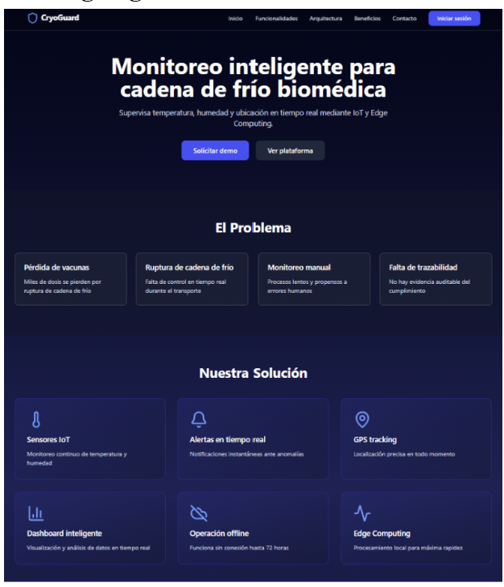

### Web Application - Dashboard Home

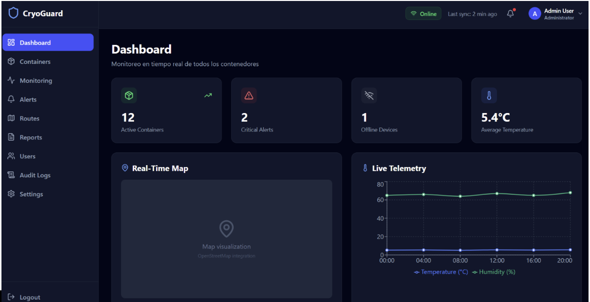

### Web Application - Monitoring

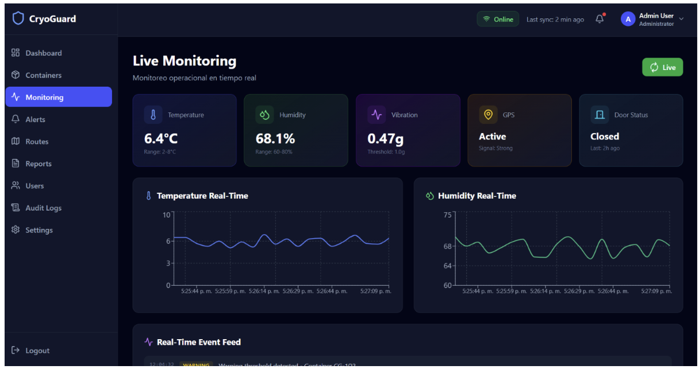

### Web Application - Routes

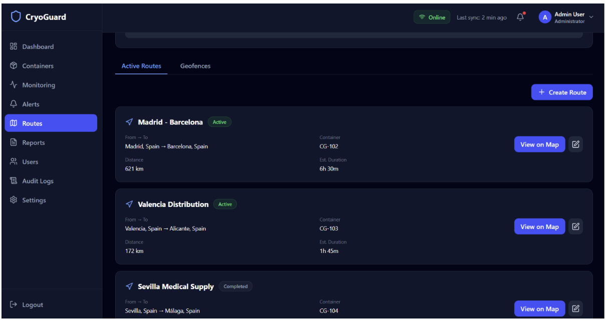

### Web Application - Alerts

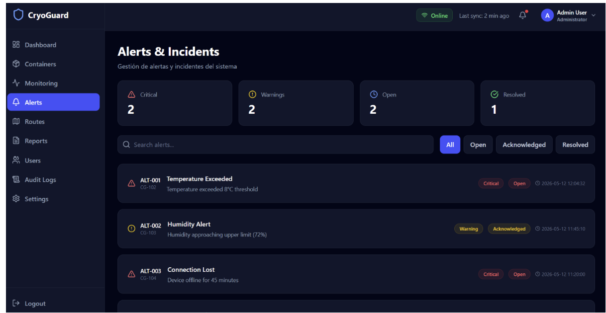

### Web Application - Settings

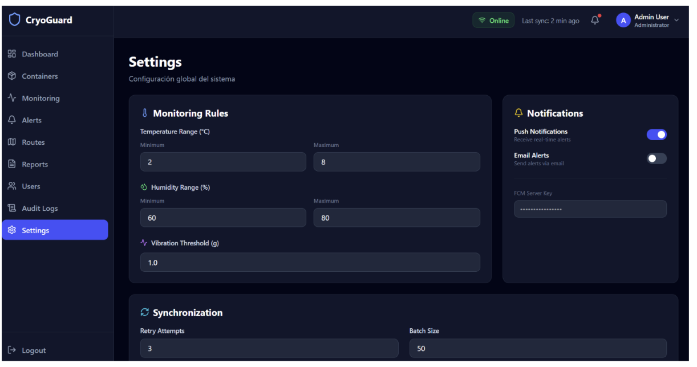

### Web Application - Audit Logs

---

#### 6.2.1.7. Services Documentation Evidence for Sprint Review

Durante este sprint se implementó la documentación de los Web Services mediante Swagger UI, integrada directamente en el backend desarrollado en Java con Spring Boot.

La especificación cubre todos los endpoints REST de CryoGuard Pro, organizados por bounded contexts de acuerdo con la arquitectura DDD adoptada, detallando métodos HTTP, parámetros, cuerpos de solicitud y respuestas esperadas.

| Bounded Context | Endpoints principales | Métodos HTTP |
|---|---|---|
| IAM – Authentication | /api/v1/auth/login, /api/v1/auth/sign-up | POST |
| IAM – Users | /api/v1/users, /api/v1/users/{userId} | GET, PUT, DELETE |
| Monitoring – Containers | /api/v1/containers, /api/v1/containers/{id} | GET, POST, PUT, DELETE |
| Monitoring – Telemetry | /api/v1/containers/{id}/telemetry | GET, POST |
| Logistics – Routes | /api/v1/routes, /api/v1/routes/{id} | GET, POST, PUT, DELETE |
| Logistics – Route History | /api/v1/routes/{id}/history, /api/v1/routes/{id}/location | GET, POST |
| Logistics – Geofences | /api/v1/geofences, /api/v1/geofences/{id} | GET, POST, PUT, DELETE |
| Evaluation – Alerts | /api/v1/alerts, /api/v1/alerts/{id} | GET, PUT |
| Evaluation – Monitoring Rules | /api/v1/monitoring-rules | GET, PUT |

## Evidencias

### Authentication

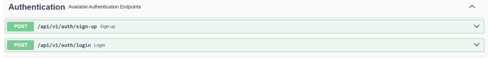

### Users

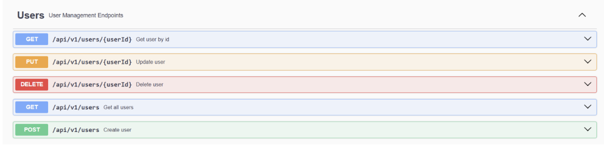

### Containers

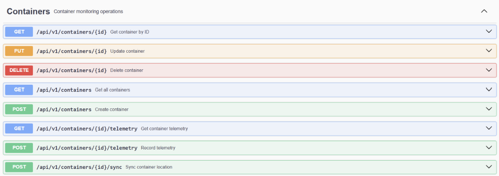

### Routes

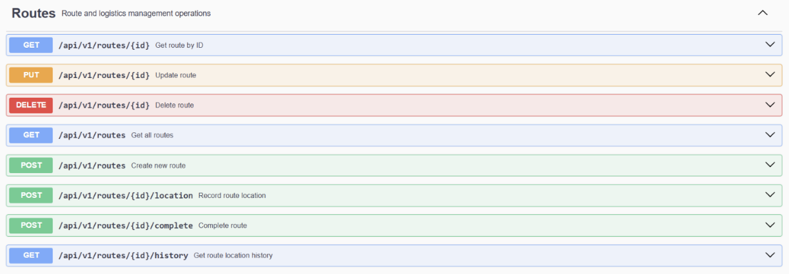

### Geofences

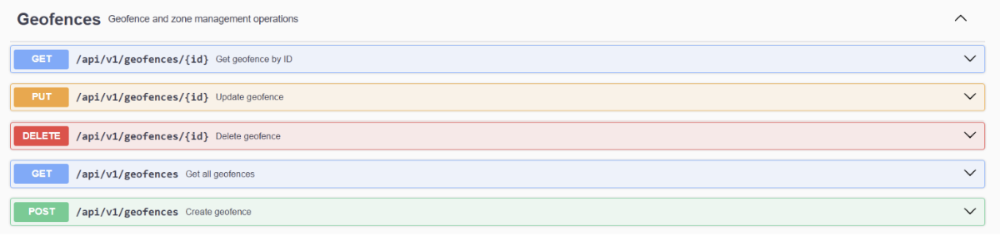

### Alerts

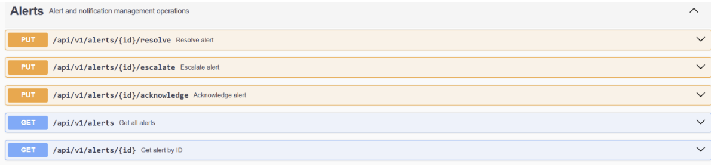

### Monitoring Rules

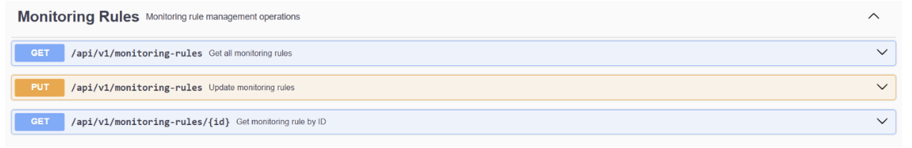

---
#### 6.2.1.8. Software Deployment Evidence for Sprint Review
Durante este sprint se realizaron los despliegues de los productos digitales de CryoGuard Pro: la Landing Page, la Aplicación Web y el Backend. El proceso incluyó la configuración de entornos de hosting e integración con servicios de despliegue continuo.

## Despliegue de la Landing Page & Frontend

La Landing Page y Frontend fueron desplegados en Vercel conectando directamente el repositorio desde GitHub. Vercel detecta automáticamente el framework React + Vite y ejecuta el build correspondiente ante cada push en `main`, publicando la nueva versión de forma automática.

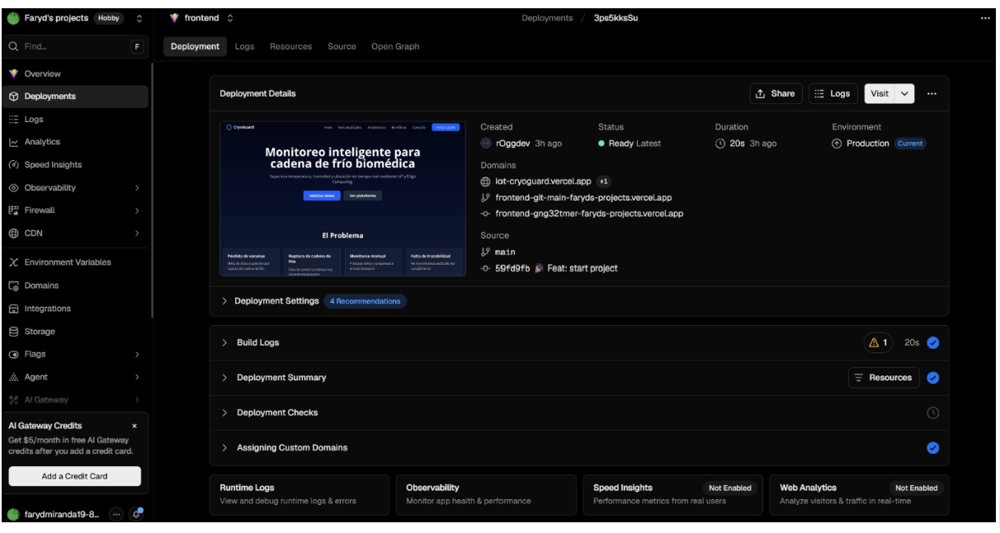

## Despliegue del Backend

El backend en Java + Spring Boot fue desplegado en una VPS de Hostinger utilizando Dokploy como plataforma de orquestación de contenedores Docker.

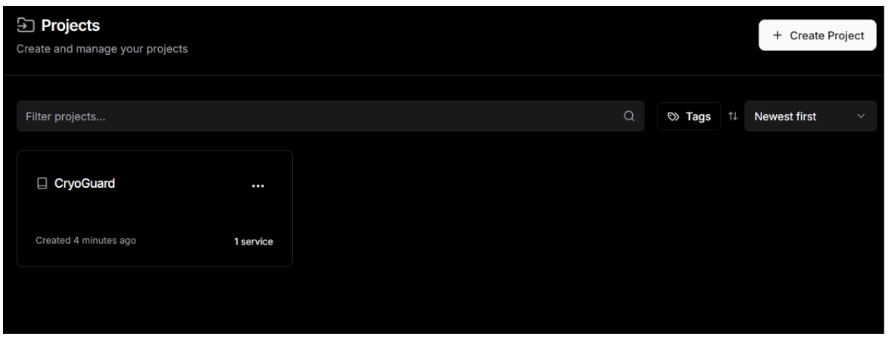

#### 6.2.1.9. Team Collaboration Insights during Sprint
Durante este sprint, el equipo de desarrollo trabajó de forma colaborativa en la implementación de las principales funcionalidades correspondientes al alcance definido: la Landing Page, la Aplicación Web y el Backend de CryoGuard Pro.

A lo largo del proceso se mantuvo comunicación constante a través de GitHub y los canales del equipo, asegurando una adecuada distribución de tareas.

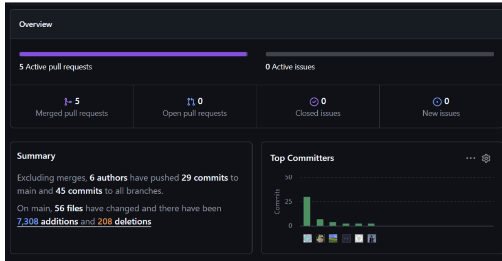

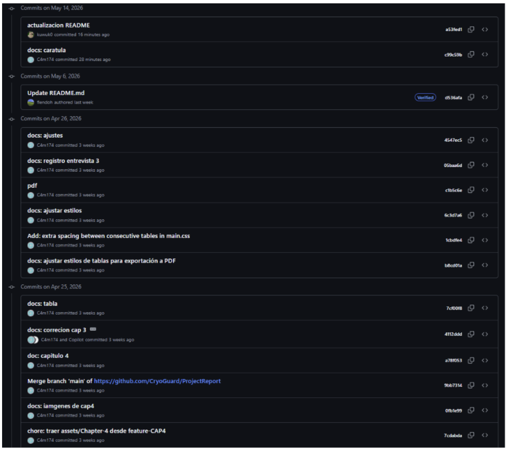
---
# Conclusiones

## TB1

La entrega del Sprint 1 del proyecto CryoGuard Pro ha permitido completar exitosamente los entregables de implementación del producto.

Se desarrolló la Landing Page moderna, la Aplicación Web con 10 páginas funcionales (`Login`, `DashboardHome`, `Monitoring`, `Routes`, `Alerts`, `AuditLogs`, `Reports`, `Containers`, `Users`, `Settings`) y el Backend Services con Spring Boot 4.0.6 implementando los bounded contexts de `iam`, `monitoring`, `logistics` y `evaluation`.

Se configuró la arquitectura DDD en el backend, se implementó autenticación JWT, se documentó la API con Swagger UI en `/swagger-ui.html`, se estableció el despliegue continuo de los productos frontend mediante Vercel y el backend se desplegó en VPS de Hostinger gestionado por Dokploy con Docker.

---

# Bibliografía

- IBM Design Thinking. (s.f.). *As-is scenario map: Build a better understanding of your users' current experience.* IBM. https://www.ibm.com/design/thinking/page/toolkit/activity/as-is-scenario-map

- IBM Design Thinking. (s.f.). *Empathy map: Build empathy for your users through a conversation informed by your team's observations.* IBM. https://www.ibm.com/design/thinking/page/toolkit/activity/empathy-map

- Nielsen Norman Group. (s.f.). *Empathy mapping: The first step in design thinking.* https://www.nngroup.com/articles/empathy-mapping/

- The Markdown Guide. (s.f.). *The Markdown Guide.* https://www.markdownguide.org/

- Fowler, M. (2006, 31 de octubre). *Ubiquitous language.* MartinFowler.com. https://martinfowler.com/bliki/UbiquitousLanguage.html

- Open Practice Library. (s.f.). *Ubiquitous language: Unambiguously define the term and concepts of a business domain.* https://openpracticelibrary.com/practice/ubiquitous-language/

- Spring Boot. (s.f.). *Spring Boot Reference Documentation.* https://spring.io/projects/spring-boot

- React. (s.f.). *React Documentation.* https://react.dev/

- Tailwind CSS. (s.f.). *Tailwind CSS Documentation.* https://tailwindcss.com/

