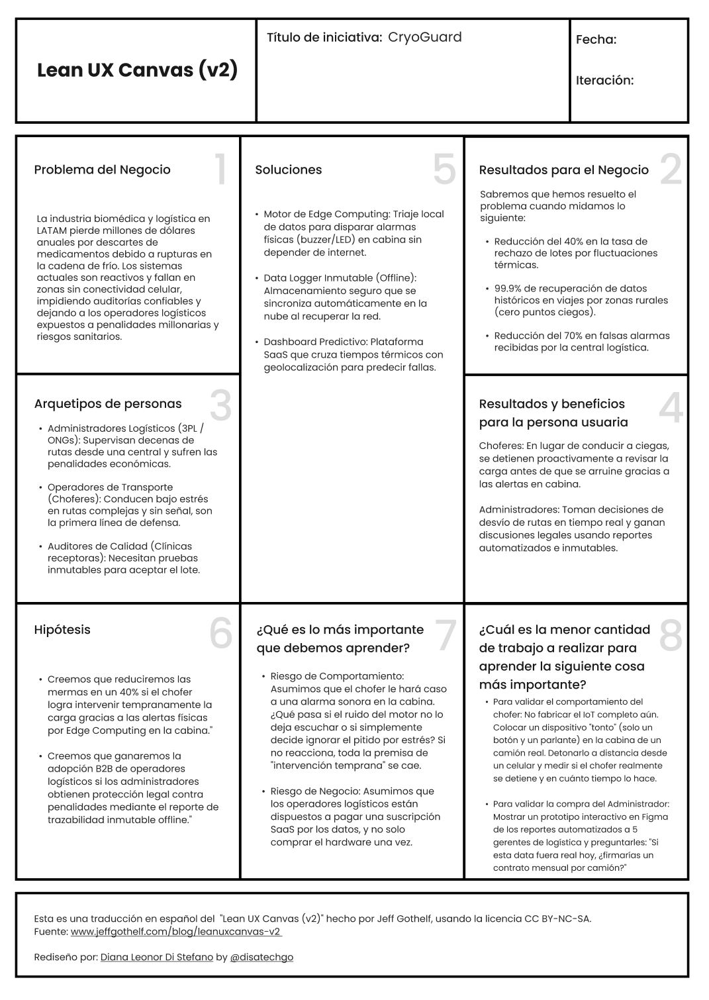

   
  
<strong>Universidad Peruana de Ciencias Aplicadas</strong>

  

  Ingeniería de Software   
  Periodo: 202610   
  1ASI0572 Desarrollo de Soluciones IOT   
  NCR: 6772   
  Docente: Marco Antonio Leon Baca   
  Informe de Trabajo Final   
  StartUp: CryoGuard   
  Producto: CryoGuard Pro   
  

  <table align="center">
    <tr>
      <th>Member</th>
      <th>Code</th>
    </tr>
    <tr>
      <td>Arias Segil, Marllely Anahi</td>
      <td>U202223984</td>
    </tr>
    <tr>
      <td>Hallasi Saravia, Miguel</td>
      <td></td>
    </tr>
    <tr>
      <td>Miranda Ayasta, Rogger Faryd</td>
      <td>u202319239</td>
    </tr>
    <tr>
      <td>Sanchez Rios, Camila</td>
      <td></td>
    </tr>
    <tr>
      <td>Vargas Javier, Jose Enrique</td>
      <td>U20221F693</td>
    </tr>
  </table>
    
Abril 2026

# Registro de Versiones del Informe

 
<table>
  <tr>
    <th>Versión</th>
    <th>Fecha</th>
    <th>Autor</th>
    <th>Descripción</th>
  </tr>
  <tr>
    <th>AV1</th>
    <td></td>
    <td></td>
    <td></td>
  </tr>
    <tr>
    <th>TB1</th>
    <td></td>
    <td></td>
    <td></td>
  </tr>
    <tr>
    <th>AV2</th>
    <td></td>
    <td></td>
    <td></td>
  </tr>
    <tr>
    <th>TB2</th>
    <td></td>
    <td></td>
    <td></td>
  </tr>
</table>

# Project Report Collaboration Insights

  <table>
    <tr>
      <td>Link del repositorio del informe</td>
      <td></td>
    </tr>
      <tr>
      <td>Link de los repositorios de la organización</td>
      <td></td>
    </tr>
      <tr>
      <td>Link del Event Storming</td>
      <td></td>
    </tr>
  </table>

   

  <h6> Evidencias AV1 </h6>
  <h6> Evidencias TB1 </h6>
  <h6> Evidencias AV2 </h6>
  <h6> Evidencias TB2 </h6>

# Contenido

- [Registro de Versiones del Informe](#registro-de-versiones-del-informe)
- [Project Report Collaboration Insights](#project-report-collaboration-insights)
- [Contenido](#contenido)
- [Student Outcome](#student-outcome)
- [Capítulo I: Introducción](#capítulo-i-introducción)
  - [1.1. Startup Profile](#11-startup-profile)
    - [1.1.1. Descripción de la Startup](#111-descripción-de-la-startup)
          - [**Visión**](#visión)
          - [**Misión**](#misión)
    - [1.1.2. Perfiles de integrantes del equipo](#112-perfiles-de-integrantes-del-equipo)
  - [1.2. Solution Profile](#12-solution-profile)
          - [**Descripción General de la Solución**](#descripción-general-de-la-solución)
          - [**Características Clave de la Solución**](#características-clave-de-la-solución)
          - [**Beneficios de la Solución**](#beneficios-de-la-solución)
          - [**Tecnología y Arquitectura**](#tecnología-y-arquitectura)
    - [1.2.1. Antecedentes y problemática](#121-antecedentes-y-problemática)
          - [**What? (¿Qué?)**](#what-qué)
          - [**When? (¿Cuándo?)**](#when-cuándo)
          - [**Where? (¿Dónde?)**](#where-dónde)
          - [**Who? (¿Quién?)**](#who-quién)
          - [**Why? (¿Por qué?)**](#why-por-qué)
          - [**How? (¿Cómo?)**](#how-cómo)
          - [**How much? (¿Cuánto?)**](#how-much-cuánto)
    - [1.2.2. Lean UX Process](#122-lean-ux-process)
      - [1.2.2.1. Lean UX Problem Statements](#1221-lean-ux-problem-statements)
      - [1.2.2.2. Lean UX Assumptions](#1222-lean-ux-assumptions)
      - [1.2.2.3. Lean UX Hypothesis Statements](#1223-lean-ux-hypothesis-statements)
      - [1.2.2.4. Lean UX Canvas](#1224-lean-ux-canvas)
  - [1.3. Segmentos objetivo](#13-segmentos-objetivo)
          - [Redes de Centros de Salud (Urbanos y Rurales)](#redes-de-centros-de-salud-urbanos-y-rurales)
          - [ONGs y Gestores de Logística Sanitaria Humanitaria](#ongs-y-gestores-de-logística-sanitaria-humanitaria)

# Student Outcome

ABET – EAC - Student Outcome 4

**Criterio:** Capacidad de reconocer responsabilidades éticas y profesionales en situaciones de ingeniería y hacer juicios informados, considerando el impacto de las soluciones en contextos globales, económicos, ambientales y sociales.

<table>
  <tr>
    <td><b>Criterio específico</b></td>
    <td><b>Acciones realizadas</b></td>
    <td><b>Conclusiones</b></td>
  </tr>
  <tbody>
    <tr>
      <td><b>Reconoce responsabilidad ética y profesional en situaciones de ingeniería de software</b></td>
      <td>
        
<b>Miranda Ayasta, Rogger Faryd</b>

        
<b>AV1: </b> 

        
<b>TB1: </b> 

        
<b>AV2: </b> 

        
<b>TB2: </b> 

        
<b>Vargas Javier, Jose Enrique</b>

        
<b>AV1: </b> 

        
<b>TB1: </b> 

        
<b>AV2: </b> 

        
<b>TB2: </b> 

        
<b>Apellidos y Nombres</b>

        
<b>AV1: </b> 

        
<b>TB1: </b> 

        
<b>AV2: </b> 

        
<b>TB2: </b> 

        
<b>Apellidos y Nombres</b>

        
<b>AV1: </b> 

        
<b>TB1: </b> 

        
<b>AV2: </b> 

        
<b>TB2: </b> 

        
<b>Apellidos y Nombres</b>

        
<b>AV1: </b> 

        
<b>TB1: </b> 

        
<b>AV2: </b> 

        
<b>TB2: </b> 

      </td>
      <td></td>
    </tr>
  </tbody>
</table>

# Capítulo I: Introducción

## 1.1. Startup Profile

### 1.1.1. Descripción de la Startup

<h6> Nombre del Startup: CryoGuard </h6>

CryoGuard es una plataforma de logística predictiva diseñada para reducir significativamente las pérdidas en la cadena de frío de productos biomédicos y vacunas. Mientras que las soluciones estándar se limitan a reportar daños cuando ya es tarde, CryoGuard combina sensores de alta precisión con Edge Computing para auditar variables críticas (temperatura, vibración, aperturas) y predecir desviaciones térmicas antes de que comprometan el producto.

Diseñado para rutas complejas, el hardware cuenta con una autonomía energética extendida para trayectos prolongados y capacidad de almacenamiento offline para más de 50,000 registros, minimizando la pérdida de trazabilidad incluso en entornos sin conectividad en zonas sin cobertura. Al recuperar la conectividad, el sistema sincroniza la data automáticamente. Nuestra solución permite a centros de salud y operadores logísticos transformar su cadena de frío de reactiva a proactiva, asegurando el cumplimiento normativo y salvando inventarios críticos.

###### **Visión**

Visualizamos una logística sanitaria de 'mínimas pérdidas' en América Latina. Nuestra visión es que la tecnología predictiva de CryoGuard se convierta en el estándar que garantice la integridad de los productos transportados y tratamientos críticos. Transformaremos un sistema vulnerable en una red altamente confiable y totalmente auditable, asegurando que cada suministro llegue viable a su destino, sin importar los desafíos geográficos o la falta de conectividad.

###### **Misión**

Nuestra misión es blindar la cadena de frío del sector salud transformando datos en acciones preventivas. Proveemos a operadores logísticos y centros médicos trazabilidad altamente auditable y analítica predictiva para erradicar las mermas por fluctuaciones térmicas, garantizar el estricto cumplimiento normativo y asegurar la calidad clínica de cada envío.

### 1.1.2. Perfiles de integrantes del equipo

<table class="students-profile">
  <tr>
    <th>
      
    </th>
    <td valign="top">
      
<b>Jose Enrique Vargas Javier</b>

      
Me considero una persona proactiva, responsable y orientada a la mejora continua. Decidí optar por esta carrera porque siempre me ha motivado comprender cómo funcionan los sistemas y, sobre todo, cómo protegerlos frente a amenazas cada vez más sofisticadas.

    </td>
  </tr>
  <tr>
    <th>
      
    </th>
    <td valign="top">
      
<b>Miranda Ayasta, Rogger Faryd</b>

      
Soy estudiante de Ingeniería de Software, actualmente curso el 6.º ciclo de la carrera.
      A lo largo de mi formación he aprendido diversos lenguajes de programación, como C++, Python, JavaScript, HTML y CSS Me destaco por mi responsabilidad, mis habilidades para el trabajo en equipo y mi motivación constante por seguir aprendiendo.

    </td>
  </tr>
  <tr>
    <th>
      
    </th>
    <td valign="top">
      
<b></b>

      

    </td>
  </tr>
  <tr>
    <th>
      
    </th>
    <td valign="top">
      
<b></b>

      

    </td>
  </tr>
  <tr>
    <th>
      
    </th>
    <td valign="top">
      
<b></b>

      

    </td>
  </tr>
</table>

## 1.2. Solution Profile

###### **Descripción General de la Solución**

CryoGuard es una plataforma de inteligencia operativa que transforma el transporte de productos médicos en un proceso predictivo y altamente auditable. En lugar de simplemente registrar datos, nuestro sistema procesa variables críticas (temperatura, aperturas, geolocalización) directamente en el dispositivo (Edge Computing) para detectar tendencias de riesgo térmico antes de que se materialice una falla.

Al detectar un riesgo inminente, CryoGuard detona protocolos de rescate en tiempo real (como alertas predictivas a los conductores y notificaciones de emergencia al centro de control) permitiendo decisiones operativas inmediatas que previenen la pérdida del lote. Diseñada para operar ininterrumpidamente, la solución garantiza una trazabilidad continua y verificable incluso en rutas sin cobertura celular, asegurando a operadores logísticos y centros de salud un cumplimiento normativo estricto y la mayor probabilidad de conservar la viabilidad de los envíos.

###### **Características Clave de la Solución**

- **Inteligencia Predictiva Offline (Edge Computing):** Análisis de riesgos térmicos procesados directamente en el dispositivo, sin depender de la nube, mediante evaluación de umbrales dinámicos y análisis de tendencias en series temporales (variación de temperatura en el tiempo).
  
Problema que resuelve: Evita que la carga se pierda al atravesar zonas sin cobertura celular. Al detectar un riesgo, el dispositivo no espera a tener internet; toma la decisión inmediata de detonar protocolos de rescate locales (como alertar al chofer) antes de que el daño sea irreversible.

- **Trazabilidad:** Almacenamiento redundante y encriptado en memoria física que registra cada segundo del historial del viaje.

Problema que resuelve: Elimina los "puntos ciegos" de auditoría. Garantiza a las autoridades sanitarias y laboratorios un alto nivel de cumplimiento normativo, asegurando que la data histórica del producto se preserve incluso ante fallos de conectividad, incluso si el vehículo sufre un apagón total de comunicaciones.

- **Auditoría Ambiental Integral:** Monitoreo cruzado de temperatura, humedad y vibraciones físicas excesivas (baches severos, caídas).
  
Previene el rechazo de lotes no solo por estrés térmico, sino por estrés mecánico. Identifica si la mala manipulación del transportista antes de que se materialice una ruptura de la cadena de frío, permitiendo deslindar responsabilidades económicas de manera exacta.

- **Geolocalización Cruzada con Tiempos Térmicos** Monitoreo GPS y geocercas sincronizadas con la capacidad de retención de frío del empaque modelada en función del tipo de empaque térmico y condiciones ambientales.

Detecta desvíos, paradas no autorizadas o tráfico pesado que amenazan el límite de tiempo del empaque térmico. Esto permite a la central logística redireccionar la carga a un puerto seguro cercano antes de que el hielo seco o gel refrigerante se agote.

- **Triaje de Alertas de Intervención Rápida:** Escalamiento de alarmas a dos niveles: físicas (visual/sonora para el operador local) y digitales (centro de control).

Empodera al chofer para tomar acciones correctivas inmediatas (ej. revisar el cierre del contenedor en la cabina). Al mismo tiempo, evita la "fatiga de notificaciones" en la central logística, enviando reportes a la nube únicamente cuando la desviación es crítica y requiere intervención remota.

###### **Beneficios de la Solución**

- **Intervención Preventiva:** Gracias al procesamiento en el borde (Edge Computing), el sistema alerta sobre tendencias de riesgo térmico con anticipación suficiente para intervención operativa de que se rompa la cadena de frío, permitiendo la intervención física del transportista o el desvío de la ruta para salvar el lote antes de que ocurra el daño.
  
- **Cumplimiento Normativo:** El almacenamiento local resistente a pérdida de datos y con integridad verificable garantiza una bitácora forense de cada viaje. Esto permite a laboratorios y centros de salud demostrar ante las autoridades regulatorias que no se evidencian desviaciones críticas en las condiciones del transporte, eliminando el riesgo de demandas o rechazo de lotes por falta de evidencia.

- **Visibilidad Logística:** Al combinar almacenamiento offline con sincronización en la nube, el sistema asegura la recuperación total de la trazabilidad. Las centrales logísticas eliminan el estrés de perder de vista sus activos críticos al atravesar zonas rurales o geográficamente complejas.

- **Inteligencia Comercial y Optimización de Procesos:** La plataforma transforma el monitoreo crudo en datos estructurados listos para procesos de Business Intelligence. Esto permite a los gerentes logísticos analizar patrones históricos, evaluar objetivamente el rendimiento de sus transportistas y tomar decisiones estratégicas basadas en evidencia dura para optimizar sus redes de distribución.

###### **Tecnología y Arquitectura**

El dispositivo está diseñado para operar con baterías de bajo consumo, optimizando la frecuencia de muestreo y transmisión para maximizar la autonomía durante trayectos prolongados.

La arquitectura de CryoGuard está estructurada en un modelo de tres capas para garantizar un flujo de datos continuo, una latencia mínima en emergencias y una alta disponibilidad de la información:

- **Capa Física y Procesamiento**
El hardware está compuesto por un microcontrolador de bajo consumo integrado con un arreglo de sensores (temperatura, humedad, acelerómetro y magnético de apertura). Aquí reside nuestro motor de Edge Computing: en lugar de ser un simple transmisor, el dispositivo ejecuta localmente algoritmos de evaluación de umbrales.

Las decisiones que toma: Si las variables superan los límites configurados, el sistema no espera a tener internet; detona acciones autónomas inmediatas, como activar alarmas físicas (buzzer y LEDs) para el transportista y registrar el evento crítico en su memoria interna no volátil. Esto asegura una auditoría forense ininterrumpida incluso en zonas sin cobertura celular.

- **Capa de Red y Backend**
Actúa como el motor de ingesta y orquestación de datos. Cuando el dispositivo detecta una red disponible (vía módulo celular o protocolos IoT), empaqueta el historial almacenado offline y lo transmite de forma segura hacia nuestra infraestructura en la nube.

El flujo de datos: El backend recibe la telemetría cruda, valida la integridad de los paquetes y procesa la información en bases de datos relacionales y de series temporales. Un motor de reglas en la nube clasifica la severidad de los eventos y se encarga de disparar webhooks o correos electrónicos de emergencia a los centros de control logístico.

- **Capa de Aplicación e Inteligencia Comercial**
Es la interfaz donde los datos estructurados se transforman en estrategia operativa. A través de aplicaciones web y móviles, los clientes acceden a la plataforma para interactuar con la información.

El impacto visual: Los operadores logísticos visualizan dashboards dinámicos que muestran el estado de la flota en tiempo real, rastreo por geolocalización y el estatus térmico de cada contenedor. El sistema incluye herramientas de análisis de datos para generar reportes de cumplimiento normativo y métricas de rendimiento, permitiendo a los gerentes optimizar rutas y evaluar la eficiencia de su red de distribución basándose en datos concretos.

### 1.2.1. Antecedentes y problemática

Mediante la técnica de “5W's & 2H’s”, se han identificado los antecedentes y la problemática relacionados con el transporte de vacunas y medicamentos sensibles a la temperatura, lo cual ha motivado el desarrollo de CryoGuard como una solución tecnológica orientada a fortalecer la cadena de frío.

###### **What? (¿Qué?)**

La pérdida de eficacia, viabilidad y el consecuente descarte masivo de productos biomédicos (vacunas y medicamentos termosensibles) debido a rupturas en la cadena de frío y daños mecánicos no detectados durante el transporte logístico.

###### **When? (¿Cuándo?)**

El problema se materializa en los "puntos ciegos" operativos: durante las transferencias de carga, retrasos imprevistos por tráfico o retenes, y en los últimos kilómetros de trayectos largos donde la autonomía de los empaques térmicos pasivos se agota antes de llegar a su destino.

###### **Where? (¿Dónde?)**

En rutas de transporte interprovincial y rural que atraviesan geografías complejas (cambios drásticos de altitud y microclimas), especialmente en zonas de América Latina donde la topografía y la falta de cobertura celular impiden la transmisión de alertas de auxilio cuando el vehículo falla.

###### **Who? (¿Quién?)**

Los actores que asumen el costo logístico y financiero: laboratorios farmacéuticos productores, operadores logísticos tercerizados (3PL) que enfrentan penalidades contractuales, y entidades del Estado (Ministerios de Salud) o clínicas privadas que pierden capacidad de atención médica.

###### **Why? (¿Por qué?)**

Por la dependencia de metodologías de auditoría reactivas ("post-mortem"). La industria utiliza data loggers básicos que solo revelan el historial de temperatura al final del viaje, lo que imposibilita la toma de decisiones estratégicas o el rescate de la carga mientras el vehículo aún está en ruta.

###### **How? (¿Cómo?)**

El quiebre de la cadena de frío ocurre por fallos en los sistemas de refrigeración de los camiones (apagados de motor), aperturas de puertas no autorizadas que liberan la temperatura óptima, exposición prolongada al clima externo durante las descargas, y estrés físico por vibraciones severas en carreteras en mal estado que generan micro-roturas en los viales.

###### **How much? (¿Cuánto?)**

El impacto financiero y sanitario es masivo. Según datos de la Organización Mundial de la Salud (OMS), hasta el 50% de las vacunas en contextos con infraestructura limitada a nivel mundial pueden perderse debido a fallas logísticas y de control de temperatura. A nivel financiero, estudios de inteligencia comercial (como IQVIA) estiman que la industria biofarmacéutica pierde más de $35,000 millones de dólares anuales por fallas en la cadena de frío, sin contar los costos ocultos de logística inversa para desechar los materiales biopeligrosos dañados.

### 1.2.2. Lean UX Process

#### 1.2.2.1. Lean UX Problem Statements

- **Usuario (Operador en ruta)**

El evento: Falla técnica del camión o estrés térmico en pleno tránsito.

La limitación: Carencia de notificaciones locales (en cabina) en tiempo real.

La consecuencia: Entrega de medicamentos inservibles.

Declaración Lean UX: > "Durante una caída de temperatura o impacto físico en ruta, el operador carece de alertas inmediatas en cabina, lo que le impide accionar protocolos de rescate a tiempo y resulta en la entrega de medicamentos irreversiblemente dañados."

- **Administrador (Gerente Logístico o de Salud)**

El evento: Gestión simultánea de múltiples envíos en zonas de conectividad variable.

La limitación: Dependencia de data loggers reactivos (post-viaje) o pérdida de señal.

La consecuencia: Incapacidad de decisión y pérdida financiera.

Declaración Lean UX: > "Al supervisar múltiples rutas, el administrador sufre puntos ciegos de trazabilidad y retraso en la recepción de datos, lo que le impide desviar unidades en peligro y genera pérdidas económicas por penalidades o descarte de inventario."

#### 1.2.2.2. Lean UX Assumptions

- **Business Outcomes**

Hipótesis de Reducción de Mermas: Creemos que al transicionar de un monitoreo reactivo a uno predictivo, nuestros clientes reducirán sus pérdidas económicas por descarte de medicamentos en al menos con un objetivo inicial de reducción del 30–40%.

Hipótesis de Retención/Ventas: Creemos que al garantizar una trazabilidad completa en condiciones operativas normales auditable (cero puntos ciegos), los operadores logísticos podrán ganar más licitaciones con el Estado o grandes farmacéuticas.

- **Users**

Operador de transporte (Chofer): Conduciendo en rutas de topografía compleja, sin señal celular y con alta carga de estrés al volante.

Administrador Logístico (Central): Supervisando simultáneamente decenas de unidades en tránsito, abrumado por notificaciones y con presión por evitar penalidades económicas.

- **Users Outcomes & Benefits**

Intervención Temprana: Si proporcionamos predicciones de riesgo térmico en la plataforma web, entonces el administrador logístico podrá desviar la unidad al centro de salud más cercano antes de que la cadena de frío se rompa.

Seguridad Forense: Si entregamos un reporte automatizado resistente a pérdida de datos y con integridad verificable al finalizar el viaje, entonces el personal de la clínica receptora firmará la conformidad del lote en segundos, sin temor a responsabilidades legales.

- **Feature Assumptions**

Hipótesis del Edge Computing y Alarmas Físicas (LED/Buzzer): Creemos que si el dispositivo detona una alarma sonora fuerte en la cabina al detectar una caída térmica offline, entonces el chofer se detendrá inmediatamente a revisar el cierre del contenedor, salvando la carga.

Hipótesis del Sensor de Apertura: Creemos que si cruzamos el sensor magnético de apertura con el GPS, entonces el administrador podrá diferenciar instantáneamente entre una falla técnica del camión y un intento de robo o sabotaje en ruta.

Hipótesis del Almacenamiento Offline: Creemos que si el dispositivo guarda la data localmente en zonas rurales y la sincroniza al recuperar red, entonces eliminaremos los rechazos de lotes médicos causados por "falta de datos" en la auditoría final.

- **Business Assumptions**

Hipótesis de Valor: Creemos que las empresas logísticas están dispuestas a pagar una suscripción premium (SaaS/HaaS) por CryoGuard, porque el costo mensual de nuestra plataforma es marginal comparado con el costo de perder un solo lote de vacunas especializadas.

Hipótesis de Cumplimiento: Asumimos que las nuevas normativas sanitarias obligarán a todas las clínicas a exigir trazabilidad ininterrumpida, convirtiendo a CryoGuard de un "lujo tecnológico" a una necesidad regulatoria.

- **User Assumptions**

Fricción Tecnológica Cero: Asumimos que el personal médico no tiene tiempo ni conocimientos técnicos; por lo tanto, si el dispositivo requiere "emparejamiento Bluetooth manual" o configuraciones complejas, no lo usarán. Debe ser de encendido automático al cerrar la caja.

Fatiga de Alarmas: Asumimos que si enviamos notificaciones a la central por cada variación mínima de temperatura, el administrador las ignorará. Por ello, la nube solo debe alertar cuando el algoritmo detecte un riesgo inminente de daño.

#### 1.2.2.3. Lean UX Hypothesis Statements

Creemos que al dotar a los operadores de transporte médico con herramientas de Edge Computing y alertas predictivas en cabina, lograremos que intervengan proactivamente antes de que ocurra una ruptura térmica, incrementando la probabilidad de mantener la viabilidad de los tratamientos críticos durante su trayecto.

Sabremos que la solución es efectiva y el modelo de negocio es viable cuando, tras los primeros pilotos, comprobemos empíricamente que:

- Tasa de Intervención Temprana: El operador atiende y reacciona a las alertas físicas (LED/Buzzer) en la cabina en un tiempo menor a 15 minutos, evitando la exposición prolongada del producto.

- Reducción de Mermas: Logramos un objetivo inicial de reducción del 30–40%, en la tasa de rechazo de lotes o pérdida total de inventario atribuible a fluctuaciones térmicas en las rutas monitoreadas.

- Integridad de la Trazabilidad: Alcanzamos un 99.9% de recuperación de datos históricos al finalizar los viajes, demostrando que el almacenamiento offline elimina los puntos ciegos causados por las zonas sin cobertura celular.

- Eficiencia en el Centro de Control: Disminuimos en una reducción significativa el volumen de falsas alarmas o notificaciones irrelevantes recibidas por el administrador, demostrando que el triaje de alertas funciona correctamente.

- Cumplimiento Normativo: La mayoría de los viajes completados generan automáticamente un reporte forense resistente a pérdida de datos y con integridad verificable aceptado por los centros de salud receptores sin disputas legales.

#### 1.2.2.4. Lean UX Canvas

## 1.3. Segmentos objetivo

###### Redes de Centros de Salud (Urbanos y Rurales)

Nos dirigimos a las entidades administrativas (privadas o públicas) encargadas de abastecer y gestionar clínicas, hospitales y postas médicas, garantizando que el inventario farmacéutico llegue viable desde la central hasta el punto de atención final.

- Tamaño: Redes de salud medianas a grandes, que administran desde 10 hasta decenas de puntos de atención distribuidos en distintas geografías y que realizan despachos de medicamentos recurrentes.

- Capacidad Económica: Presupuestos institucionales (financiación estatal en el sector público o corporativa en el privado). Su disposición de pago se justifica al comparar el costo de la plataforma CryoGuard frente al alto costo de desechar lotes de vacunas por fallas en sus propios traslados internos.

- Nivel Tecnológico: Altamente asimétrico. En la central urbana (donde están los administradores) cuentan con conectividad estable y personal capaz de usar dashboards web. Sin embargo, en los puntos de destino (rurales) el personal médico carece de formación técnica y la conectividad es nula. Por ello, requieren que el dispositivo sea autónomo y no requiera configuraciones complejas por parte del usuario final.

###### ONGs y Gestores de Logística Sanitaria Humanitaria

Nos enfocamos en organizaciones dedicadas a la planificación y ejecución de campañas de salud, distribución de ayuda médica y programas de inmunización en zonas vulnerables o de difícil acceso.

- Tamaño: Operaciones de alcance regional, nacional o internacional que movilizan altos volúmenes de tratamientos médicos críticos durante campañas de salud o respuestas a emergencias.

- Capacidad Económica: Sus presupuestos provienen de fondos de cooperación internacional, donaciones o subvenciones. Son muy estrictos con el gasto, pero tienen la obligación legal y moral de garantizar a sus donantes que la ayuda llega en estado óptimo, lo que hace viable la inversión en trazabilidad.

- Nivel Tecnológico: Acostumbrados a operar en condiciones de infraestructura extrema. Necesitan tecnología de despliegue rápido. Sus centrales requieren datos precisos y reportes automatizados para justificar el uso de fondos, mientras que sus operadores en campo dependen de las alertas físicas del dispositivo y del almacenamiento offline debido a la falta total de red celular en sus misiones.

