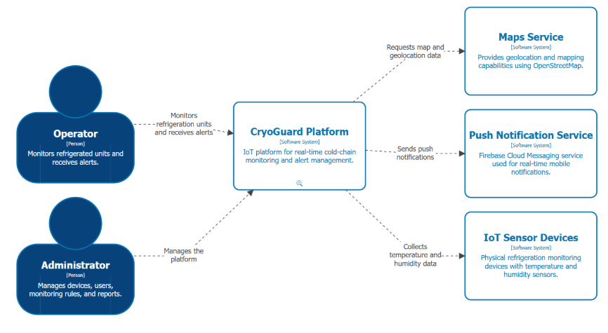
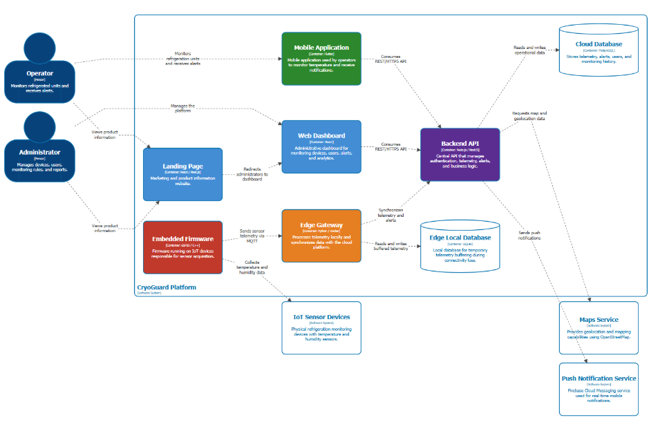
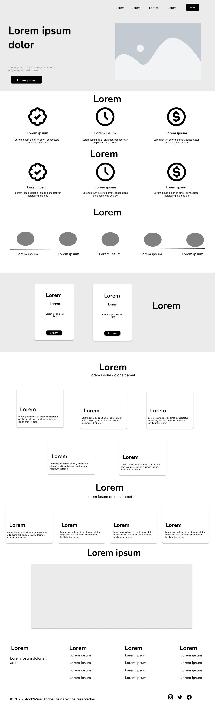

<div class="cover" style="font-family: 'Times New Roman', Times, serif; text-align:center; margin-top:40px;">
  
  <h2 style="margin:8px 0 0;">Universidad Peruana de Ciencias Aplicadas</h2>
  <h3 style="margin:4px 0;">Facultad de Ingeniería</h3>

  <div style="margin-top:24px; text-align:left; display:inline-block; width:60%;">
    <p style="margin:4px 0;"><strong>Curso:</strong> 1ASI0572 - Desarrollo de Soluciones IOT</p>
    <p style="margin:4px 0;"><strong>Periodo:</strong> 202610</p>
    <p style="margin:4px 0;"><strong>NCR:</strong> 6772</p>
    <p style="margin:4px 0;"><strong>Docente:</strong> Marco Antonio León Baca</p>
  </div>

  <h1 style="margin-top:28px; font-size:28px;">“Informe del Trabajo Final”</h1>

  <div style="margin-top:14px;">
    <p style="margin:4px 0;"><strong>StartUp:</strong> CryoGuard</p>
    <p style="margin:4px 0;"><strong>Producto:</strong> CryoGuard Pro</p>
  </div>

  <div style="margin:28px auto; width:72%; text-align:left;">
    <p style="margin:6px 0;"><strong>Integrantes:</strong></p>
    <table style="width:100%; border-collapse:collapse; border:1px solid #000;">
      <tr>
        <th style="border:1px solid #000; padding:8px; background:#f5f5f5; text-align:left;">Código</th>
        <th style="border:1px solid #000; padding:8px; background:#f5f5f5; text-align:left;">Apellidos y Nombres</th>
      </tr>
      <tr>
        <td style="border:1px solid #000; padding:8px;">U202223984</td>
        <td style="border:1px solid #000; padding:8px;">Arias Segil, Marllely Anahi</td>
      </tr>
      <tr>
        <td style="border:1px solid #000; padding:8px;">U202312391</td>
        <td style="border:1px solid #000; padding:8px;">Hallasi Saravia, Miguel</td>
      </tr>
      <tr>
        <td style="border:1px solid #000; padding:8px;">U202319239</td>
        <td style="border:1px solid #000; padding:8px;">Miranda Ayasta, Rogger Faryd</td>
      </tr>
      <tr>
        <td style="border:1px solid #000; padding:8px;">U202210973</td>
        <td style="border:1px solid #000; padding:8px;">Sanchez Rios, Camila</td>
      </tr>
      <tr>
        <td style="border:1px solid #000; padding:8px;">U20221F693</td>
        <td style="border:1px solid #000; padding:8px;">Vargas Javier, Jose Enrique</td>
      </tr>
    </table>
  </div>

  <p style="margin-top:28px;">Lima - Mayo 2026</p>
</div>

<div class="page"/>

<div>

# Registro de Versiones del Informe

<br>
<table>
  <tr>
    <th>Versión</th>
    <th>Fecha</th>
    <th>Autor</th>
    <th>Descripción</th>
  </tr>
  <tr>
    <th>AV1</th>
    <td>25/4/2026</td>
    <td>Todos</td>
    <td>Se desarrollo los primeros avances del trabajo</td>
  </tr>
    <tr>
    <th>TB1</th>
    <td>14/05/2026</td>
    <td>Todos</td>
    <td>Capítulo V: Solution UI/UX Design y Capítulo VI: Product Implementation, Validation & Deployment.</td>
  </tr>
    <tr>
    <th>AV2</th>
    <td></td>
    <td></td>
    <td></td>
  </tr>
    <tr>
    <th>TB2</th>
    <td></td>
    <td></td>
    <td></td>
  </tr>
</table>
</div>

<div class="page"/>

<div class="insights">

# Project Report Collaboration Insights

  <table>
    <tr>
      <td>Link del repositorio del informe</td>
      <td>https://github.com/CryoGuard/ProjectReport/tree/main</td>
    </tr>
      <tr>
      <td>Link de los repositorios de la organización</td>
      <td>https://github.com/CryoGuard</td>
  </table>

  <br>

  <h6> Evidencias AV1 </h6>


  <h6> Evidencias TB1 </h6>
  
  <h6> Evidencias AV2 </h6>
  <h6> Evidencias TB2 </h6>

</div>

<div class="page"/>

<div class="content-table">

# Contenido

- [Registro de Versiones del Informe](#registro-de-versiones-del-informe)
- [Project Report Collaboration Insights](#project-report-collaboration-insights)
- [Contenido](#contenido)
- [Student Outcome](#student-outcome)
- [Capítulo I: Introducción](#capítulo-i-introducción)
  - [1.1. Startup Profile](#11-startup-profile)
    - [1.1.1. Descripción de la Startup](#111-descripción-de-la-startup)
    - [1.1.2. Perfiles de integrantes del equipo](#112-perfiles-de-integrantes-del-equipo)
  - [1.2. Solution Profile](#12-solution-profile)
    - [1.2.1. Antecedentes y problemática](#121-antecedentes-y-problemática)
    - [1.2.2. Lean UX Process](#122-lean-ux-process)
      - [1.2.2.1. Lean UX Problem Statements](#1221-lean-ux-problem-statements)
      - [1.2.2.2. Lean UX Assumptions](#1222-lean-ux-assumptions)
      - [1.2.2.3. Lean UX Hypothesis Statements](#1223-lean-ux-hypothesis-statements)
      - [1.2.2.4. Lean UX Canvas](#1224-lean-ux-canvas)
  - [1.3. Segmentos objetivo](#13-segmentos-objetivo)
- [Capítulo II: Requirements Elicitation \& Analysis](#capítulo-ii-requirements-elicitation--analysis)
  - [2.1. Competidores](#21-competidores)
    - [2.1.1. Análisis competitivo](#211-análisis-competitivo)
    - [2.1.2. Estrategias y tácticas frente a competidores](#212-estrategias-y-tácticas-frente-a-competidores)
  - [2.2. Entrevistas](#22-entrevistas)
    - [2.2.1. Diseño de entrevistas](#221-diseño-de-entrevistas)
    - [2.2.2. Registro de entrevistas](#222-registro-de-entrevistas)
    - [2.2.3. Análisis de entrevistas](#223-análisis-de-entrevistas)
  - [2.3. Needfinding](#23-needfinding)
    - [2.3.1. User Personas](#231-user-personas)
    - [2.3.2. User Task Matrix](#232-user-task-matrix)
    - [2.3.3. User Journey Mapping](#233-user-journey-mapping)
    - [2.3.4. Empathy Mapping](#234-empathy-mapping)
  - [2.4. Big Picture EventStorming](#24-big-picture-eventstorming)
  - [2.5. Ubiquitous Language](#25-ubiquitous-language)
- [Capítulo III: Requirements Specification](#capítulo-iii-requirements-specification)
  - [3.1. User Stories](#31-user-stories)
  - [3.2. Impact Mapping](#32-impact-mapping)
  - [3.3. Product Backlog](#33-product-backlog)
- [Capítulo IV: Solution Software Desing](#capítulo-iv-solution-software-desing)
  - [4.1 Strategic-Level Domain-Driven Design.](#41-strategic-level-domain-driven-design)
    - [4.1.1 Design-Level EventStorming.](#411-design-level-eventstorming)
    - [4.1.1.1 Candidate Context Discovery.](#4111-candidate-context-discovery)
    - [4.1.1.2 Domain Message Flows Modeling.](#4112-domain-message-flows-modeling)
    - [4.1.1.3 Bounded Context Canvases.](#4113-bounded-context-canvases)
    - [4.1.2 Context Mapping.](#412-context-mapping)
    - [4.1.3. Software Architecture](#413-software-architecture)
      - [4.1.3.1 Software Architecture System Landscape Diagram](#4131-software-architecture-system-landscape-diagram)
      - [4.1.3.2. Software Architecture Context Level Diagrams.](#4132-software-architecture-context-level-diagrams)
      - [4.1.3.2. Software Architecture Container Level Diagrams](#4132-software-architecture-container-level-diagrams)
      - [4.1.3.3. Software Architecture Deployment Diagrams](#4133-software-architecture-deployment-diagrams)
  - [4.2. Tactical-Level Domain-Driven Design](#42-tactical-level-domain-driven-design)
    - [4.2.4. Bounded Context: Control y Actuación](#424-bounded-context-control-y-actuación)
      - [4.2.4.1. Domain Layer](#4241-domain-layer)
      - [4.2.4.2. Interface Layer](#4242-interface-layer)
      - [4.2.4.3. Application Layer](#4243-application-layer)
      - [4.2.4.4. Infrastructure Layer](#4244-infrastructure-layer)
      - [4.2.4.5. Bounded Context Software Architecture Component Level Diagrams](#4245-bounded-context-software-architecture-component-level-diagrams)
      - [4.2.4.6. Bounded Context Software Architecture Code Level Diagrams](#4246-bounded-context-software-architecture-code-level-diagrams)
        - [4.2.4.6.1. Bounded Context Domain Layer Class Diagrams](#42461-bounded-context-domain-layer-class-diagrams)
        - [4.2.4.6.2. Bounded Context Database Design Diagram](#42462-bounded-context-database-design-diagram)
    - [4.2.5 Bounded Context: Operaciones / Flags](#425-bounded-context-operaciones--flags)
      - [4.2.5.1. Domain Layer](#4251-domain-layer)
      - [4.2.5.2. Interface Layer](#4252-interface-layer)
      - [4.2.5.3. Application Layer](#4253-application-layer)
      - [4.2.5.4. Infrastructure Layer](#4254-infrastructure-layer)
      - [4.2.5.5. Bounded Context Software Architecture Component Level Diagrams](#4255-bounded-context-software-architecture-component-level-diagrams)
      - [4.2.5.6. Bounded Context Software Architecture Code Level Diagrams](#4256-bounded-context-software-architecture-code-level-diagrams)
        - [4.2.5.6.1. Bounded Context Domain Layer Class Diagrams](#42561-bounded-context-domain-layer-class-diagrams)
        - [4.2.5.6.2. Bounded Context Database Design Diagram](#42562-bounded-context-database-design-diagram)
    - [4.2.6 Bounded Context: Notificaciones](#426-bounded-context-notificaciones)
      - [4.2.6.1. Domain Layer](#4261-domain-layer)
      - [4.2.6.2. Interface Layer](#4262-interface-layer)
      - [4.2.6.3. Application Layer](#4263-application-layer)
      - [4.2.6.4. Infrastructure Layer](#4264-infrastructure-layer)
      - [4.2.6.5. Bounded Context Software Architecture Component Level Diagrams](#4265-bounded-context-software-architecture-component-level-diagrams)
      - [4.2.6.6. Bounded Context Software Architecture Code Level Diagrams](#4266-bounded-context-software-architecture-code-level-diagrams)
        - [4.2.6.6.1. Bounded Context Domain Layer Class Diagrams](#42661-bounded-context-domain-layer-class-diagrams)
        - [4.2.6.6.2. Bounded Context Database Design Diagram](#42662-bounded-context-database-design-diagram)
    - [4.2.7. Bounded Context: Seguridad / Roles](#427-bounded-context-seguridad--roles)
      - [4.2.7.1. Domain Layer](#4271-domain-layer)
      - [4.2.7.2. Interface Layer](#4272-interface-layer)
      - [4.2.7.3. Application Layer](#4273-application-layer)
      - [4.2.7.4. Infrastructure Layer](#4274-infrastructure-layer)
      - [4.2.7.5. Bounded Context Software Architecture Component Level Diagrams](#4275-bounded-context-software-architecture-component-level-diagrams)
      - [4.2.7.6. Bounded Context Software Architecture Code Level Diagrams](#4276-bounded-context-software-architecture-code-level-diagrams)
        - [4.2.7.6.1. Bounded Context Domain Layer Class Diagrams](#42761-bounded-context-domain-layer-class-diagrams)
        - [4.2.7.6.2. Bounded Context Database Design Diagram](#42762-bounded-context-database-design-diagram)
- [Capítulo V: Solution UI/UX Design](#capítulo-v-solution-uiux-design)
  - [5.1. Style Guidelines.](#51-style-guidelines)
    - [5.1.1. General Style Guidelines](#511-general-style-guidelines)
    - [5.1.2. Web, Mobile and IoT Style Guidelines](#512-web-mobile-and-iot-style-guidelines)
  - [5.2. Information Architecture.](#52-information-architecture)
    - [5.2.1. Organization Systems](#521-organization-systems)
    - [5.2.2. Labeling Systems](#522-labeling-systems)
    - [5.2.3. SEO Tags and Meta Tags](#523-seo-tags-and-meta-tags)
    - [5.2.4. Searching Systems](#524-searching-systems)
    - [5.2.5. Navigation Systems](#525-navigation-systems)
  - [5.3. Landing Page UI Design.](#53-landing-page-ui-design)
    - [5.3.1. Landing Page Wireframe](#531-landing-page-wireframe)
    - [5.3.2. Landing Page Mock-up](#532-landing-page-mock-up)
  - [5.4. Applications UX/UI Design.](#54-applications-uxui-design)
    - [5.4.1. Applications Wireframes](#541-applications-wireframes)
    - [5.4.2. Applications Wireflow Diagrams](#542-applications-wireflow-diagrams)
    - [5.4.2. Applications Mock-ups](#542-applications-mock-ups)
    - [5.4.3. Applications User Flow Diagrams](#543-applications-user-flow-diagrams)
  - [5.5. Applications Prototyping](#55-applications-prototyping)
  - [5.6. IoT Device Design](#56-iot-device-design)
- [Capítulo VI: Product Implementation, Validation \& Deployment](#capítulo-vi-product-implementation-validation--deployment)
  - [6.1. Software Configuration Management.](#61-software-configuration-management)
    - [6.1.1. Software Development Environment Configuration](#611-software-development-environment-configuration)
    - [6.1.2. Source Code Management](#612-source-code-management)
    - [6.1.3. Source Code Style Guide \& Conventions](#613-source-code-style-guide--conventions)
    - [6.1.4. Software Deployment Configuration](#614-software-deployment-configuration)
  - [6.2. Landing Page, Services \& Applications Implementation.](#62-landing-page-services--applications-implementation)
    - [6.2.1. Sprint n](#621-sprint-n)
      - [6.2.1.1. Sprint Planning n](#6211-sprint-planning-n)
      - [6.2.1.2. Aspect Leaders and Collaborators](#6212-aspect-leaders-and-collaborators)
      - [6.2.1.3. Sprint Backlog n](#6213-sprint-backlog-n)
      - [6.2.1.4. Development Evidence for Sprint Review](#6214-development-evidence-for-sprint-review)
      - [6.2.1.5. Testing Suite Evidence for Sprint Review](#6215-testing-suite-evidence-for-sprint-review)
      - [6.2.1.6. Execution Evidence for Sprint Review](#6216-execution-evidence-for-sprint-review)
      - [6.2.1.7. Services Documentation Evidence for Sprint Review](#6217-services-documentation-evidence-for-sprint-review)
      - [6.2.1.8. Software Deployment Evidence for Sprint Review](#6218-software-deployment-evidence-for-sprint-review)
      - [6.2.1.9. Team Collaboration Insights during Sprint](#6219-team-collaboration-insights-during-sprint)
  - [6.3. Validation Interviews.](#63-validation-interviews)
    - [6.3.1. Diseño de Entrevistas](#631-diseño-de-entrevistas)
    - [6.3.2. Registro de Entrevistas](#632-registro-de-entrevistas)
    - [6.3.3. Evaluaciones según heurísticas](#633-evaluaciones-según-heurísticas)
  - [6.4. Video About-the-Product](#64-video-about-the-product)
- [Conclusiones](#conclusiones)
  - [Conclusiones y recomendaciones.](#conclusiones-y-recomendaciones)
- [Video About-the-Team.](#video-about-the-team)
- [Bibliografía](#bibliografía)
- [Anexos](#anexos)
- [Concluciones](#concluciones)
- [Recomendaciones](#recomendaciones)
- [Bibliografia](#bibliografia)

  

</div>

<div class="page"/>

<div class="Student-Outcome">

# Student Outcome

ABET – EAC - Student Outcome 4

**Criterio:** Capacidad de reconocer responsabilidades éticas y profesionales en situaciones de ingeniería y hacer juicios informados, considerando el impacto de las soluciones en contextos globales, económicos, ambientales y sociales.

<table>
  <tr>
    <td><b>Criterio específico</b></td>
    <td><b>Acciones realizadas</b></td>
    <td><b>Conclusiones</b></td>
  </tr>
  <tbody>
    <tr>
      <td><b>Trabaja en equipo para proporcionar liderazgo en forma conjunta</b></td>
      <td>
        <p><b>Arias Segil, Marllely Anahi</b></p>
        <p><b>AV1: </b> Participé activamente en el liderazgo compartido del proyecto mediante el desarrollo del diseño de software basado en Domain-Driven Design y la elaboración de diagramas de arquitectura del sistema. Mi trabajo implicó coordinar con los demás integrantes para identificar bounded contexts, modelar flujos de dominio y mantener coherencia entre la arquitectura propuesta y los requerimientos definidos previamente. </p>
        <p><b>TB1: </b> Me encargué del Sprint Planning 1 (sección 6.2.1.1) y la definición de colaboradores por aspecto (sección 6.2.1.2). Estas actividades requirieron organizar la comunicación entre los integrantes del equipo para distribuir las responsabilidades de manera equitativa, considerando las fortalezas y disponibilidad de cada miembro. </p>
        <p><b>Hallasi Saravia, Miguel</b></p>
        <p><b>AV1: </b>Participé activamente en el trabajo colaborativo mediante el desarrollo de los bounded contexts y la documentación de las capas de arquitectura relacionadas con el sistema. Mi participación requirió coordinar constantemente con Rogger para definir correctamente los diagramas de componentes, diagramas de clases y el diseño de base de datos, asegurando que cada elemento estuviera alineado con la arquitectura general del proyecto. </p>
        <p><b>TB1: </b>Contribuí con el equipo mediante la documentación de las evidencias de desarrollo y pruebas del sprint (secciones 6.2.1.4 y 6.2.1.5). Estas secciones son críticas para la Sprint Review, ya que consolidan el trabajo técnico de todo el equipo. Para elaborarlas correctamente, coordiné con mis compañeros la recopilación de evidencias de sus propios avances </p>
        <p><b>Miranda Ayasta, Rogger Faryd</b></p>
        <p><b>AV1: </b>Durante el desarrollo del proyecto participé de manera colaborativa en la elaboración de los bounded contexts y en el diseño de las diferentes capas de arquitectura del sistema, incluyendo Domain Layer, Interface Layer, Application Layer e Infrastructure Layer. Mi responsabilidad implicó coordinar con Miguel y con los demás integrantes para asegurar que los diagramas y componentes mantuvieran coherencia con la arquitectura general propuesta. </p>
        <p><b>TB1: </b>Durante el desarrollo del sprint, me encargué de la documentación de evidencias de servicios para la Sprint Review (sección 6.2.1.7). Esta tarea requirió coordinar con los demás integrantes para recopilar información actualizada sobre los servicios implementados, asegurándome de que los avances individuales quedarán correctamente registrados. </p>
        <p><b>Sanchez Rios, Camila</b></p>
        <p><b>AV1: </b>Durante el proyecto trabajé de manera colaborativa en el análisis de requerimientos, participando en actividades como entrevistas, análisis competitivo, needfinding y elaboración de historias de usuario. Mi participación requirió coordinar constantemente con el equipo para validar necesidades reales de los usuarios y transformar esa información en requerimientos funcionales para el sistema. </p>
        <p><b>TB1: </b>Mi participación fue avanzar el Capítulo V de UI/UX Design, esta sección implicó articular criterios de diseño con los demás integrantes que desarrollaban componentes técnicos, asegurando coherencia entre la interfaz y la implementación de nuestro proyecto. </p>
        <p><b>Vargas Javier, Jose Enrique</b></p>
        <p><b>AV1: </b>Durante el desarrollo del proyecto participé activamente en el trabajo colaborativo mediante la elaboración de la introducción del proyecto, el perfil de la startup y el desarrollo del proceso Lean UX. Mi responsabilidad implicó coordinar con el equipo para recopilar información relacionada con la problemática, los segmentos objetivo y las hipótesis planteadas para la solución. </p>
        <p><b>TB1: </b>Avance la sección 6.1.3 y la gestión del repositorio (sección 6.1.2). Estas decisiones impactaron directamente en cómo todo el equipo organizó y nombró sus contribuciones, por lo que requirieron comunicación constante con los demás integrantes. </p>
      </td>
      <td>En conclusión, durante el desarrollo del proyecto se evidenció un trabajo en equipo constante, donde cada integrante asumió responsabilidades específicas y colaboró activamente en la toma de decisiones y coordinación de actividades. La comunicación continua, la organización conjunta y el apoyo entre los miembros permitieron mantener coherencia entre los requerimientos, el diseño y la arquitectura del sistema. </td>
      <tr>
  <td><b>Crea un entorno colaborativo e inclusivo, establece metas, planifica tareas y cumple objetivos</b></td>
  <td>
    <p><b>Arias Segil, Marllely Anahi</b></p>
    <p><b>AV1: </b>Organicé las actividades relacionadas con el modelado de bounded contexts, context mapping y diagramas arquitectónicos, permitiendo que el equipo tuviera una referencia técnica clara durante el desarrollo.</p>
    <p><b>TB1: </b>Durante el Sprint Planning 1 y las correcciones del AV1, me encargué de establecer las metas del sprint junto con el equipo, definir los criterios de aceptación de las tareas y distribuir el trabajo de acuerdo con la disponibilidad y capacidad de cada integrante del equipo.</p>
    <p><b>Hallasi Saravia, Miguel</b></p>
    <p><b>AV1: </b>Organicé junto a mi compañero las tareas relacionadas con diagramas de código, componentes y base de datos, permitiendo avanzar de forma ordenada en el diseño técnico del sistema. Asimismo, participé en la validación de la estructura propuesta para asegurar que las diferentes capas del sistema estuvieran correctamente integradas.</p>
    <p><b>TB1: </b>Para cumplir con la sección de Testing Suite Evidence (6.2.1.5), establecí criterios de validación que el equipo debía considerar al desarrollar sus módulos, de modo que las pruebas pudieran realizarse de manera organizada. Esta planificación permitió que la documentación de desarrollo y pruebas se presentara de forma ordenada y dentro de los plazos establecidos por el equipo.</p>
    <p><b>Miranda Ayasta, Rogger Faryd</b></p>
    <p><b>AV1: </b>Para cumplir los objetivos del proyecto, coordiné continuamente con Miguel la distribución de tareas relacionadas con diagramas de componentes, clases y diseño de base de datos. Asimismo, mantuve seguimiento sobre la coherencia entre las distintas capas de arquitectura para facilitar el trabajo de implementación del equipo.</p>
    <p><b>TB1: </b>Me encargué del despliegue de la primera versión del Landing Page y de documentar toda la evidencia de despliegue en la sección 6.2.1.8. Para cumplir este objetivo, planifiqué las tareas de publicación con anticipación, verifiqué que el entorno de despliegue estuviera correctamente configurado y comuniqué los resultados al equipo una vez finalizado el proceso.</p>
    <p><b>Sanchez Rios, Camila</b></p>
    <p><b>AV1: </b>Cumplí los objetivos establecidos, planifiqué la documentación de entrevistas, el análisis de competidores y la elaboración de artefactos UX que ayudaron a definir las necesidades de los usuarios. También coordiné con el equipo la validación de historias de usuario y del Product Backlog para mantener coherencia entre los requerimientos y el alcance del sistema.</p>
    <p><b>TB1: </b>Definí y documenté el entorno de desarrollo de software en la sección 6.1.1, lo que implicó investigar, seleccionar y describir las herramientas que todo el equipo utilizaría durante el proyecto.</p>
    <p><b>Vargas Javier, Jose Enrique</b></p>
    <p><b>AV1: </b>Contribuí a crear un entorno colaborativo e inclusivo mediante la planificación y documentación de los apartados iniciales del proyecto, especialmente los relacionados con el enfoque Lean UX y la definición de la problemática.</p>
    <p><b>TB1: </b>Me encargué de la configuración de despliegue del software (sección 6.1.4) y del Sprint Backlog (sección 6.2.1.3, incluyendo correcciones del AV1). Para ello, planifiqué las tareas de configuración con detalle, establecí los parámetros de despliegue que el equipo debía respetar, y actualicé el backlog incorporando la retroalimentación recibida.</p>
  </td>
  <td>
    El desarrollo del proyecto permitió crear un entorno colaborativo e inclusivo mediante la planificación y organización constante de las actividades asignadas a cada integrante. A través de la definición de metas, la distribución adecuada de tareas, la documentación técnica y la coordinación continua, el equipo logró mantener un trabajo ordenado y alineado con los objetivos del proyecto.
  </td>
</tr>
    </tr>
  </tbody>
</table>
</div>

<div class="page"/>

<div class="chap1">

# Capítulo I: Introducción

## 1.1. Startup Profile

### 1.1.1. Descripción de la Startup

### 1.1.2. Perfiles de integrantes del equipo

<table class="students-profile">
  <tr>
    <th>
      
    </th>
    <td valign="top">
      <p><b>Jose Enrique Vargas Javier</b></p>
      <p><b>(Ing. Software)</b></p>
      <p>Me considero una persona proactiva, responsable y orientada a la mejora continua. Decidí optar por esta carrera porque siempre me ha motivado comprender cómo funcionan los sistemas y, sobre todo, cómo protegerlos frente a amenazas cada vez más sofisticadas.</p>
    </td>
  </tr>
  <tr>
    <th>
      
    </th>
    <td valign="top">
      <p><b>Miranda Ayasta, Rogger Faryd</b></p>
      <p><b>(Ing. Software)</b></p>
      <p>Soy estudiante de Ingeniería de Software, actualmente curso el 6.º ciclo de la carrera.
      A lo largo de mi formación he aprendido diversos lenguajes de programación, como C++, Python, JavaScript, HTML y CSS Me destaco por mi responsabilidad, mis habilidades para el trabajo en equipo y mi motivación constante por seguir aprendiendo.</p>
    </td>
  </tr>
  <tr>
    <th>
      
    </th>
    <td valign="top">
      <p><b>Camila Sanchez Rios</b></p>
      <p><b>(Ing. Software)</b></p>
      <p>Soy estudiante de la carrera de Ingeniería de Software en la Universidad Peruana de Ciencias Aplicadas, actualmente me encuentro en el octavo ciclo. Me gusta escuchar música y leer en los ratos libres y aprender más sobre la carrera.</p>
    </td>
  </tr>
  <tr>
    <th>
      
    </th>
    <td valign="top">
      <p><b>Miguel Angel Hallasi</b></p>
      <p><b>(Ing. Software)</b></p>
      <p>Estudiante del séptimo ciclo, motivado por el aprendizaje continuo y la adquisición de nuevas experiencias en desarrollo móvil, diseño de interfaces y trabajo colaborativo.</p>
    </td>
  </tr>
  <tr>
    <th>
      
    </th>
    <td valign="top">
      <p><b>Marllely Anahi Arias Segil</b></p>
      <p><b>(Ing. Software)</b></p>
      <p>Hola, mi nombre es Marllely. Soy estudiante 
      de Ingeniería de Software en la Universidad Peruana de 
      Ciencias Aplicadas (UPC), una persona empática, 
      responsable y comprometida con mi crecimiento 
      profesional. Me gusta trabajar en equipo y siempre busco 
      dar lo mejor de mí en cada proyecto. </p>
    </td>
  </tr>
</table>

## 1.2. Solution Profile

### 1.2.1. Antecedentes y problemática


### 1.2.2. Lean UX Process

#### 1.2.2.1. Lean UX Problem Statements
#### 1.2.2.2. Lean UX Assumptions

#### 1.2.2.3. Lean UX Hypothesis Statements


#### 1.2.2.4. Lean UX Canvas


_Imagen (N°1). Elaboración propia. Realizado en Canva_

## 1.3. Segmentos objetivo


</div>

<div class="page"/>

<div class="chap2">

# Capítulo II: Requirements Elicitation & Analysis

## 2.1. Competidores
### 2.1.1. Análisis competitivo

### 2.1.2. Estrategias y tácticas frente a competidores

</div>

<div class="page"/>

<div class="chap2">


## 2.2. Entrevistas

### 2.2.1. Diseño de entrevistas

### 2.2.2. Registro de entrevistas
### 2.2.3. Análisis de entrevistas

</div>

<div class="page"/>

<div class="chap2">

## 2.3. Needfinding

En el siguiente apartado, analizaremos a nuestros segmentos objetivos para identificar sus necesidades y en base a esto ofrecerles soluciones óptimas a sus problemas.

### 2.3.1. User Personas

**Segmento 1: Centros de salud rurales o urbanos**


_Imagen (N°2). Elaboración propia. Realizado en UXPressia_

**Segmento 2: ONGs y gestores de logística sanitaria**


_Imagen (N°3). Elaboración propia. Realizado en UXPressia_
<br> <!-- Esto agrega espacio visual en algunas plataformas -->

### 2.3.2. User Task Matrix

### 2.3.3. User Journey Mapping

**Segmento 1: Centros de salud rurales o urbanos**


_Imagen (N°4). Elaboración propia. Realizado en UXPressia_

**Segmento 2: ONGs y gestores de logística sanitaria)**


_Imagen (N°5). Elaboración propia. Realizado en UXPressia_
<br> <!-- Esto agrega espacio visual en algunas plataformas -->

### 2.3.4. Empathy Mapping

**Segmento 1: Centros de salud rurales o urbanos**


_Imagen (N°6). Elaboración propia. Realizado en UXPressia_

**Segmento 2: ONGs y gestores de logística sanitaria (ej. UNICEF, MINSA, OPS, Cruz Roja)**


_Imagen (N°7). Elaboración propia. Realizado en UXPressia_
<br> <!-- Esto agrega espacio visual en algunas plataformas -->

</div>

<div class="page"/>

<div class="chap2">

## 2.4. Big Picture EventStorming

</div>

<div class="page"/>

<div class="chap2">


## 2.5. Ubiquitous Language

# Capítulo III: Requirements Specification

## 3.1. User Stories

## 3.2. Impact Mapping

El siguiente mapa de impacto conecta el objetivo de negocio con actores, impactos deseados y entregables del producto.

**Segmento #1: Centros de salud rurales o urbanos**


_Imagen (N°8). Elaboración propia. Realizado en UXPressia_

**Segmento #2: ONGs y gestores de logística sanitaria (ej. UNICEF, MINSA, OPS, Cruz Roja)**


_Imagen (N°9). Elaboración propia. Realizado en UXPressia_
<br> <!-- Esto agrega espacio visual en algunas plataformas -->
  
## 3.3. Product Backlog


# Capítulo IV: Solution Software Desing 

## 4.1 Strategic-Level Domain-Driven Design.

### 4.1.1 Design-Level EventStorming.


### 4.1.1.1 Candidate Context Discovery.

### 4.1.1.2 Domain Message Flows Modeling.

En esta sección, se modeló la colaboración entre los Bounded Contexts para resolver los casos de uso críticos de CryoGuard. Se utilizó la técnica de Domain Storytelling, que permite visualizar la narrativa del negocio mediante el intercambio de mensajes entre actores, sistemas y contextos.


<p align="center">
  
</p>

El Sensor IoT detecta una temperatura fuera de los parámetros permitidos y envía el mensaje a Evaluation Management. Este contexto genera la alerta hacia IoT Monitoring Management, la cual viaja a través de la CryoGuard Platform. Finalmente, Operations Management procesa la información para que el Operador Logístico visualice la alerta y tome medidas.

<p align="center">
  
</p>

Al detectar una desviación, el Sensor IoT lo comunica a Logistics Management, que genera una alerta de ubicación. El mensaje pasa por IoT Monitoring Management hacia la CryoGuard Platform. Desde allí, Operations Management registra el desvío, permitiendo que el Operador Logístico visualice la ruta y la alerta en su pantalla.

<p align="center">
  
</p>

El Sensor IoT detecta la apertura física y IAM Management valida que no cuenta con autorización. Se genera una alerta de seguridad hacia IoT Monitoring Management que llega a la CryoGuard Platform. El sistema envía la notificación a Operations Management para almacenar el incidente y el Operador Logístico recibe la alerta de seguridad inmediata.

<p align="center">
  
</p>

El Sensor IoT verifica la conexión y IoT Monitoring Management detecta la pérdida de red. Ante esto, Operations Management activa el almacenamiento local para no perder datos. La información se registra temporalmente en el dispositivo y la CryoGuard Platform reporta al Operador Logístico la falta de monitoreo en tiempo real.

<p align="center">
  
</p>

La CryoGuard Platform detecta que hay conexión disponible y lo comunica a IoT Monitoring Management. Este restablece la conexión con Operations Management, que procede a sincronizar todos los datos almacenados con la nube. Al terminar, la plataforma actualiza el dashboard y entrega el historial de eventos completo al Operador Logístico.

### 4.1.1.3 Bounded Context Canvases.

### 4.1.2 Context Mapping.


### 4.1.3. Software Architecture 

#### 4.1.3.1 Software Architecture System Landscape Diagram

<p align="center">
  
</p>

#### 4.1.3.2. Software Architecture Context Level Diagrams.

<p align="center">
  
</p>

#### 4.1.3.2. Software Architecture Container Level Diagrams

<p align="center">
  
</p>

#### 4.1.3.3. Software Architecture Deployment Diagrams

<p align="center">
  
</p>

## 4.2. Tactical-Level Domain-Driven Design

### 4.2.4. Bounded Context: Control y Actuación

#### 4.2.4.1. Domain Layer

#### 4.2.4.2. Interface Layer

| Tipo | Clase / Nombre | Descripción | Métodos / Endpoints principales |
| --- | --- | --- | --- |
| Controller | ActuatorController | Control de actuadores | POST /api/commands · GET /api/actuators/status |
| Controller | OverrideController | Override manual protegido | POST /api/commands/override · GET /api/commands/override/available |
| DTO (in) | CommandResource | Payload de comando | actuatorId, command, parameters{}, authorizedBy? |
| DTO (in) | OverrideRequestResource | Request de override con autorización | command, reason, authToken, actor |
| DTO (out) | ExecutionResponse | Respuesta de ejecución | sessionId, command, result, executedAt |
| DTO (out) | ActuatorStatusResource | Estado actual de todos los actuadores | actuators[], lockState, coolingMode |

#### 4.2.4.3. Application Layer

| Tipo | Clase / Nombre | Descripción | Métodos / Comandos manejados |
| --- | --- | --- | --- |
| Command Handler | ExecuteCommandHandler | Ejecuta comando en actuador | handle(ExecuteCommandCommand) |
| Command Handler | ScheduleCommandHandler | Programa comando para ejecución diferida | handle(ScheduleCommandCommand) |
| Command Handler | ApplyOverrideHandler | Aplica override manual autorizado | handle(ApplyOverrideCommand) |
| Command Handler | ReleaseInterlockHandler | Libera bloqueo de seguridad | handle(ReleaseInterlockCommand) |
| Event Handler | ActuationResultPublisher | Publica resultado a Operaciones | on(ActuatorCommandExecuted) |
| Event Handler | SafetyEventPublisher | Publica eventos de seguridad | on(SafetyLockApplied, ManualCommandRejected) |

#### 4.2.4.4. Infrastructure Layer

#### 4.2.4.5. Bounded Context Software Architecture Component Level Diagrams


#### 4.2.4.6. Bounded Context Software Architecture Code Level Diagrams

##### 4.2.4.6.1. Bounded Context Domain Layer Class Diagrams


##### 4.2.4.6.2. Bounded Context Database Design Diagram


### 4.2.5 Bounded Context: Operaciones / Flags

#### 4.2.5.1. Domain Layer

#### 4.2.5.2. Interface Layer

#### 4.2.5.3. Application Layer

#### 4.2.5.4. Infrastructure Layer

#### 4.2.5.5. Bounded Context Software Architecture Component Level Diagrams


#### 4.2.5.6. Bounded Context Software Architecture Code Level Diagrams

##### 4.2.5.6.1. Bounded Context Domain Layer Class Diagrams


##### 4.2.5.6.2. Bounded Context Database Design Diagram

### 4.2.6 Bounded Context: Notificaciones

#### 4.2.6.1. Domain Layer

#### 4.2.6.2. Interface Layer

#### 4.2.6.3. Application Layer

#### 4.2.6.4. Infrastructure Layer

#### 4.2.6.5. Bounded Context Software Architecture Component Level Diagrams

#### 4.2.6.6. Bounded Context Software Architecture Code Level Diagrams

##### 4.2.6.6.1. Bounded Context Domain Layer Class Diagrams

##### 4.2.6.6.2. Bounded Context Database Design Diagram

### 4.2.7. Bounded Context: Seguridad / Roles

#### 4.2.7.1. Domain Layer

#### 4.2.7.2. Interface Layer

#### 4.2.7.3. Application Layer

#### 4.2.7.4. Infrastructure Layer

#### 4.2.7.5. Bounded Context Software Architecture Component Level Diagrams

#### 4.2.7.6. Bounded Context Software Architecture Code Level Diagrams

##### 4.2.7.6.1. Bounded Context Domain Layer Class Diagrams

##### 4.2.7.6.2. Bounded Context Database Design Diagram

# Capítulo V: Solution UI/UX Design

## 5.1. Style Guidelines.

### 5.1.1. General Style Guidelines

A continuación, se definen las decisiones de diseño visual y comunicacional que guiarán la construcción de la interfaz de usuario de CryoGuard, tanto para la plataforma web (administradores y ONGs) como para la aplicación móvil (operadores en ruta) y la pantalla local del dispositivo.

**Branding**

| Elemento | Decisión |
| --- | --- |
| Nombre del producto | CryoGuard |
| Tagline | Cold Chain IoT Monitoring |
| Propuesta visual | Confianza, precisión, tecnología médica, seguridad. Transmite control predictivo y protección de la cadena de frío. |

**Logotipo:**
<p align="center">
  
</p>

**Typography**
La elección tipográfica para CryoGuard es un componente esencial que complementa la identidad visual de la marca. Se ha seleccionado una familia tipográfica que ofrece versatilidad y coherencia, asegurando que la comunicación sea clara y efectiva tanto en web como en dispositivos móviles y pantalla local.

| Elemento | Decisión |
| --- | --- |
| Fuente primaria | Inter (sans-serif) - Limpia, moderna, altamente legible en pantallas de escritorio, móviles y pantallas pequeñas del dispositivo. |
| Fuente secundaria | Inter (misma familia) para consistencia, variando pesos (Regular 400, Medium 500, Bold 700). |
| Escala tipográfica | Tamaños basados en progresión 1.25 (major third) |
| Títulos principales (H1) | Web (Desktop): 32px / 40px — Móvil / Pantalla local: 24px / 32px |
| Subtítulos (H2) | Web (Desktop): 24px / 32px — Móvil / Pantalla local: 20px / 28px |
| Encabezados de sección (H3) | Web (Desktop): 20px / 28px — Móvil / Pantalla local: 18px / 24px |
| Texto base (Body) | 16px / 24px |
| Texto pequeño (Caption) | 14px / 20px |
| Texto auxiliar (Helper) | 12px / 16px |

**Colors**
<p align="center">
  
</p>

| Token | Color | Uso Principal |
| --- | --- | --- |
| Primary | #0E9094 (Teal) | Botones principales, encabezados, enlaces, elementos de navegación activos. Transmite confianza, tecnología médica y precisión. |
| Secondary | #1E1801 (Dark Olive) | Fondos secundarios, bordes, elementos de soporte, íconos no principales. |
| Accent 1 | #DACDAC (Beige claro) | Fondos de secciones alternas, tarjetas destacadas, modales informativos. |
| Accent 2 | #F39708 (Ámbar) | Alertas preventivas, advertencias de temperatura cercana al límite, atención. |
| Alert / Critical | #F85741 (Rojo coral) | Flags críticos, alertas de temperatura fuera de rango, emergencias, notificaciones de alta prioridad. |
| Success | #2E7D32 (Verde) | Estados de éxito, confirmaciones, temperatura dentro del rango permitido, operación normal. |
| Warning | #F39708 (Ámbar) | Advertencias, vibración excesiva, apertura no autorizada, atención preventiva. |
| Neutral Gray | #6C757D (Gris) | Texto secundario, placeholders, deshabilitados, separadores. |
| Dark / Text | #1E1801 (Dark Olive) | Texto principal sobre fondos claros, elementos de alto contraste. |
| White | #FFFFFF (Blanco) | Fondos principales, tarjetas, contenedores de contenido. |

**Spacing**
Sistema basado en múltiplos de 8px (8, 16, 24, 32, 48, 64).

| Token | Valor | Uso |
| --- | ---: | --- |
| spacing-1 | 4px | Espaciado mínimo entre elementos muy cercanos |
| spacing-2 | 8px | Espaciado interno de componentes pequeños (padding) |
| spacing-3 | 16px | Espaciado estándar entre elementos relacionados |
| spacing-4 | 24px | Margen entre secciones, padding de tarjetas |
| spacing-5 | 32px | Separación entre bloques funcionales |
| spacing-6 | 48px | Separación entre secciones principales |
| spacing-7 | 64px | Separación entre pantallas o grandes bloques |

**Tono de comunicación**

| Aspecto | Decisión |
| --- | --- |
| Estilo general | Profesional, claro, orientado a acción médica y seguridad. |
| Formalidad | Formal pero directo. Debe transmitir urgencia sin alarmismo. |
| Para administradores (Web) | Tono preciso, orientado a datos, eficiencia y cumplimiento normativo. Uso de términos como "monitoreo", "trazabilidad", "flag crítico", "reporte", "auditoría", "cumplimiento". |
| Para operadores (App / Pantalla local) | Tono claro, simple, accionable. Uso de términos como "revisar contenedor", "temperatura alta", "abrir caja", "silenciar alerta". |
| Comunicación de errores/alertas | Clara, urgente pero no alarmista. Acción recomendada siempre presente. Uso de color rojo (#F85741) para flags críticos. |
| Mensajes de éxito | Positivos, breves, reforzantes. Uso de color verde (#2E7D32). |
| Mensajes preventivos | Informativos, con acción sugerida. Uso de color ámbar (#F39708). |

### 5.1.2. Web, Mobile and IoT Style Guidelines

A continuación, se definen los estilos particulares para cada plataforma, considerando los diferentes contextos de uso, dispositivos y necesidades de cada segmento objetivo.

**Web (Dashboard - Administradores y ONGs)**

Basado en los estilos generales, se aplican las siguientes particularidades para la versión web:

| Elemento | Decisión |
| --- | --- |
| Layout | Sidebar lateral izquierdo + contenido principal. Sidebar colapsable. |
| Header | Fijo en la parte superior, con selector de proyecto/región, notificaciones y perfil de usuario. |
| Mapa interactivo | Ocupa el área principal. Marcadores con códigos de color según estado del envío (verde, amarillo, rojo). |
| Tarjetas de envío | Diseño en grid (3-4 columnas). Muestran: ID, destino, temperatura actual, estado. |
| Tablas (logs) | Scroll horizontal en pantallas pequeñas. Filas con hover highlight. |
| Botones de acción | Primary: fondo #0E9094. Secondary: outline #0E9094. Danger: fondo #F85741. |

**Mobile (App - Operadores en ruta)**

Basado en los estilos generales, se aplican las siguientes particularidades para la aplicación móvil:

| Elemento | Decisión |
| --- | --- |
| Layout | Navegación inferior (Bottom Navigation) con 4-5 íconos: Inicio, Mis Envíos, Alertas, Perfil. |
| Header | Simple con título de pantalla y botón de notificaciones. |
| Lista de envíos | Tarjetas verticales apiladas. Muestran: ID, destino, temperatura actual, estado (ícono + color). |
| Detalle del envío | Pantalla con mapa pequeño, datos de sensores, historial de alertas. |
| Notificaciones push | Aparecen en centro de notificaciones del sistema. Al tocarlas, abren el detalle del envío. |
| Botones de acción | Grandes, fáciles de presionar (altura mínima 48px). Contraste alto para lectura en exteriores. |
| Modo offline | Indicador visual de "sin conexión". Datos cargados desde caché local. |

**IoT (Pantalla Local del Dispositivo)**

| Elemento | Decisión |
| --- | --- |
| Tecnología de pantalla | LCD o OLED monocromático o de bajo consumo. Fondo oscuro, texto claro para legibilidad en exteriores. |
| Resolución | 128x64px mínimo. Información jerarquizada en 2-3 líneas. |
| Formato de información | Pantalla de inicio: temperatura actual + estado (LED simulado). Al presionar botón: humedad, vibración, GPS. |
| Códigos de estado | Ícono + palabra: "NORMAL" (verde), "PREVENCIÓN" (amarillo), "CRÍTICO" (rojo invertido). |
| Alertas visuales | La pantalla puede parpadear o mostrar mensaje completo cuando hay flag crítico. |
| Botones físicos asociados | Navegación simple: botón "Siguiente" para rotar vistas, botón "Silencio" para desactivar buzzer. |
| Mensajes típicos | "Temp: 4.2°C OK", "ALERTA: 9.5°C", "GPS: 12 satélites", "Abierto: 14:32". |
| Legibilidad | Contraste alto, tamaño de fuente grande para lectura desde distancia (0.5-1 metro). |
| Consumo energético | Pantalla se apaga después de 30 segundos sin interacción. Se activa con botón o al detectar flag crítico. |

## 5.2. Information Architecture.
La arquitectura de la información, también conocida como Information Architecture (IA), implica la organización de la información de manera clara y lógica, de modo que los usuarios puedan comprender su ubicación, lo que han descubierto, qué pueden esperar y qué está disponible a su alrededor. Esto tiene como objetivo permitir a los usuarios encontrar con facilidad lo que están buscando, y a los clientes, comprender las capacidades de la plataforma. Además, la arquitectura de la información posibilita la incorporación de nuevas funciones y la expansión del producto sin generar una estructura compleja o de difícil comprensión (Rosenfeld, Morville & Arango 2015).

### 5.2.1. Organization Systems
La arquitectura de organización de CryoGuard está diseñada siguiendo principios de agrupación funcional, monitoreo en tiempo real y priorización de eventos críticos, permitiendo a los usuarios acceder rápidamente a la información y acciones necesarias según su rol (operador de transporte, supervisor logístico, administrador u ONG) y el contexto operativo de la cadena de frío biomédica.

**Estructura organizacional principal**

**Plataforma Web (Supervisores y Administradores)**

| Módulo | Descripción | Funciones Principales | Acceso por Rol |
| --- | --- | --- | --- |
| Dashboard General | Vista consolidada del estado operativo de la cadena de frío | KPIs en tiempo real; estado de envíos; resumen de alertas; dispositivos conectados; sincronización de datos | Supervisor, Administrador |
| Mapa en Tiempo Real | Monitoreo geográfico de contenedores activos | Geolocalización GPS; rutas activas; estado por color; seguimiento en vivo; geocercas | Supervisor |
| Gestión de Envíos | Administración de envíos biomédicos | Crear envío; asignar producto; configurar rangos; monitoreo individual; estado del contenedor | Supervisor, Administrador |
| Alertas e Incidentes | Gestión de eventos críticos y preventivos | Alertas por temperatura; humedad; vibración; apertura no autorizada; salida de geocerca; historial de incidentes | Supervisor |
| Reportes y Trazabilidad | Generación y exportación de información histórica | Reportes PDF/CSV; estadísticas; gráficos; auditoría logística; reportes para donantes | Supervisor, ONG, Administrador |
| Usuarios y Roles | Administración de accesos y permisos | Crear usuarios; modificar roles; gestión de permisos; control de accesos | Administrador |
| Configuración del Sistema | Parámetros operativos del sistema | Configuración de sensores; límites críticos; sincronización; redes; notificaciones | Administrador |

**Aplicación Móvil (Operadores de Transporte)**

| Módulo | Descripción | Funciones Principales | Acceso por Rol |
| --- | --- | --- | --- |
| Estado del Contenedor | Monitoreo rápido del estado actual | Temperatura; humedad; alertas visuales; estado crítico; sincronización | Operador |
| Alertas Push | Recepción de eventos críticos | Notificaciones en tiempo real; acciones recomendadas; confirmación de alertas | Operador |
| Seguimiento GPS | Visualización del trayecto del envío | Ruta activa; ubicación actual; geocercas; tiempo estimado | Operador |
| Override y Control | Gestión de desbloqueo y silenciamiento | Override remoto; desbloqueo autorizado; silenciar buzzer; confirmación manual | Operador autorizado |
| Historial de Eventos | Registro de acciones y alertas | Logs del envío; eventos recientes; acciones ejecutadas; incidentes | Operador |
| Perfil | Gestión de cuenta y preferencias | Configuración personal; notificaciones; cerrar sesión | Operador |

### 5.2.2. Labeling Systems
El sistema de etiquetado en CryoGuard sigue principios de claridad, precisión operativa y consistencia visual, asegurando que los usuarios comprendan rápidamente el estado de los contenedores, sensores y envíos biomédicos. El sistema adapta ligeramente las etiquetas entre la plataforma web (supervisores y administradores) y la aplicación móvil (operadores de transporte), manteniendo una terminología uniforme en toda la solución.

**Sistema de Iconografía**

**Acciones Principales (Web y Móvil)**

| Acción | Etiqueta | Icono sugerido |
| --- | --- | --- |
| Crear/Registrar | “Nuevo envío” / “Registrar” | ➕ |
| Editar | “Editar” / “Modificar” | ✏️ |
| Eliminar | “Eliminar” | 🗑️ |
| Buscar | “Buscar” / “Filtrar” | 🔍 |
| Confirmar | “Confirmar” / “Aceptar” | ✓ |
| Cancelar | “Cancelar” | ✖️ |
| Exportar | “Exportar PDF” / “Exportar CSV” | ⬇️ |
| Actualizar | “Actualizar” / “Sincronizar” | 🔄 |
| Ver detalles | “Ver detalles” | 👁️ |
| Monitorear | “Monitorear” | 📡 |
| Ubicación | “Ver ruta” / “Mapa” | 📍 |
| Alertas | “Alertas” / “Incidentes” | 🚨 |
| Override | “Desbloquear” / “Override” | 🔓 |

**Etiquetas por Módulo y Plataforma**

**Plataforma Web (Supervisores y Administradores)**

| Módulo | Etiquetas principales |
| --- | --- |
| Navegación principal | Dashboard / Envíos / Mapa en tiempo real / Alertas / Reportes / Usuarios / Configuración |
| Dashboard General | Envíos activos / Alertas críticas / Preventivas / Dispositivos online / Última sincronización / Estado del sistema |
| Mapa en Tiempo Real | Ruta activa / Geocerca / Contenedor / Última ubicación / Tiempo estimado / Señal GPS / Estado del envío |
| Gestión de Envíos | Nuevo envío / Producto biomédico / Rango permitido / Estado / Supervisor asignado / Contenedor activo |
| Alertas e Incidentes | Alertas críticas / Preventivas / Apertura no autorizada / Vibración detectada / Temperatura fuera de rango / Resolver incidente |
| Reportes | Generar reporte / Exportar PDF / Exportar CSV / Historial / Trazabilidad / Estadísticas / Proyecto |
| Usuarios y Roles | Crear usuario / Rol / Permisos / Supervisor / Operador / ONG / Administrador |
| Configuración | Límites críticos / Configuración IoT / Sincronización / Notificaciones / Redes / Sensores |

**Aplicación Móvil (Operadores de Transporte)**

| Módulo | Etiquetas principales |
| --- | --- |
| Navegación principal | Inicio / Alertas / Ruta / Historial / Perfil |
| Estado del Contenedor | Temperatura actual / Humedad / Vibración / Estado crítico / Enfriamiento activo |
| Alertas Push | Alerta crítica / Acción requerida / Temperatura elevada / Apertura detectada / Geocerca excedida |
| Seguimiento GPS | Ubicación actual / Ruta activa / Tiempo restante / Señal GPS |
| Override y Control | Solicitar override / Desbloquear contenedor / Silenciar buzzer / Confirmar acción |
| Historial | Eventos recientes / Incidentes / Registro del envío / Fecha / Hora |
| Perfil | Mi cuenta / Notificaciones / Configuración / Cerrar sesión |

**Estados del Sistema**

| Estado | Etiqueta | Color asociado | Uso |
| --- | --- | --- | --- |
| Correcto | “Normal” / “Operativo” | Verde (#75C9A3) | Variables dentro del rango permitido |
| Preventivo | “Advertencia” / “Preventivo” | Amarillo (#F7EFA2) | Valores próximos al límite permitido |
| Crítico | “Crítico” / “Alerta crítica” | Rojo (#D64545) | Riesgo para la cadena de frío |
| Procesando | “Sincronizando” / “Actualizando” | Azul (#4A90E2) | Transferencia o actualización de datos |
| Información | “Info” / “Detalle” | Gris (#6B7280) | Mensajes informativos o de ayuda |
| Inactivo | “Sin conexión” / “Offline” | Gris claro (#D1D5DB) | Sensor o dispositivo desconectado |

**Estados de Contenedores y Sensores**

| Entidad | Estado | Etiqueta | Color |
| --- | --- | --- | --- |
| Contenedor | Operativo | “Normal” / “Protegido” | Verde |
| Contenedor | Preventivo | “Atención” / “Preventivo” | Amarillo |
| Contenedor | Crítico | “CRÍTICO” / “Riesgo detectado” | Rojo |
| Sensor de temperatura | Dentro del rango | “Temperatura estable” | Verde |
| Sensor de temperatura | Fuera del rango | “Temp. crítica” | Rojo |
| Sensor de humedad | Normal | “Humedad estable” | Verde |
| Sensor de humedad | Riesgo | “Humedad fuera de rango” | Amarillo |
| Sensor de vibración | Normal | “Sin impactos” | Verde |
| Sensor de vibración | Impacto detectado | “Vibración anormal” | Naranja |
| GPS | Conectado | “GPS activo” | Verde |
| GPS | Sin señal | “GPS sin conexión” | Gris |
| Peltier | Encendido | “Enfriamiento activo” | Azul |
| Peltier | Apagado | “En espera” | Gris |
| Servo | Bloqueado | “Contenedor bloqueado” | Rojo |
| Servo | Desbloqueado | “Acceso autorizado” | Verde |

**Etiquetado de Prioridad de Alertas**

| Prioridad | Etiqueta | Color | Uso |
| --- | --- | --- | --- |
| Baja | “Info” | Gris | Eventos no críticos |
| Media | “Preventiva” | Amarillo | Riesgos potenciales |
| Alta | “Crítica” | Rojo | Riesgo inmediato para el producto |
| Urgente | “Acción inmediata” | Rojo pulsante | Eventos que requieren intervención inmediata |

### 5.2.3. SEO Tags and Meta Tags
SEO (Search Engine Optimization) Tags son elementos HTML que permiten a los motores de búsqueda comprender el contenido, propósito y estructura de una plataforma digital. En CryoGuard, estos tags están diseñados para posicionar la solución como una plataforma tecnológica especializada en monitoreo IoT, cadena de frío biomédica y trazabilidad logística para vacunas y medicamentos sensibles.

**SEO Tags para Landing Pages**

| Página | Title | Description | Keywords | Author |
|--------|-------|-------------|----------|--------|
| Landing Home | CryoGuard - Monitoreo Inteligente de Cadena de Frío Biomédica | Plataforma IoT para monitoreo en tiempo real de vacunas y medicamentos sensibles. Controla temperatura, humedad, GPS y alertas críticas durante el transporte. | cadena de frío IoT, monitoreo vacunas, logística biomédica, trazabilidad medicamentos, sensores temperatura, cold chain monitoring, CryoGuard | CryoGuard Technologies |
| Landing For Logistics | CryoGuard para Operadores Logísticos - Control Total de Envíos Biomédicos | Supervisa contenedores inteligentes en tiempo real con alertas críticas, geolocalización GPS y sincronización automática en la nube. | monitoreo logístico IoT, transporte vacunas, GPS biomédico, alertas cadena de frío, dashboard logístico | CryoGuard Technologies |
| Landing For NGOs | CryoGuard para ONG y Centros de Salud - Trazabilidad y Seguridad Biomédica | Garantiza la integridad de vacunas y medicamentos mediante monitoreo IoT y reportes completos de trazabilidad para auditorías y donantes. | trazabilidad vacunas, ONG salud, monitoreo medicamentos, logística humanitaria, reportes biomédicos | CryoGuard Technologies |
| Web App Dashboard | CryoGuard Dashboard - Plataforma de Monitoreo Inteligente | Dashboard profesional para monitoreo de cadena de frío, alertas críticas, mapas GPS, reportes y gestión de contenedores inteligentes. | dashboard IoT, monitoreo biomédico, control cadena de frío, sensores inteligentes, logística médica | CryoGuard Technologies |

**Header Tags Estructurados**

**Landing Home**
```html
<h1>CryoGuard - Monitoreo Inteligente de Cadena de Frío Biomédica</h1>
<h2>La plataforma IoT que protege vacunas y medicamentos durante el transporte</h2>
<h3>Monitoreo en tiempo real de temperatura, humedad, GPS y alertas críticas</h3>
```
**Landing For Logistics**
```html
<h1>CryoGuard para Operadores Logísticos - Control Total de Envíos Biomédicos</h1>
<h2>Visualiza y supervisa contenedores inteligentes desde un dashboard en tiempo real</h2>
<h3>GPS en vivo | Alertas críticas | Geocercas | Sincronización automática</h3>
```
**Landing For NGOs**
```html
<h1>CryoGuard para ONG y Centros de Salud - Seguridad y Trazabilidad Biomédica</h1>
<h2>Garantiza la integridad de vacunas y medicamentos incluso en zonas remotas</h2>
<h3>Reportes auditables | Cadena de frío segura | Monitoreo IoT en tiempo real</h3>
```

**Meta Tags Optimizadas**

**Landing Home**
```html
<meta name="description" content="CryoGuard - Plataforma IoT para monitoreo inteligente de vacunas y medicamentos sensibles. Controla temperatura, humedad, GPS y alertas críticas durante el transporte biomédico." />

<meta name="keywords" content="cadena de frío IoT, monitoreo vacunas, logística biomédica, trazabilidad medicamentos, sensores temperatura, cold chain monitoring, CryoGuard" />

<meta name="author" content="CryoGuard Technologies" />

<meta name="robots" content="index, follow" />
```
**Landing For Logistics**
```html
<meta name="description" content="Supervisa contenedores inteligentes en tiempo real con GPS, alertas críticas y sincronización automática en la nube. Plataforma avanzada para operadores logísticos biomédicos." />

<meta name="keywords" content="monitoreo logístico IoT, transporte vacunas, GPS biomédico, alertas cadena de frío, dashboard logístico, CryoGuard" />

<meta name="author" content="CryoGuard Technologies" />

<meta name="robots" content="index, follow" />
```
**Landing For NGOs**
```html
<meta name="description" content="Garantiza la trazabilidad y seguridad de vacunas y medicamentos mediante monitoreo IoT y reportes auditables para organizaciones de salud y donantes." />

<meta name="keywords" content="trazabilidad vacunas, ONG salud, monitoreo medicamentos, logística humanitaria, reportes biomédicos, CryoGuard" />

<meta name="author" content="CryoGuard Technologies" />

<meta name="robots" content="index, follow" />
```
**Web App Dashboard**
```html
<meta name="description" content="Dashboard profesional para monitoreo de cadena de frío biomédica. Gestión de alertas, seguimiento GPS, reportes y control de contenedores inteligentes." />

<meta name="keywords" content="dashboard IoT, monitoreo biomédico, control cadena de frío, sensores inteligentes, logística médica" />

<meta name="author" content="CryoGuard Technologies" />

<meta name="robots" content="noindex, nofollow" />
```

### 5.2.4. Searching Systems

### 5.2.5. Navigation Systems

## 5.3. Landing Page UI Design.

### 5.3.1. Landing Page Wireframe

**Desktop Web Browser**


**Mobile Web Browser**


### 5.3.2. Landing Page Mock-up

**Desktop Web Browser**


**Mobile Web Browser**


## 5.4. Applications UX/UI Design.

### 5.4.1. Applications Wireframes

### 5.4.2. Applications Wireflow Diagrams

### 5.4.2. Applications Mock-ups

### 5.4.3. Applications User Flow Diagrams

## 5.5. Applications Prototyping

## 5.6. IoT Device Design

# Capítulo VI: Product Implementation, Validation & Deployment

## 6.1. Software Configuration Management.

### 6.1.1. Software Development Environment Configuration

### 6.1.2. Source Code Management

### 6.1.3. Source Code Style Guide & Conventions

### 6.1.4. Software Deployment Configuration

## 6.2. Landing Page, Services & Applications Implementation.

### 6.2.1. Sprint n

#### 6.2.1.1. Sprint Planning n

#### 6.2.1.2. Aspect Leaders and Collaborators

#### 6.2.1.3. Sprint Backlog n

#### 6.2.1.4. Development Evidence for Sprint Review

#### 6.2.1.5. Testing Suite Evidence for Sprint Review

#### 6.2.1.6. Execution Evidence for Sprint Review

#### 6.2.1.7. Services Documentation Evidence for Sprint Review

#### 6.2.1.8. Software Deployment Evidence for Sprint Review

#### 6.2.1.9. Team Collaboration Insights during Sprint

## 6.3. Validation Interviews.

### 6.3.1. Diseño de Entrevistas

### 6.3.2. Registro de Entrevistas

### 6.3.3. Evaluaciones según heurísticas

## 6.4. Video About-the-Product
# Conclusiones
## Conclusiones y recomendaciones.
# Video About-the-Team.
# Bibliografía
# Anexos

# Concluciones
# Recomendaciones
# Bibliografia


