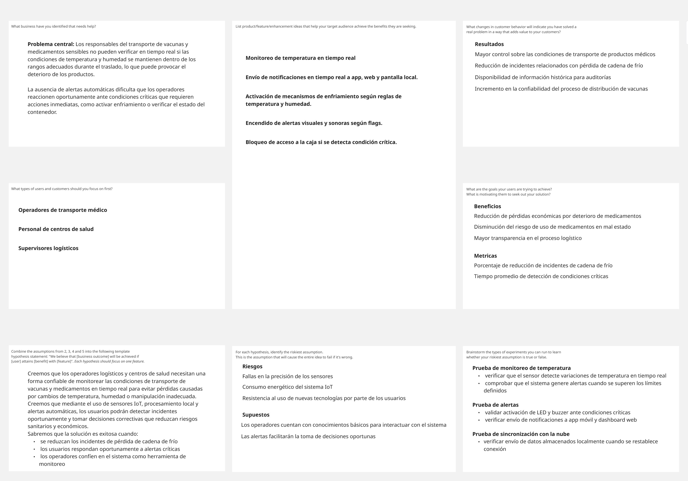

   
  
<strong>Universidad Peruana de Ciencias Aplicadas</strong>

  

  Ingeniería de Software   
  Periodo: 202610   
  1ASI0572 Desarrollo de Soluciones IOT   
  NCR: 6772   
  Docente: Marco Antonio Leon Baca   
  Informe de Trabajo Final   
  StartUp: CryoGuard   
  Producto: CryoGuard Pro   
  

  <table align="center">
    <tr>
      <th>Member</th>
      <th>Code</th>
    </tr>
    <tr>
      <td>Arias Segil, Marllely Anahi</td>
      <td>U202223984</td>
    </tr>
    <tr>
      <td>Hallasi Saravia, Miguel</td>
      <td></td>
    </tr>
    <tr>
      <td>Miranda Ayasta, Rogger Faryd</td>
      <td>U202319239</td>
    </tr>
    <tr>
      <td>Sanchez Rios, Camila</td>
      <td>U202210973</td>
    </tr>
    <tr>
      <td>Vargas Javier, Jose Enrique</td>
      <td>U20221F693</td>
    </tr>
  </table>
    
Abril 2026

# Registro de Versiones del Informe

 
<table>
  <tr>
    <th>Versión</th>
    <th>Fecha</th>
    <th>Autor</th>
    <th>Descripción</th>
  </tr>
  <tr>
    <th>AV1</th>
    <td></td>
    <td></td>
    <td></td>
  </tr>
    <tr>
    <th>TB1</th>
    <td></td>
    <td></td>
    <td></td>
  </tr>
    <tr>
    <th>AV2</th>
    <td></td>
    <td></td>
    <td></td>
  </tr>
    <tr>
    <th>TB2</th>
    <td></td>
    <td></td>
    <td></td>
  </tr>
</table>

# Project Report Collaboration Insights

  <table>
    <tr>
      <td>Link del repositorio del informe</td>
      <td></td>
    </tr>
      <tr>
      <td>Link de los repositorios de la organización</td>
      <td></td>
    </tr>
      <tr>
      <td>Link del Event Storming</td>
      <td></td>
    </tr>
  </table>

   

  <h6> Evidencias AV1 </h6>
  <h6> Evidencias TB1 </h6>
  <h6> Evidencias AV2 </h6>
  <h6> Evidencias TB2 </h6>

# Contenido

- [Registro de Versiones del Informe](#registro-de-versiones-del-informe)
- [Project Report Collaboration Insights](#project-report-collaboration-insights)
- [Contenido](#contenido)
- [Student Outcome](#student-outcome)
- [Capítulo I: Introducción](#capítulo-i-introducción)
  - [1.1. Startup Profile](#11-startup-profile)
    - [1.1.1. Descripción de la Startup](#111-descripción-de-la-startup)
          - [**Visión**](#visión)
          - [**Misión**](#misión)
    - [1.1.2. Perfiles de integrantes del equipo](#112-perfiles-de-integrantes-del-equipo)
  - [1.2. Solution Profile](#12-solution-profile)
          - [**Descripción General de la Solución**](#descripción-general-de-la-solución)
          - [**Características Clave de la Solución**](#características-clave-de-la-solución)
          - [**Beneficios de la Solución**](#beneficios-de-la-solución)
          - [**Tecnología y Arquitectura**](#tecnología-y-arquitectura)
    - [1.2.1. Antecedentes y problemática](#121-antecedentes-y-problemática)
          - [**What? (¿Qué?)**](#what-qué)
          - [**When? (¿Cuándo?)**](#when-cuándo)
          - [**Where? (¿Dónde?)**](#where-dónde)
          - [**Who? (¿Quién?)**](#who-quién)
          - [**Why? (¿Por qué?)**](#why-por-qué)
          - [**How? (¿Cómo?)**](#how-cómo)
          - [**How much? (¿Cuánto?)**](#how-much-cuánto)
    - [1.2.2. Lean UX Process](#122-lean-ux-process)
      - [1.2.2.1. Lean UX Problem Statements](#1221-lean-ux-problem-statements)
      - [1.2.2.2. Lean UX Assumptions](#1222-lean-ux-assumptions)
      - [1.2.2.3. Lean UX Hypothesis Statements](#1223-lean-ux-hypothesis-statements)
      - [1.2.2.4. Lean UX Canvas](#1224-lean-ux-canvas)
  - [1.3. Segmentos objetivo](#13-segmentos-objetivo)
          - [Centros de salud rurales o urbanos:](#centros-de-salud-rurales-o-urbanos)
          - [ONGs y gestores de logística sanitaria:](#ongs-y-gestores-de-logística-sanitaria)
- [Capítulo II: Requirements Elicitation \& Analysis](#capítulo-ii-requirements-elicitation--analysis)
  - [2.1. Competidores](#21-competidores)
    - [2.1.1. Análisis competitivo](#211-análisis-competitivo)
    - [2.1.2. Estrategias y tácticas frente a competidores](#212-estrategias-y-tácticas-frente-a-competidores)
      - [Estrategias generales de posicionamiento](#estrategias-generales-de-posicionamiento)
      - [Estrategias ofensivas frente a competidores](#estrategias-ofensivas-frente-a-competidores)
      - [Estrategias defensivas](#estrategias-defensivas)
  - [2.2. Entrevistas](#22-entrevistas)
    - [2.2.1. Diseño de entrevistas](#221-diseño-de-entrevistas)
    - [2.2.2. Registro de entrevistas](#222-registro-de-entrevistas)
    - [2.2.3. Análisis de entrevistas](#223-análisis-de-entrevistas)
  - [2.3. Needfinding](#23-needfinding)
    - [2.3.1. User Personas](#231-user-personas)
    - [2.3.2. User Task Matrix](#232-user-task-matrix)
    - [2.3.3. User Journey Mapping](#233-user-journey-mapping)
    - [2.3.4. Empathy Mapping](#234-empathy-mapping)
  - [2.4. Big Picture EventStorming](#24-big-picture-eventstorming)
  - [2.5. Ubiquitous Language](#25-ubiquitous-language)

# Student Outcome

ABET – EAC - Student Outcome 4

**Criterio:** Capacidad de reconocer responsabilidades éticas y profesionales en situaciones de ingeniería y hacer juicios informados, considerando el impacto de las soluciones en contextos globales, económicos, ambientales y sociales.

<table>
  <tr>
    <td><b>Criterio específico</b></td>
    <td><b>Acciones realizadas</b></td>
    <td><b>Conclusiones</b></td>
  </tr>
  <tbody>
    <tr>
      <td><b>Reconoce responsabilidad ética y profesional en situaciones de ingeniería de software</b></td>
      <td>
        
<b>Miranda Ayasta, Rogger Faryd</b>

        
<b>AV1: </b> 

        
<b>TB1: </b> 

        
<b>AV2: </b> 

        
<b>TB2: </b> 

        
<b>Vargas Javier, Jose Enrique</b>

        
<b>AV1: </b> 

        
<b>TB1: </b> 

        
<b>AV2: </b> 

        
<b>TB2: </b> 

        
<b>Sanchez Rios, Camila</b>

        
<b>AV1: </b> 

        
<b>TB1: </b> 

        
<b>AV2: </b> 

        
<b>TB2: </b> 

        
<b>Apellidos y Nombres</b>

        
<b>AV1: </b> 

        
<b>TB1: </b> 

        
<b>AV2: </b> 

        
<b>TB2: </b> 

        
<b>Apellidos y Nombres</b>

        
<b>AV1: </b> 

        
<b>TB1: </b> 

        
<b>AV2: </b> 

        
<b>TB2: </b> 

      </td>
      <td></td>
    </tr>
  </tbody>
</table>

# Capítulo I: Introducción

## 1.1. Startup Profile

### 1.1.1. Descripción de la Startup

<h6> Nombre del Startup: CryoGuard </h6>

CryoGuard es una startup tecnológica enfocada en mejorar la seguridad y trazabilidad en el transporte de vacunas, medicamentos y productos biomédicos sensibles a condiciones ambientales. La solución utiliza tecnologías de Internet de las Cosas (IoT) para monitorear en tiempo real variables críticas como temperatura, humedad, vibración, ubicación GPS y apertura de contenedores durante el proceso logístico.

El sistema integra sensores inteligentes, procesamiento en el borde (edge computing) y sincronización con la nube para garantizar que los productos mantengan condiciones óptimas durante todo el trayecto. CryoGuard permite detectar desviaciones de los parámetros establecidos y activar mecanismos automáticos de control, como enfriamiento interno, alertas visuales, sonoras, y notificaciones remotas a través de aplicaciones web y móviles.

La propuesta de valor se centra en reducir pérdidas económicas y riesgos sanitarios derivados del deterioro de medicamentos, especialmente en contextos donde la conectividad es limitada o las rutas de transporte presentan condiciones variables. El sistema funciona de forma autónoma, almacenando datos y sincronizándolos cuando existe conexión disponible.

CryoGuard está dirigido a centros de salud, organizaciones no gubernamentales y operadores logísticos que requieren garantizar la integridad de la cadena de frío en el transporte de productos médicos críticos.

###### **Visión**

Visualizamos un futuro en el que la tecnología IoT permita garantizar la seguridad y calidad de vacunas y medicamentos durante todo su proceso de transporte, incluso en entornos con conectividad limitada. Aspiramos a que CryoGuard se convierta en un referente de innovación en la gestión inteligente de la cadena de frío, contribuyendo a sistemas de salud más eficientes, confiables y accesibles. Nuestra meta es impulsar una transformación positiva en la logística sanitaria mediante soluciones tecnológicas que fortalezcan la trazabilidad, reduzcan riesgos y promuevan un acceso seguro a tratamientos esenciales para la población.

###### **Misión**

Trabajamos para desarrollar una solución tecnológica integral basada en Internet de las Cosas que permita monitorear, controlar y proteger las condiciones de transporte de vacunas y medicamentos sensibles. Buscamos proporcionar a organizaciones de salud y operadores logísticos herramientas inteligentes que mejoren la toma de decisiones, reduzcan pérdidas por fallas en la cadena de frío y garanticen la integridad de los productos médicos. CryoGuard está comprometido con la innovación, la confiabilidad y la mejora continua de los procesos logísticos sanitarios, contribuyendo al bienestar de las personas y al fortalecimiento de los sistemas de salud mediante el uso responsable de la tecnología.

### 1.1.2. Perfiles de integrantes del equipo

<table class="students-profile">
  <tr>
    <th>
      
    </th>
    <td valign="top">
      
<b>Jose Enrique Vargas Javier</b>

      
Me considero una persona proactiva, responsable y orientada a la mejora continua. Decidí optar por esta carrera porque siempre me ha motivado comprender cómo funcionan los sistemas y, sobre todo, cómo protegerlos frente a amenazas cada vez más sofisticadas.

    </td>
  </tr>
  <tr>
    <th>
      
    </th>
    <td valign="top">
      
<b>Miranda Ayasta, Rogger Faryd</b>

      
Soy estudiante de Ingeniería de Software, actualmente curso el 6.º ciclo de la carrera.
      A lo largo de mi formación he aprendido diversos lenguajes de programación, como C++, Python, JavaScript, HTML y CSS Me destaco por mi responsabilidad, mis habilidades para el trabajo en equipo y mi motivación constante por seguir aprendiendo.

    </td>
  </tr>
  <tr>
    <th>
      
    </th>
    <td valign="top">
      
<b>Camila Sanchez Rios</b>

      
Soy estudiante de la carrera de Ingeniería de Software en la Universidad Peruana de Ciencias Aplicadas, actualmente me encuentro en el octavo ciclo. Me gusta escuchar música y leer en los ratos libres y aprender más sobre la carrera.

    </td>
  </tr>
  <tr>
    <th>
      
    </th>
    <td valign="top">
      
<b></b>

      

    </td>
  </tr>
  <tr>
    <th>
      
    </th>
    <td valign="top">
      
<b></b>

      

    </td>
  </tr>
</table>

## 1.2. Solution Profile

###### **Descripción General de la Solución**

CryoGuard es una solución IoT diseñada para garantizar la integridad de vacunas, medicamentos y otros productos biomédicos sensibles durante su transporte. El sistema combina sensores inteligentes, procesamiento local y sincronización con la nube para monitorear continuamente variables críticas como temperatura, humedad, vibración, apertura del contenedor y ubicación geográfica.

Su propósito es reducir el riesgo de pérdida de productos médicos causada por fallas en la cadena de frío, asegurando que las condiciones ambientales se mantengan dentro de los rangos adecuados durante todo el trayecto logístico. CryoGuard permite detectar incidentes en tiempo real y ejecutar acciones automáticas que contribuyen a preservar la calidad de los medicamentos, mejorando la confiabilidad del proceso de distribución y fortaleciendo la seguridad sanitaria.

La solución está orientada a centros de salud, organizaciones humanitarias y operadores logísticos que requieren herramientas tecnológicas confiables para supervisar el transporte de productos médicos en entornos urbanos o rurales, incluso en situaciones donde la conectividad a internet es limitada.

###### **Características Clave de la Solución**

- **Monitoreo de Condiciones Ambientales:** Permite supervisar continuamente la temperatura, humedad y vibración del contenedor para asegurar que los productos médicos se mantengan dentro de los rangos establecidos.

- **Detección de Apertura del Contenedor:** Identifica eventos de apertura no autorizada que puedan comprometer la seguridad o calidad de los medicamentos transportados.

- **Geolocalización y Control de Rutas:** Integra tecnología GPS para monitorear la ubicación del transporte y detectar desviaciones de la ruta definida mediante geocercas.

- **Procesamiento Local Inteligente (Edge Computing):** Analiza los datos directamente en el dispositivo, permitiendo generar alertas y ejecutar acciones automáticas sin depender completamente de la conexión a internet.

- **Sistema de Alertas Automatizadas:** Activa indicadores visuales (LEDs), alertas sonoras (buzzer) y notificaciones digitales cuando se detectan condiciones críticas.

- **Almacenamiento Local de Información:** Guarda los datos en memoria interna o tarjeta SD para asegurar la continuidad del monitoreo en entornos con conectividad limitada.

###### **Beneficios de la Solución**

- **Protección de la Cadena de Frío:** Permite mantener las condiciones adecuadas de transporte, reduciendo el riesgo de deterioro de vacunas y medicamentos.

- **Mayor Seguridad Sanitaria:** Disminuye la probabilidad de administrar productos que hayan perdido su efectividad debido a cambios ambientales.

- **Monitoreo en Tiempo Real:** Facilita la supervisión constante del estado del transporte, permitiendo actuar rápidamente ante incidentes.

- **Optimización de la Logística Médica:** Mejora la planificación y el control de los envíos mediante información confiable y actualizada.

- **Reducción de Pérdidas Económicas:** Evita costos asociados al descarte de productos dañados por condiciones inadecuadas.

###### **Tecnología y Arquitectura**

CryoGuard ha sido diseñado como un sistema IoT autónomo basado en una arquitectura distribuida que combina hardware y software especializado. El dispositivo integra sensores ambientales, módulos de comunicación y un controlador central encargado de procesar la información mediante técnicas de edge computing.

El sistema permite operar de manera offline gracias al almacenamiento local de datos, garantizando la continuidad del monitoreo incluso en zonas con conectividad limitada. Posteriormente, la información se sincroniza con plataformas en la nube, donde puede ser visualizada mediante dashboards web y aplicaciones móviles.

La arquitectura contempla distintos componentes funcionales, como el monitoreo de variables ambientales, la evaluación de condiciones mediante reglas, la activación de actuadores y la gestión de notificaciones. Esta estructura permite que el sistema sea escalable, confiable y adaptable a diferentes escenarios de transporte médico, contribuyendo a mejorar la eficiencia y seguridad en la cadena de suministro de productos sanitarios.

### 1.2.1. Antecedentes y problemática

Mediante la técnica de “5W's & 2H’s”, se han identificado los antecedentes y la problemática relacionados con el transporte de vacunas y medicamentos sensibles a la temperatura, lo cual ha motivado el desarrollo de CryoGuard como una solución tecnológica orientada a fortalecer la cadena de frío.

###### **What? (¿Qué?)**

El transporte de vacunas y medicamentos requiere mantener condiciones ambientales controladas para preservar su efectividad y garantizar su calidad. Sin embargo, en muchos casos el monitoreo de variables críticas como temperatura, humedad o manipulación del contenedor se realiza de forma manual o con herramientas limitadas, lo que impide detectar a tiempo situaciones que pueden deteriorar los productos biomédicos. La falta de supervisión continua incrementa el riesgo de pérdidas económicas y compromete la seguridad sanitaria de los pacientes.

###### **When? (¿Cuándo?)**

Esta problemática se presenta de manera constante durante todo el proceso logístico de transporte de productos médicos, desde su almacenamiento inicial hasta su entrega en el destino final. La necesidad de monitorear en tiempo real las condiciones ambientales es permanente, ya que cualquier variación fuera de los rangos establecidos puede afectar la calidad del producto en cualquier momento del trayecto.

###### **Where? (¿Dónde?)**

El problema se evidencia principalmente en el transporte terrestre de vacunas y medicamentos en zonas urbanas y rurales, especialmente en regiones donde la infraestructura tecnológica o la conectividad a internet es limitada. En estos entornos, la supervisión de la cadena de frío se vuelve más compleja, lo que incrementa el riesgo de interrupciones en el control de las condiciones ambientales.

###### **Who? (¿Quién?)**

Los principales afectados por esta situación son los centros de salud, operadores logísticos, organizaciones no gubernamentales (ONGs), entidades públicas y personal médico responsable del transporte y almacenamiento de vacunas y medicamentos. Estos actores requieren herramientas confiables que permitan verificar que los productos han sido transportados bajo condiciones adecuadas, garantizando su calidad y efectividad.

###### **Why? (¿Por qué?)**

La ausencia de sistemas de monitoreo continuo dificulta la detección oportuna de variaciones en las condiciones ambientales durante el transporte. Esto puede ocasionar la pérdida de vacunas y medicamentos, generar costos adicionales por reposición de productos y afectar la planificación de campañas de salud. Además, la falta de trazabilidad limita la capacidad de verificar si los productos han sido manipulados correctamente durante todo el trayecto, reduciendo la confiabilidad del proceso logístico.

###### **How? (¿Cómo?)**

CryoGuard propone una solución basada en tecnología IoT que integra sensores capaces de medir temperatura, humedad, vibración, ubicación y eventos de apertura del contenedor. El sistema utiliza procesamiento local (edge computing) para analizar la información en tiempo real, generar alertas automáticas y ejecutar acciones correctivas cuando se detectan condiciones fuera de rango. Asimismo, permite almacenar datos de manera local en entornos sin conectividad y sincronizar la información con la nube para su posterior análisis y trazabilidad.

###### **How much? (¿Cuánto?)**

La implementación de CryoGuard permite reducir pérdidas económicas asociadas al deterioro de productos médicos, mejorar la eficiencia en la logística de transporte y aumentar la confiabilidad de la cadena de frío. Asimismo, contribuye a fortalecer la seguridad sanitaria al asegurar que las vacunas y medicamentos mantengan sus propiedades durante todo el proceso de distribución.

### 1.2.2. Lean UX Process

#### 1.2.2.1. Lean UX Problem Statements

- **Usuario**
  Para el operador encargado del traslado de medicamentos sensibles a la temperatura, resulta difícil detectar oportunamente cambios en temperatura, humedad, vibración o manipulaciones indebidas del contenedor que puedan afectar la calidad del producto.

- **Administrador**
  Para los responsables de supervisar la logística de múltiples envíos biomédicos, las soluciones tradicionales no ofrecen trazabilidad completa ni mecanismos automáticos de alerta que permitan tomar decisiones rápidas ante incidentes en la cadena de frío.

#### 1.2.2.2. Lean UX Assumptions

- **Business Outcomes**

Reducir pérdidas de vacunas y medicamentos ocasionadas por interrupciones en la cadena de frío.
Incrementar la confiabilidad del transporte de productos biomédicos sensibles.
Optimizar la supervisión logística mediante monitoreo remoto y automatizado.

- **Users**

Operadores de transporte de productos médicos.
Personal de centros de salud y clínicas.
Organizaciones humanitarias y entidades públicas de salud.
Administradores de logística sanitaria.

- **Users Outcomes & Benefits**

Recepción de alertas en tiempo real ante condiciones críticas.
Mayor seguridad en el transporte de productos sensibles a temperatura controlada.
Disponibilidad de registros históricos de condiciones ambientales.
Mejora en la toma de decisiones basada en datos confiables.

- **Feature Assumptions**

Sensores de temperatura y humedad para monitoreo ambiental.
Sensor de vibración para detectar impactos durante el transporte.
Sensor de apertura de contenedor para detectar manipulaciones no autorizadas.
GPS para monitoreo de ubicación y control de rutas.
Alertas visuales mediante LEDs y alertas sonoras mediante buzzer.
Dashboard web para supervisión logística.
Aplicación móvil para recepción de notificaciones.
Sincronización de datos con la nube.
Botones físicos para control manual del dispositivo.

- **Business Assumptions**

Existe necesidad en el sector salud de soluciones tecnológicas que mejoren la confiabilidad en la cadena de frío.
Las organizaciones buscan reducir riesgos asociados al transporte de vacunas y medicamentos.
La trazabilidad digital incrementa la confianza en los procesos logísticos sanitarios.

- **User Assumptions**

Los usuarios necesitan información clara, precisa y disponible en tiempo real.
Las alertas deben ser simples de interpretar para facilitar una respuesta rápida.
El dispositivo debe ser portátil, resistente y fácil de usar en diferentes contextos de transporte.

#### 1.2.2.3. Lean UX Hypothesis Statements

Creemos que los operadores de transporte médico necesitan monitorear en tiempo real las condiciones ambientales de las vacunas y medicamentos para asegurar que mantengan su efectividad durante todo el trayecto.

Sabremos que la solución es efectiva cuando:

se reduzcan los incidentes relacionados con la pérdida de cadena de frío
los usuarios respondan oportunamente a alertas ante condiciones críticas
se registren datos completos sobre las condiciones de transporte
se mejore la eficiencia en la supervisión logística
disminuyan las pérdidas económicas asociadas al deterioro de productos biomédicos

#### 1.2.2.4. Lean UX Canvas

## 1.3. Segmentos objetivo

###### Centros de salud rurales o urbanos:

CryoGuard ha sido diseñado considerando las necesidades de centros de salud ubicados tanto en zonas urbanas como rurales, donde el transporte de vacunas y medicamentos sensibles a la temperatura requiere mantener condiciones ambientales controladas. En muchos casos, estos entornos presentan limitaciones de conectividad o infraestructura, lo que dificulta la supervisión continua de la cadena de frío y aumenta el riesgo de deterioro de los productos médicos.

###### ONGs y gestores de logística sanitaria:

CryoGuard también está orientado a organizaciones y entidades responsables de planificar y supervisar la distribución de productos biomédicos a diferentes regiones, incluyendo zonas de difícil acceso.

# Capítulo II: Requirements Elicitation & Analysis

## 2.1. Competidores
### 2.1.1. Análisis competitivo

<table border="1" cellspacing="0" cellpadding="6">
  <tr>
    <th colspan="5">
      <b>Objetivo del análisis:</b> Identificar el posicionamiento competitivo de CryoGuard en el mercado de soluciones IoT para monitoreo de cadena de frío en el transporte de medicamentos y productos biomédicos sensibles, entendiendo las ventajas diferenciales y oportunidades de mejora frente a competidores reales del sector. 
    </th>
  </tr>
  <tr>
    <th></th>
    <th>CryoGuard </th>
    <th>Sensitech (Carrier) </th>
    <th>ELPRO-BUCHS AG</th>
    <th>Controlant Ehf </th>
  </tr>
  <tr>
    <th colspan="5"><b>PERFIL</b></th>
  </tr>
  <tr>
    <td><b>Overview</b></td>
    <td>Startup tecnológica enfocada en monitoreo IoT para cadena de frío en transporte de vacunas y medicamentos sensibles. Solución integra sensores IoT, procesamiento edge computing y sincronización cloud, diseñada para operar en entornos con conectividad limitada.</td>
    <td>Líder mundial en visibilidad de cadena de suministro, parte de Carrier Global Corporation. Adquirió el negocio de Monitoring Solutions de Berlinger & Co. AG en agosto de 2024, expandiendo su portafolio en ciencias de la vida y salud global.</td>
    <td>Empresa suiza fundada en 1986, especializada en monitoreo para industrias reguladas (farmacéutica, biotecnología). Ofrece soluciones GxP-compliant incluyendo LIBERO (monitoreo en tiempo real 4G/NB-IoT), ECOLOG-PRO y elproCLOUD.</td>
    <td>Empresa islandesa fundada en 2007, especializada en transformación digital de la cadena de suministro farmacéutica. Sus dispositivos Saga (data loggers reutilizables con conectividad IoT) han logrado tasas de entrega exitosa >99% en clientes farmacéuticos.</td>
  </tr>
  <tr>
    <td><b>Ventaja competitiva</b></td>
    <td>Procesamiento edge computing para operación offline completa; monitoreo de múltiples variables (temp, humedad, vibración, GPS, apertura); alertas multisensoriales (LED, buzzer, notificaciones); diseño específico para entornos con conectividad limitada en regiones en desarrollo.</td>
    <td>Portafolio integral de monitoreo convencional y en tiempo real; respaldo de Carrier (NYSE:CARR); presencia global con ~85 empleados dedicados del negocio de Berlinger; soluciones para farmacéutica, ensayos clínicos y salud global.</td>
    <td>Alta precisión y confiabilidad validada; cumplimiento 100% GxP; software validado 21 CFR Part 11; soluciones que utilizan redes 4G LTE y NB-IoT; servicios de consultoría, instalación y calibración. </td>
    <td>Tasa de éxito en entregas >99% (vs industria con ~35% de pérdida histórica); reducción de 53kg CO2e por caja de medicamentos; red de conectividad global a través de Vodafone Business IoT (570 redes en 180+ países); dispositivos reutilizables.</td>
  </tr>
  <tr>
    <th colspan="5"><b>PERFIL DE MARKETING</b></th>
  </tr>
  <tr>
    <td><b>Mercado objetivo</b></td>
    <td>Centros de salud rurales y urbanos, ONGs humanitarias, operadores logísticos de productos médicos</td>
    <td>Empresas farmacéuticas globales, distribuidores, organizaciones de salud global (UNICEF, OMS), logística de ensayos clínicos.</td>
    <td>Industria farmacéutica, biotecnología, hospitales de alta complejidad, centros de investigación clínica, farmacias.</td>
    <td>Empresas farmacéuticas y de logística que buscan cero desperdicio en cadena de suministro. Clientes incluyen grandes farmacéuticas globales.</td>
  </tr>
  <tr>
    <td><b>Estrategias de marketing</b></td>
    <td>Marketing digital B2B/B2G, alianzas con ONGs y ministerios de salud, participación en conferencias de logística sanitaria, modelo freemium para adopción inicial.</td>
    <td>Venta directa a través de fuerza de ventas global, adquisiciones estratégicas (Berlinger), marketing de confianza y trayectoria de 30+ años.</td>
    <td>Presencia en ferias sectoriales (Expopharm 2025), marketing técnico especializado, venta directa con equipos de expertos, servicios de consultoría GxP.</td>
    <td>Alianzas estratégicas (Vodafone Business IoT), marketing de sostenibilidad y reducción de huella de carbono, casos de éxito con métricas cuantificables.</td>
  </tr>
  <tr>
    <th colspan="5"><b>PERFIL DE PRODUCTO</b></th>
  </tr>
  <tr>
    <td><b>Productos & Servicios</b></td>
    <td>Dispositivo IoT con sensores de temperatura, humedad, vibración, GPS, sensor de apertura; alertas LED/buzzer/notificaciones; dashboard web, app móvil, almacenamiento local SD, sincronización cloud.</td>
    <td>TempTale Geo-X (monitoreo temperatura + GPS en tiempo real), Berlinger solutions (monitoreo convencional y en tiempo real), software y analytics.</td>
    <td>LIBERO Gx (monitoreo 4G/NB-IoT en tiempo real), LIBERO Cx (PDF loggers para aplicaciones life science), ECOLOG-PRO (monitoreo ambiental inalámbrico), elproCLOUD. </td>
    <td>Saga devices (data loggers reutilizables con conectividad IoT), plataforma central de gestión, dashboard para monitoreo de temperatura, ubicación y exposición a luz.</td>
  </tr>
  <tr>
    <td><b>Precios & Costos</b></td>
    <td>Modelo freemium (monitoreo básico limitado) con planes premium escalables por volumen de dispositivos, funcionalidades de analytics y almacenamiento cloud.</td>
    <td>Modelo enterprise con contratos anuales; precios no públicos (solución premium para grandes farmacéuticas).</td>
    <td>Alto costo inicial por hardware y software de validación; precios enterprise con contratos anuales y servicios profesionales adicionales.</td>
    <td>Modelo basado en dispositivos reutilizables + suscripción; inversión inicial significativa pero con ROI por reducción de pérdidas.</td>
  </tr>
  <tr>
    <td><b>Canales de distribución</b></td>
    <td>Venta directa B2B/B2G, distribuidores especializados en logística sanitaria, marketplaces de tecnología para salud, alianzas con ONGs.</td>
    <td>Red global de distribución (Carrier), fuerza de ventas directa en América del Norte, Europa y Asia.</td>
    <td>Venta directa con equipos de expertos en Europa y América del Norte, partners de integración certificados.</td>
    <td>Distribución global a través de alianza con Vodafone Business IoT (570 redes en 180+ países).</td>
  </tr>

<tr>
    <th colspan="5"><b>Análisis SWOT</b></th>
  </tr>
<tr>
    <td><b>Fortalezas</b></td>
    <td>- Procesamiento edge computing para operación offline total - Monitoreo de 5+ variables (temp, humedad, vibración, GPS, apertura) - Alertas multisensoriales (LED, buzzer, notificaciones) - Almacenamiento local en tarjeta SD - Diseñado específicamente para entornos con conectividad limitada - Bajo costo relativo vs soluciones enterprise</td><td>- Respaldo de Carrier (NYSE:CARR) con recursos significativos - Portafolio integral post-adquisición de Berlinger - Presencia global establecida por 30+ años - Soluciones para farmacéutica, ensayos clínicos y salud global - Reconocimiento de marca en el sector </td> <td>- Alta precisión y confiabilidad documentada - Cumplimiento 100% GxP y 21 CFR Part 11 - Tecnología 4G LTE y NB-IoT de última generación - Servicios completos de validación y calibración - Historial comprobado en la industria </td> <td>- Tasa de éxito en entregas >99% (vs 65% industria) - Red global de conectividad con Vodafone (570 redes) - Reducción documentada de 53kg CO2e por caja - Prevención de 16,700 toneladas CO2e en 2022 - Dispositivos reutilizables</td>
  </tr>
  <tr>
    <td><b>Debilidades</b></td>
    <td>- Marca nueva sin trayectoria comprobada en sector salud - Falta de certificaciones regulatorias (FDA, OMS, ISO 13485) en etapa inicial - Ecosistema limitado vs competidores establecidos - Recursos limitados para ventas y marketing global - Dependencia de alianzas para escalar rápidamente</td> <td>- Modelo de negocio tradicional vs startups ágiles - Posible rigidez burocrática por ser parte de Carrier - Costos elevados para clientes pequeños - Curva de aprendizaje de integración post-adquisición </td> <td>- Alto costo inicial de hardware y software - Requiere infraestructura técnica para implementación - Curva de aprendizaje pronunciada para personal no técnico - Dependencia de conectividad celular para tiempo real </td> <td>- Dependencia de conectividad celular (aunque extensa, no es 100% global) - Costo inicial significativo de dispositivos - Presencia menor en mercados emergentes vs Europa - Requiere integración con sistemas del cliente </td>
  </tr>
  <tr>
    <td><b>Oportunidades</b></td>
    <td>- Crecimiento del mercado de monitoreo de cadena de frío (CAGR 12.6% hasta 2030) - Necesidad creciente en regiones en desarrollo post-pandemia - Inversión global en infraestructura de salud y vacunación - Alianzas con ministerios de salud y ONGs internacionales - Expansión a alimentos perecederos y órganos para trasplantes - Desarrollo de funcionalidades predictivas con IA</td> <td>- Consolidación como líder indiscutible post-adquisición de Berlinger - Expansión en segmento de salud global y mercados emergentes - Desarrollo de soluciones más asequibles para competir con startups - Integración con plataformas de sostenibilidad </td> <td>- Expansión en mercados de América Latina y Asia-Pacífico - Desarrollo de versiones más económicas para competir en segmento medio - Alianzas con fabricantes de vacunas para monitoreo integrado - Crecimiento en monitoreo ambiental de laboratorios </td> <td>- Expansión geográfica a mercados emergentes donde CryoGuard puede competir - Desarrollo de soluciones para pequeños proveedores farmacéuticos - Integración con blockchain para trazabilidad inmutable - Liderazgo en métricas de sostenibilidad como diferenciador </td>
  </tr>
  <tr>
    <td><b>Amenazas</b></td>
    <td>- Competidores establecidos (Sensitech, ELPRO, Controlant) expandiéndose a segmento de bajo costo - Commoditización de sensores IoT reduciendo barreras de entrada - Dificultad para obtener certificaciones regulatorias sin historial - Preferencia de compradores institucionales por marcas con trayectoria - Posible entrada de gigantes tecnológicos (Amazon, Google) al sector salud</td> <td>- Startups ágiles con modelos freemium disruptivos (como CryoGuard) - Presiones de precio por parte de grandes compradores (gobiernos, ONGs) - Cambios en regulaciones internacionales de cadena de frío - Competencia de soluciones open-source IoT de bajo costo </td> <td>- Startups con soluciones más económicas y ágiles en mercados emergentes - Soluciones integradas de fabricantes de vacunas con monitoreo propio - Plataformas logísticas con soluciones nativas (Uber Health, Amazon Pharmacy) - Requisitos regulatorios cada vez más estrictos</td> <td>- Competidores directos con soluciones similares pero mayor respaldo (Sensitech, ELPRO) - Startups locales en mercados emergentes con ventaja de precio significativa - Commoditización de tecnología IoT reduciendo diferenciación - Concentración del mercado en pocos grandes jugadores </td>
  </tr>

</table>

### 2.1.2. Estrategias y tácticas frente a competidores

#### Estrategias generales de posicionamiento

**1. Especialización en entornos con conectividad limitada**

**Objetivo:** Diferenciarnos como la única solución IoT que opera de manera confiable en zonas rurales y regiones en desarrollo sin dependencia de conectividad continua.

**Tácticas:**
- Desarrollar capacidades exclusivas de procesamiento edge computing para operación offline total.
- Optimizar el almacenamiento local con capacidad extendida para trayectos de hasta 7 días sin sincronización.
- Implementar sincronización inteligente por lotes al recuperar conectividad.
- Diseñar una interfaz de usuario que funcione completamente sin internet (modo avión nativo).

**1. Enfoque en simplicidad y bajo costo para ONGs y centros de salud rurales**

**Objetivo:** Ofrecer la solución más accesible y fácil de usar del mercado para organizaciones con recursos técnicos y financieros limitados.

**Tácticas:**
- Crear un sistema de onboarding visual con tutoriales en video offline (sin necesidad de streaming).
- Desarrollar alertas interpretables universalmente (códigos de color, iconos y sonidos).
- Implementar configuración plug-and-play sin necesidad de calibración técnica.
- Diseñar dashboards preconfigurados por tipo de institución (centro de salud, ONG u operador logístico).

**3. Posicionamiento en sostenibilidad y reducción de pérdidas**

**Objetivo:** Diferenciarnos como la solución con mayor impacto documentado en reducción de pérdidas de medicamentos y huella de carbono.

**Tácticas:**
- Calcular y publicar métricas de reducción de desperdicio por dispositivo implementado.
- Desarrollar reportes automáticos de sostenibilidad para donantes y financiadores de ONGs.
- Crear la certificación CryoGuard Verified para envíos que mantuvieron cadena de frío completa.
- Establecer alianzas con organizaciones ambientales para validar la reducción de emisiones por medicamentos no desperdiciados.

#### Estrategias ofensivas frente a competidores

**1. Contra Sensitech (Carrier)**

**Debilidad a explotar:** Dependencia de conectividad celular continua y alto costo de implementación en regiones en desarrollo.

**Tácticas:**
- Lanzar campañas comparativas destacando capacidad offline frente a la dependencia de conectividad de Sensitech.
- Implementar un programa de migración asistida para organizaciones que buscan reducir costos operativos.
- Ofrecer precios significativamente más competitivos (40-60% menos) para el segmento de salud pública.
- Construir mensajería centrada en monitoreo que funciona donde la señal no llega.
- Documentar casos de éxito en zonas rurales de Latinoamérica y África subsahariana.

**2. Contra ELPRO-BUCHS AG**

**Debilidad a explotar:** Alto costo inicial de hardware y software de validación, y complejidad técnica para personal no especializado.

**Tácticas:**
- Posicionarnos como ELPRO para el resto del mundo: misma calidad, menor precio.
- Ofrecer un modelo freemium que permita prueba gratuita sin inversión inicial.
- Eliminar costos ocultos de calibración y consultoría.
- Diseñar una interfaz enfocada en personal de salud sin formación técnica.
- Aplicar certificaciones progresivas que reduzcan barreras regulatorias iniciales.

 **3. Contra Controlant Ehf**

**Debilidad a explotar:** Dependencia de red Vodafone (no disponible en todas las regiones) y enfoque en grandes farmacéuticas.

**Tácticas:**
- Posicionarnos como una solución independiente de operador de telecomunicaciones.
- Incorporar almacenamiento local como respaldo cuando la red no está disponible.
- Dirigir campañas a mercados donde Vodafone tiene presencia limitada (por ejemplo, partes de Latinoamérica y Sudeste Asiático).
- Definir precios accesibles para volúmenes pequeños y medianos frente al enfoque enterprise de Controlant.
- Desarrollar versiones desechables de bajo costo para campañas de vacunación masiva.

**4. Contra Temptime Corporation**

**Debilidad a explotar:** Sin alertas en tiempo real, monitoreo post-evento e indicadores desechables que generan residuos.

**Tácticas:**
- Desarrollar mensajería centrada en saber antes de que sea demasiado tarde frente a saber después de que el daño está hecho.
- Ejecutar campañas de sostenibilidad que destaquen la reutilización de dispositivos frente a residuos de indicadores desechables.
- Desarrollar una versión económica de CryoGuard para competir directamente en precio con Temptime.
- Crear alianzas con organizaciones ambientales para posicionar CryoGuard como opción ecológica.
- Ofrecer dashboard comparativo en tiempo real frente a informe post-evento.

#### Estrategias defensivas

**1. Ante posible comoditización de sensores IoT**

**Tácticas:**
- Desarrollar continuamente funcionalidades diferenciadoras (IA predictiva, blockchain para trazabilidad inmutable e integración con sistemas de salud nacionales).
- Crear un programa de actualización tecnológica para clientes existentes con precios preferenciales.
- Construir una comunidad de usuarios para co-crear funcionalidades específicas por región.
- Desarrollar integraciones exclusivas con proveedores locales de logística médica en cada mercado.

 **2. Protección frente a entrada de grandes competidores (Amazon Pharmacy, Uber Health y gigantes tecnológicos)**

**Tácticas:**
- Formar alianzas estratégicas con ministerios de salud y ONGs internacionales (UNICEF, OMS y GAVI).
- Negociar contratos a largo plazo con precios congelados para organizaciones de salud pública.
- Desarrollar especialización vertical por tipo de producto (vacunas pediátricas, insulina y órganos para trasplantes).
- Fortalecer un branding centrado en tecnología para salud pública y no solo en tecnología para ganancias.
- Buscar certificaciones regulatorias tempranas (ISO 13485 y certificación OMS) como barrera de entrada.

**3. Protección frente a competidores locales de bajo costo en mercados emergentes**

**Tácticas:**
- Aplicar un modelo freemium que permita adopción gratuita mientras se monetizan funcionalidades premium.
- Incluir programa de capacitación y soporte técnico como valor agregado que competidores locales no ofrecen.
- Desarrollar versiones específicas por país con integraciones a sistemas nacionales de salud.
- Establecer alianzas con universidades locales para investigación y validación de eficacia.
- Definir precios adaptados por región (sin precio único global).

**4. Ante posible consolidación del mercado (adquisiciones de startups por grandes players)**

**Tácticas:**
- Mantener la independencia como valor diferencial: no somos parte de una corporación, somos parte de tu misión de salud.
- Construir una comunidad de usuarios leales que valore el enfoque humanitario sobre el corporativo.
- Diversificar fuentes de financiamiento (grants de fundaciones de salud e inversión de impacto social).
- Desarrollar tecnología propietaria difícil de replicar (edge computing con algoritmos específicos para cadena de frío).

## 2.2. Entrevistas
La finalidad de realizar entrevistas es obtener un alcance más completo sobre las experiencias, perspectivas y opiniones de los segmentos de mercado definidos. Nuestro objetivo es recolectar información valiosa que nos permita conocer mejor a nuestro público objetivo.

### 2.2.1. Diseño de entrevistas

**Segmento 1: Centros de salud rurales o urbanos**

**Perfil de entrevistados:** Operadores y supervisores responsables del transporte de vacunas y medicamentos sensibles a temperatura.

**Preguntas principales:**
1. ¿Podrías contarme cómo realizan actualmente el monitoreo de temperatura durante el transporte de vacunas y medicamentos desde tu centro de salud?
2. ¿Cuáles son los mayores retos que enfrentas al momento de transportar productos que requieren cadena de frío?
3. ¿Has tenido pérdidas o incidentes por rompimiento de la cadena de frío durante el transporte? ¿Cómo lo detectaron y cómo lo resolvieron?
4. ¿Qué tan importante es para ti recibir alertas en tiempo real cuando la temperatura del contenedor se sale del rango permitido?
5. ¿Utilizas algún sistema o herramienta tecnológica para monitorear las condiciones del transporte? ¿Cuál y cómo te va con ella?

**Preguntas complementarias:**
1. ¿Cómo te enteras actualmente si una vacuna o medicamento se ha dañado durante el traslado? ¿Lo descubres al llegar o durante el trayecto?
2. ¿Qué tipo de información o reportes te gustaría tener al finalizar cada envío para respaldar que los productos llegaron en buen estado?
3. ¿Qué dispositivos tecnológicos utilizas en tu trabajo diario (laptop, celular, tablet, termómetros digitales, dataloggers)?
4. ¿Qué tan frecuente es el problema de falta de conexión a internet durante las rutas de transporte en tu zona?
5. ¿Cómo crees que una solución tecnológica de monitoreo podría ayudarte a reducir pérdidas y mejorar la seguridad de los medicamentos que transportas?
6. ¿Qué factores son más importantes para ti al evaluar una solución de monitoreo: precio, facilidad de uso, confiabilidad, duración de batería o capacidad de funcionar sin internet?

**Segmento 2: ONGs y gestores de logística sanitaria (ej. UNICEF, MINSA, OPS, Cruz Roja)**

**Perfil de entrevistados:** Administradores y planificadores de rutas, responsables de garantizar que los productos lleguen intactos a comunidades de difícil acceso.

**Preguntas principales:**
1. ¿Cómo gestionan actualmente la trazabilidad y el monitoreo de las condiciones ambientales en los envíos de vacunas y medicamentos que coordinan?
2. ¿En qué momentos del proceso logístico has identificado mayores riesgos de rompimiento de la cadena de frío?
3. ¿Cómo manejan la supervisión de múltiples envíos simultáneos que se distribuyen a diferentes regiones, especialmente aquellas con conectividad limitada?
4. ¿Qué funcionalidades consideras indispensables en una solución de monitoreo IoT para cadena de frío en contextos humanitarios?
5. ¿Has trabajado con proveedores de soluciones de monitoreo? ¿Cuáles han sido tus principales dificultades o frustraciones con ellas?

**Preguntas complementarias:**
1. ¿Qué porcentaje aproximado de pérdidas por rompimiento de cadena de frío estimas en tus operaciones actuales? ¿Cómo impacta esto en tu presupuesto y planificación?
2. ¿Qué tipo de reportes o dashboards necesitas para rendir cuentas a donantes, financiadores o entidades reguladoras sobre la integridad de los productos transportados?
3. ¿Cómo gestionas la capacitación del personal en terreno que no siempre tiene formación técnica especializada?
4. ¿Qué tan relevante es para tu organización la sostenibilidad ambiental de los dispositivos de monitoreo (reutilización vs desechables)?
5. ¿Qué rango de precio por dispositivo o por envío consideras aceptable para una solución que garantice monitoreo confiable en tiempo real?
6. ¿Qué integraciones con sistemas existentes (SIGA, plataformas gubernamentales, sistemas de donantes) serían necesarias para adoptar una nueva solución de monitoreo?
7. ¿Cómo manejas actualmente la verificación de que los productos han sido transportados bajo condiciones adecuadas cuando no hay conectividad durante el trayecto?

### 2.2.2. Registro de entrevistas

**Segmento 1: Centros de salud rurales o urbanos**

<table border="1">
  <tr>
    <th>Entrevista</th>
    <td>1</td>
    <th>Nombre</th>
    <td>...</td>
  </tr>
  <tr>
    <th>Edad</th>
    <td>x</td>
    <th>Distrito</th>
    <td></td>
  </tr>
  <tr>
    <th>Captura de la entrevista: </th>
    <td colspan="3">
        ..
    </td>
  </tr>
  <tr>
    <th>URL de la grabación</th>
    <td colspan="3">
      <a href="h">
        Ver grabación
      </a>
    </td>
  </tr>
  <tr>
   <th>Timing</th>
    <td colspan="3">
         xx
    </td>
  </tr>
</table>

**Segmento 2: ONGs y gestores de logística sanitaria**

<table border="1">
  <tr>
    <th>Entrevista</th>
    <td>1</td>
    <th>Nombre</th>
    <td>...</td>
  </tr>
  <tr>
    <th>Edad</th>
    <td>x</td>
    <th>Distrito</th>
    <td></td>
  </tr>
  <tr>
    <th>Captura de la entrevista: </th>
    <td colspan="3">
        ..
    </td>
  </tr>
  <tr>
    <th>URL de la grabación</th>
    <td colspan="3">
      <a href="h">
        Ver grabación
      </a>
    </td>
  </tr>
  <tr>
   <th>Timing</th>
    <td colspan="3">
         xx
    </td>
  </tr>
</table>

### 2.2.3. Análisis de entrevistas

**Segmento 1: Centros de salud rurales o urbanos**

**Segmento 2: ONGs y gestores de logística sanitaria**

## 2.3. Needfinding

En el siguiente apartado, analizaremos a nuestros segmentos objetivos para identificar sus necesidades y en base a esto ofrecerles soluciones óptimas a sus problemas.

### 2.3.1. User Personas

**Segmento 1: Centros de salud rurales o urbanos**

_Imagen (N°2). Elaboración propia. Realizado en UXPressia_

**Segmento 2: ONGs y gestores de logística sanitaria**

_Imagen (N°3). Elaboración propia. Realizado en UXPressia_
  <!-- Esto agrega espacio visual en algunas plataformas -->

### 2.3.2. User Task Matrix

**Segmento 1: Centros de salud rurales o urbanos**

| Tarea del usuario | Frecuencia | Importancia |
| --- | --- | --- |
| Monitorear temperatura del contenedor durante el transporte | Alta | Alta |
| Verificar humedad dentro del rango permitido | Media | Alta |
| Detectar vibraciones o impactos que puedan dañar los productos | Media | Media |
| Conocer ubicación GPS del transporte en tiempo real | Alta | Alta |
| Recibir alertas cuando se abre el contenedor sin autorización | Baja | Alta |
| Activar respuesta ante condición crítica (alerta visual/sonora) | Baja | Alta |
| Revisar historial de condiciones al finalizar el trayecto | Media | Media |
| Generar reporte de trazabilidad para auditoría | Baja | Alta |
| Configurar rangos permitidos de temperatura y humedad | Baja | Media |
| Sincronizar datos con la nube cuando hay conectividad | Media | Media |
| Almacenar datos localmente durante trayectos sin internet | Alta | Alta |
| Capacitar personal nuevo en uso del dispositivo | Baja | Alta |

**Segmento 2: ONGs y gestores de logística sanitaria**

| Tarea del usuario | Frecuencia | Importancia |
| --- | --- | --- |
| Supervisar múltiples envíos simultáneos en dashboard centralizado | Alta | Alta |
| Identificar envíos con condiciones críticas en tiempo real | Alta | Alta |
| Visualizar ubicación geográfica de todos los contenedores activos | Alta | Alta |
| Recibir notificaciones remotas ante incidentes en cualquier envío | Media | Alta |
| Consolidar reportes de trazabilidad para donantes internacionales | Media | Alta |
| Analizar datos históricos para identificar patrones de falla en rutas | Media | Media |
| Planificar rutas óptimas basadas en datos de incidentes previos | Media | Media |
| Integrar datos de CryoGuard con sistemas existentes (SIGA, plataformas gubernamentales) | Baja | Alta |
| Validar que socios locales estén usando correctamente los dispositivos | Media | Alta |
| Generar evidencia documentada para auditorías externas | Baja | Alta |
| Evaluar costo-beneficio de la solución para futuros proyectos | Baja | Media |
| Capacitar a equipos locales en terreno sobre uso del dispositivo | Media | Alta |

### 2.3.3. User Journey Mapping

**Segmento 1: Centros de salud rurales o urbanos**

_Imagen (N°4). Elaboración propia. Realizado en UXPressia_

**Segmento 2: ONGs y gestores de logística sanitaria)**

_Imagen (N°5). Elaboración propia. Realizado en UXPressia_
  <!-- Esto agrega espacio visual en algunas plataformas -->

### 2.3.4. Empathy Mapping

**Segmento 1: Centros de salud rurales o urbanos**

**Segmento 2: ONGs y gestores de logística sanitaria (ej. UNICEF, MINSA, OPS, Cruz Roja)**

## 2.4. Big Picture EventStorming

## 2.5. Ubiquitous Language

